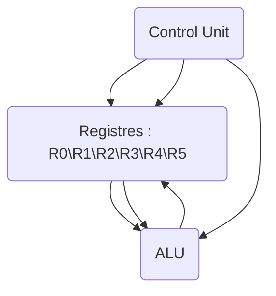
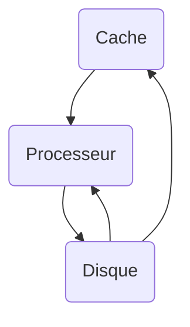

# Assembleur x_86/64

## Processeur

> *ALU* : Ce qui permet de faire des opérations très rapidement. Concept vu en électronique.
>
> *Control Unit* : Centre de contrôle des différentes opérations



## Cache

> Partie permettant de stocker des données auxquelles on accède de manière très fréquente. Le cache est beaucoup plus rapide que le disque, mais posséde beaucoup moins d’espace de stockage (en Mo). Par ailleurs, il est situé très proche « géographiquement » du processeur.



## Pipeline


## TP_01

```assembly
%rdi --> Correspond au premier paramètre de la fonction qui va être appelée.
%rsi --> Correspond au second paramètre de la fonction qui va être appelée. 
%rax --> Correspond au registre contenant la valeur de retour de la fonction

"Fonction Puissances de 2"

    .global main

    .text
main:
    movq    $5, %rdi

my_pow:
    movq    $1, %r12
    movq    %rdi, %r13

my_sub_pow:
    cmp     $0, %r13
    jl      end
    
    movq    $my_str, %rdi
    movq    %r12, %rsi
    movq    $0, %rax
    call    printf

    addq    %r12, %r12
    addq    $-1, %r13

    cmp     $0, %r13
    jge     my_sub_pow

end:
    mov     %rsi, %rax
    ret

my_str:
    .asciz     "%d\n"
```


## Cours 2 - Memory

**Utilisé pour :**

-   Fetch instructions
-   Access data

*Von Neuman architecture*: données et instructions situées au même espace d’adressage

*Harvard architecture*: données et instructions situés dans 2 espaces mémoires physiques séparés

### Immediate addressing

-   *Value* of data is directly stored in the *instruction*
-   No memory access needed

```
add $2, %rdi
```

### Absolute addressing

-   Adresse de la donnée est directement stockée dans l’instruction (ultra rare, on sait rarement où se situe la data qui nous intéresse).
-   memory access needed to get value inside the address

```
mov [0x830], %rdi
```

### Register indirect addressing

-   *Address* of data is stored in a *register*
-   Memory access needed to get value inside the address stored in the register

```
mov [%rsi], %rdi
```

### Complex addressing

-   Register indirect with base register
-   Register indirect with offset
-   …

```
mov [%rsi + 0x123], %rdi
mov [%rsi + %rax], %rdi
```

Alignement est une histoire de data type width, les accès non-alignés sont beaucoup plus lents, parfois même interdits selon les procs

In a structure, fields are stored in declaration order and they must all be aligned


Si on a pas un cas idéal comme au dessus, le compilo add du padding pour garder l’alignement


= gain de vitesse mais perte de place (padding bytes are unused)

Avec `__attribute__((packed))` on peut forcer le fait de ne pas aligner les fields = pas de padding donc moins rapide mais pas de perte de place (en vrai c’est rarement utile à notre niveau)

### Endianness

*Le sens dans lequel on lit la donnée i.e. Si le “`poids fort`” est à droite ou à gauche*.

### Address Space

Mapping in memory –> Charger en mémoire.

Une `Address Space` est contiguë, est envoyée à une `target address`, virtuelle. Permettant de faire croire que tous les programmes tournent sur la même adresse, alors qu’il s’agit d’une adresse virtuelle. En réalité les programmes ne sont pas du tout à la même adresse.

### Cache memory

-   local copy of central memory
-   transparent (invisible pour nous)
-   volatile = peut être flushed à tout moment
-   faster, closer to CPU
-   mais cher

Plusieurs caches de différentes taille, vitesses, latences… Chaque cache est à une distance différente du CPU

Memory address space in contiguous (physically) and be mapped to another address space (virtually)

### Memory Segments

-   `segment base` address in target address space (début du segment)
-   `segment size`
-   `segment type` and access rights (read, write, execute) (permissions)

Pour gérer les segments: segment descriptor table

### Limitations

-   address-space must be mapped at contiguous blocks donc compliqué d’extend un segment
-   on ne peut pas avoir de “bouts de segments”

### Pages

Blocs de mémoire au plus bas niveau. On peut stocker tout ce qu’on veut dedans. On ne peut pas demander une demie page. Chaque programme demande un nombre entier de pages.

Modern OS use **pages** to split address space. On les définit par

-   address in target address space
-   type + access rights
-   size
-   other: cachability, …

Pour gérer les pages: page descriptor table

Better than segments:

-   addresses spaces may be mapped to uncontiguous target page (remember malloc)
-   sharing, swapping…

### Memory protection

Évite que la gestion mémoire d’un processus puisse influencer d’autres processus.

Is used to protect:

-   system from hosted processes
-   hosted processes from each other

`cr3` est registre qui hold le PDBR (Page Directory Base Register) qui permet d’accéder aux pages d’un process

Sur les segments, il y a le flags permettant de gérer les utilisateurs.

### Process Switching

Permet de gérer à quelles pages un `process` peut accéder. Ou y accéder, ai-je le droit d’y accéder ? etc.

C’est donc le process qui sait ou est sa data, quelles sont les pages auxquelles il a droit d’accéder. Non le système.

### Memory Sharing

On peut partager des pages de mémoire, pour permettre de les partager. 

Exemple : `sudo vim /etc/init.d` va partager de la mémoire pour permettre à `Vim` d’accéder à de la mémoire accessible uniquement en `root`.

### `mmap()`

```c 
// To do
```

### Branch Principle

`*Branching is breaking the normal incremental execution flow to go execute code somewhere else.*`

**Une branche possède :**

-   Une destination
-   Une condition
-   Un lien, permettant de savoir si on stocke la valeur de retour.


### Prologue

Sauvegarde du contexte actuel.

### Epilogue

Restauration du contexte précédent.


## Cours 3 - Handling events and OS generalities

*interrupt*: caused by external event
*exception*: caused by instruction execution

*synchronous*: vient d’un effet du code, on peut plus ou moins le prévoir (syscall, page fault, …)
*asynchronous*: indépendant du code, interruption qui vient de l’exterieur (appuyer sur une touche du clavier, problème hardware, …)

On peut voir ça comme “synchronisé avec l’exécution d’une instruction”

**User mode** can access user space only
**Kernel mode** can access both user space and kernel space

Trap handler table: contient les routines à suivre pour chaque interruption

Syscalls:

-   execute process, exit
-   read input, write ouput, …
-   perform restricted actions (accessing hardware devices or the MMU)

On l’utilise de la même manière qu’une fonction, concernant les arguments.Cependant, il faut mettre le numéro du syscall sur `%rax`.

Processor modes to ensure process isolation: user mode (user applications) / supervisor mode (system kernel operations)

On peut voir les syscalls comme des moyens d’accéder aux services que le kernel met à notre disposition (comme une grosse API)


Faults:

-   conséquence de l’exécution de certaines instructions
-   kernel exception handler may return to faulty user context
-   syscalls are deliberate, faults are unexpected (et pas voulues)

To handle a fault, the OS can:

-   kill user process
-   notify process about the fault so it may resolve it itself
-   solve the problem and resume transparently


To perform **multitasking**, OS has to:

-   create and delete processes
-   organize processes in memory
-   schedule processes for CPU use

The idea is simulationg execution of concurrent execution of many processes as one may not use system ressources at full capacity


Important:


