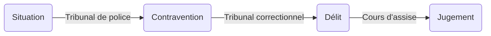
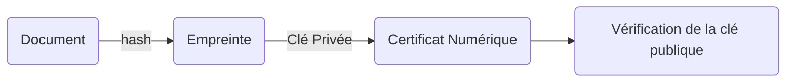

# Droit général

`Notes de cours par Thomas Peugnet.`

# Introduction

Le système de justice français est composé de deux ordres : Le judiciaire et l’administratif.

| Judiciaire | Administratif |
| :--------: | :-----------: |

| Judiciaire                                                   | Judiciaire                                                   | Administratif                                                |
| :----------------------------------------------------------- | ------------------------------------------------------------ | :----------------------------------------------------------- |
| Civil                                                        | Pénal                                                        | -                                                            |
| - Concerne les litiges **Civil** contre **Civil**.<br />- On parle d’**assignation** devant un tribunal.<br />- Par la suite, on parle de **jugement**. | - Concerne les infractions, délits etc.<br />- On parle de **convocation** devant le tribunal.<br />- **Citation à comparaitre** (Témoin ?) | - Il est nécéssaire d’avoir un avocat.<br />- On ne parle pas de litige, mais de **contentieux**. |

*Pour éviter d’avoir un **denis de justice**, à savoir une situation où personne ne prend en charge le litige, ou si deux juges ne savent s’ils doivent prendre le litige en charge, l’affaire se redirige vers le **tribunal des conflits**.*

**Non lieu** : Le non besoin de poursuivre.

Il existe **3** instances qu’il est possible d’appeler. **Concerne uniquement l’ordre judiciaire**.

# Première instance 

| Civil                                                        | Pénal                                                        |
| ------------------------------------------------------------ | ------------------------------------------------------------ |
| **Conseil de prud’homme** :<br />- Traite les litiges *salariés - employeurs* **uniquement**<br />- Il existe deux conseillers par partie. (2 pour l’employeur, 2 pour le salarié)<br />- Attention, un **conseiller** est différent d’un **juge**.<br /><br />**Tribunal de commerce :**<br />- Traite les litiges concernant les *employeurs* **uniquement**<br />- Tout ce qui concerne les liquidations, par exemple.<br />- Ex : Un ascenseur mal réparé.<br /> | **Tribunal de police : **<br /> - Identique au tribunal judiciaire, mais varie selon l’infration.<br /><br />**Tribunal correctionnel :**<br />- Concerne les peines pouvant aller jusque **10 ans**, au maximum. <br /><br />**Cours d’assise :**<br />- Concerne les peines allant au delà de **10 ans.** |

**Remarque :** Actuellement, un seul tribunal prend en charge tout le monde, **le tribunal judiciaire.** Auparavant, il existait deux tribunaux, **Instance** et **Grande Instance**. Il se sont fusionnnés pour donner le **tribunal judiciaire**.

### Contravention, Délit, Crime



**Contraventions** : Amendes forfaitaires, de 1, 2, 3, 4, et 5e classe. Une amende forfaitaire de 5e classe amène directement devant le tribunal correctionnel. Il n’y a pas de prison.

**Délits** : Amendes de 3e classe, avec récidive, amène devant le tribunal. La prison est potentielle.

**Crimes** : Cours d’assise. Cette dernière est composée d’un président, et de plusieurs assesseurs et jurés. La prison est généralement obligatoire. En **France**, il n’y a pas de perpétuité, mais une période de 25 ans minimum. L’objectif est de garder l’espoir de sortie.

# Seconde instance

L’objectif de la seconde instance, est de repartir du procès de 0. Cela, afin de vérifier que le jugement n’a pas été mal effectué lors du premier jugement.

Il est toujours autorisé de faire appel, excepté lorsque les frais sont trop bas. (Utilité proportionnelle, en général).

| Civil           | Pénal                                                        |
| --------------- | ------------------------------------------------------------ |
| - Cours d’appel | - Cours d’appel correctionnelle<br />- Cours d’assise d’appel |

> Lors de la reprise du procès, il peut être demandé de ne reprendre que certains points de zéro.

# Troisième instance

Il n’y a aucune différence entre le côté civil et le côté pénal cette fois-ci. La **Cours de cassation** a pour seul et unique but de vérifier que le jugement effectué en **Cours d’appel** a été fait en appliquant correctement le droit. Son objectif n’est pas de dire si le jugement rendu est juste ou non. Son utilité est simplement de vérifier que le droit a été appliqué correctement.


# Résumé

La seule personne ayant la possibilité de **dire le droit** est le **juge**.

La seule personne ayant la possibilité d’**écrire la loi** est le **législateur**.

Le seul groupe de personnes ayant la possibilité de **décréter une loi** est le **gouvernement**.

 ```mermaid
 graph
 1_inst(Première Instance) --> |Déscision + Jugemement| 2_inst(Seconde Instance)
 2_inst(Seconde Instance) --> |Arrêt + Décision exécutoire| 3_inst(Troisième Instance)
 3_inst(Seconde Instance) --> |Arrêt ou Non-prononciation| Fin(Fin)
 ```

# Tribunal Administratif

*Toute décision préfectorale peut être contestée, mais uniquement au tribunal administratif.*

| Première instance      | Tribunal Administratif                                       |
| ---------------------- | ------------------------------------------------------------ |
| **Seconde instance**   | **Cours administrative d’appel**                             |
| **Troisième instance** | - **Conseil d’état** (Conseiller le gouvernement)<br />- **Conseil constitutionnel** : *Dit si une loi est contraire à la constitution.* |

**Note :** Si l’on souhaite attaquer **l’État**, il sera nécessaire de passer par le **Conseil d’état**.


# Qualification Pénale

Une **dénonciation** va donner lieu à une **enquête préliminaire**. Au cours de cette dernière, durant 72h, on va chercher :

- Des soupçons
- Des éléments de preuve
- Des moyens liés à la preuve

Par la suite, une **demande** va être transmise au **procureur**, permettant de savoir si l’on continue l’enquête ou non.

- Si la réponse est négative, l’affaire est classée **sans suite**.

Pour chaque **nouvelle preuve** découverte, le **juge** doit faire un **réquisitoire supplétif**. Par la suite, le **procureur** se charge de voir les nouveaux éléments.


# Exemple : la signature électronique

Étude de l’article 1366-7 du code Civil.

> On dit qu’un **document produit du droit**. Un certificat de scolarité produit du droit, par exemple.

> Un **acte authentique** est un acte effectué par une personne ayant droit. Un notaire, par exemple.

> Une **signature sous seing privé** : Exemple -> Un contrat de travail (Employeur et Employé)

> Le juge se contente d’énoncer par écrit les conflits entre deux signatures. Le rôle de l’expert sera de vérifier et de corriger ces conflits, dans le cas d’une signature électronique.

> **Irréfragable** : Une preuve absolue.
>
> - On dit que c’est une preuve qui fait **force probante**
> - Contrairement à une preuve qui fait **force probatoire** (pas certain)

**Remarque** : Une signature numérique n’existe pas. On parle uniquement de **signature électronique**.

Principe de **fonctionnement** global d’une signature électronique :



## Signature Simple, Avancée, Qualifiée


### Signature Simple

> - «  *Il y a une signature électronique **simple** lorsqu'un lien est établi entre deux ensembles de données électroniques* »
> - « *Ce type de signature ne **permet pas d'identifier le signataire de manière univoque.** Il s'agit donc du type de signature électronique qui offre **le** **niveau de sécurité le plus bas**.* »

### Signature Avancée

> - « *Le niveau de sécurité de la signature électronique avancée est **supérieur** à celui de la signature simple. En effet, **une signature électronique avancée répond à 4 exigences selon le règlement eIDAS,** permettant **d'identifier le signataire** et de **garantir l'intégrité de l'acte**.* »
>
> Usage : contrat de travail, devis, bon de commande, mandat SEPA, etc.
>
> Résumé : Avancée –> Simple + authentification dûment prouvée

### Signature Qualifiée

> - « *Ce type de signature offre le niveau de sécurité le plus élevé, cependant son utilisation est plus contraignante. En effet **le signataire doit disposer d’un certificat qualifié de signature électronique** pour pouvoir signer.* »
>
> Usage : actes authentiques, actes avec des organismes publics etc.
>
> Résumé : Qualifiée –> Avancée + authentification par l ’intermédiaire d’un document spécifique

La signature qualifiée est la seule **ayant droit**.

### Horodatage

L’horodatage d’un document s’effectue par l’intermédiaire d’un serveur, et non pas par l’heure de l’ordinateur à partir duquel la signature a été générée.

### Divers

Lors d’une affaire concernant le **code pénal**, seules les signatures **au minimum** avancées sont de mises. Les signatures simples ne sont pas reçues, contrairement aux affaires concernant le **code civil**, où toute signature sera prise en compte ou non, variant selon le juge.

---

# Notes diverses

> **On ne poursuit personne.** Il revient en effet au **procureur** de déclarer si des poursuites sont engagées ou non.

> –> Enquête de flagrance :  **Flagrant délit ** 
>
> - Pendant 24 à 72h, tout est possible du côté de la loi. Perquisitions etc.
>
> –> Enquête préliminaire :
>
> - Transmission des informations au juge d’instruction ?

> Le **juge** ne peut pas faire de **commission rogatoires.**

> Une **commission rogatoire** ressemble à ce qu’est un **mandat** aux États-Unis.

> Pour effectuer un **perquisition** il est nécessaire de posséder :
>
> - 6 à 21h
> - Un officier de police judificiare
> - Le papier du procureur

> Exemple *amusant* :
>
> - Un Policier vous croise dans la rue, et vous demande vos papiers.
>   - Il s’agit d’un contrôle illégal, le policier ne peut vous les demander.
>   - Cependant, refuser de lui donner est un acte de rébellion
> - On ne peut donc empêcher un Policier d’effectuer un **contrôle illégal** sur votre personne, sous peine de faire acte de rébellion, et donc d’être potentiellement amendé.

> La différence entre un **policier** et un **gendarme** est très faible. Un gendarme est un militaire, et a donc une utilisation des armes, contrairement aux policiers ?

> **Contra-Legem** : Qui est contre la loi.

> Il est autorisé de falsifier un document tant que ce dernier n’implique la responsabilité que de soi-même

> Le **tribunal civil** n’exige pas nécessairement d’avocat. On peut y aller seul pour se défendre soi-même.

> ```mermaid
> graph
> C(Constitution) --> P(Préambule)
> C --> A(Articles)
> ```
>
> Le **Droit Supra-Judiciaire** est ce qui s’impose à nous en plus de la constitution. Il s’agit du **Droit Européen**. Le droit supra-judiciaire est différent du **Droit International**.

> Une décision prise en **Cours d’assise** peut parfois produire un jugement moins sévère qu’un décision prise en **Tribunal correctionnel**. Comme donné en définition, le procès est recommencé depuis 0.
> La **correctionnalisation** : Exemple
>
> –> Partir d‘un fait de *viol* vers un cas moins grave d’*attouchement*, pour être jugé par un **juge professionnel**. Pour une raison très précise. Un juge professionnel pourra infliger une peine **plus importante** qu’un groupe de jurés en cours d’assise.

> Il y a **prescription** lorsqu’il est jugé que trop de temps s’est écoulé depuis les faits.

> Un numéro est dit **signifiant** lorsque la décomposition de ce dernier permet de découvrir des informations sur l’individu auquel il se rapporte. 
>
> Le numéro de sécurité social est un numéro **très signifiant**.

> **Il est important de toujours employer des moyens adaptés au but recherché.** 
>
> - Pour entrer dans une école, il est inutile d’imposer un appareil de Scan rétinien. Un simple badge suffit. 
> - Suivre les employés d’une entreprise de livraison à l’aide d’une balise GPS, simplement pour vérifier qu’ils font le trajet le plus performant, n’est pas adapté, et peut ne pas être accepté en tribunal si ce n’est pas totalement justifiée.

