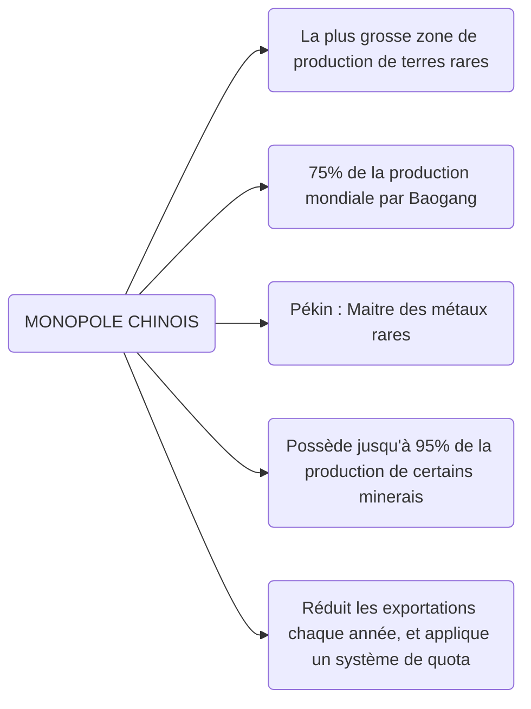
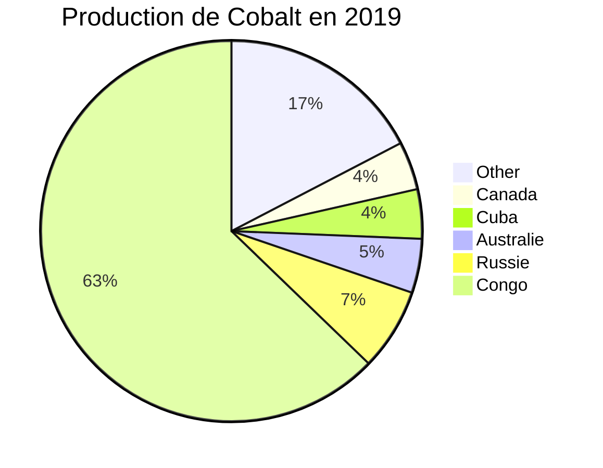

# Développement durable - Premiers pas

`Notes de cours par Thomas Peugnet`.

## Questions - Réponses 

*`Merci à Chloé pour les photos des slides`*.

> Dans le bilan carbone, on ne prend pas que le $CO_2$ ? **VRAI**

> C’est l’ONU qui a créé les 17 **ODD** ? **VRAI**

> Pourquoi les technologies vertes posent-elles problème ?
>
> - La fabrication et le recyclage sont polluants

> Quels pays sont à l’orgine des 17 **ODD** ?
>
> - Colombie, Guatemala et Perou

> La sixième extinction de masse est Locale ? **FAUX**

> La phase la plus impactante pour un logiciel est ?
>
> - L’utilisation, et non le développement

> Quelle phase du cycle de vie d’un appareil électronique a le plus d’impact environnemental ?
>
> - Extraction des matières premières

> Quelles sont les notions sur lesquelles repose le développement durable ?
>
> - Besoins, Développement, Générations Futures

> Que remettait en question le rapport du Club de Rome ?
>
> - La croissance économique

> Le $N_2$ n’est pas un gaz à effet de serre ? **VRAI**

> Les métaux rares sont appelés ainsi car ils sont très peu présents sur la planète ? **FAUX**

> Il faut **850**kg de matière pour fabriquer un ordinateur de **2.5Kg** ? **VRAI**

> À quelle température peut fonctionner un datacenter d’après les recommandations de *ASHRAE* ?
>
> - 25°C

## Informations diverses

> GIEC 2021 : L’homme est responsable du changement climatique

> 1988 : Naissance du GIEC

> 1987 : Définition de *Développement durable*, dans le rapport de Brundtland
>
> - *Le développement durable, c’est s’efforcer de répondre aux besoins du présent sans compromettre la capacité de satisfaire ceux des générations futures.*

> 1968 : Fondation du *Club de Rome*, par Aurélio Peccei

> 1972 : Rapport Meadows. Premier rapport du Club de Rome ?

> CMED : Commission mondiale de l’environnement et du développement

> Le développement durable sous 3 dimensions :
>
> - Économique : Omniprésent depuis révolution Industrielle - **PIB**
> - Sociale : Développement Humain - **IDH**
>   - **IDH**
>     - Créé par l’ONU en 1990
>     - Regroupe la santé/longévité de vie, l’éducation et niveau de vie avec la richesse économique produite
>     - Les pays **développés** (IDH>0,8) ont une empreinte écologique > 1 planète
>     - Les pays **pauvres** (IDH<0,4) ont une empreinte écologique < 1 planète.
> - Environnement : Impact sur l’environnement, la biodiversité etc. - **Empreinte écologique**
>   - **Empreinte écologique**
>     - Proposé par Wiliam Rees au **Sommet Johannesburg** en **2002** 

> 29 Juillet 2021 : Jour de dépassement : 
>
> - Plus de consommation ce **jour** là, que l’ensemble des ressources que la Terre peut régénerer en **1 an**.

## Changement climatique

> - Effet de Serre, GES
> - Dérèglement climatique
> - Montée des eaux, fonte des glaces etc.
> - Boucle de réatroaction positive

## Métaux rares

Ces métaux rares ont des propriétés très intéressantes pour les appareils électroniques. 

Ils seront, à priori utilisés dans tout ce qui concerne la **Green Tech**, à savoir : Éoliennes, Barrages Hydrauliques etc.

Utilisés également dans les moteurs électriques, avec notamment un système d’aimants. 

>   “ Pour faire du propre, il faut faire du sale. ” - Guillaume Pitron

Il semblerait qu’il y a une sorte de paradoxe entre la volonté d’effectuer une transition écologique, mais que cette dernière ne soit pas sans émettre justement de la pollution.

*Par ailleurs, la pollution peut-être amenée à causer l’infertilité des terres autour.*

## Pollution délocalisée

-   REACH : Règlement européen qui vise à réduire les risques sanitaires liés à l’utilisation de produits chimiques.
-   Besoin de délocaliser la pollution liée aux matière premières
-   Exports des déchets radioactifs au fin fond de la Sibérie
-   Villages Cancer

## Cycle de vie (Smartphone)

> *L’ensemble des étapes de la vie d’un produit : conception, l’extraction des matières première, la fabrication, l’emballage, le transport, l’utilisation, la fin de vie/recyclage (si possible).*

Informations à prendre en considération :

- Conception
- Stockage
- Electricité consommée
- Réseau utilisé
- Obsolescence Programmée

3 Solutions proposées :

- `Réparer`
- `Réutiliser`
- `Recycler`

Un exemple de smartphone durable : ………… Le **FairPhone** !

## Green IT

> *Le processus d’amélioration continue permettant de réduire l’impact environnemental, social et économique des TIC (Technologies de l’Information et de la Communication).*

Repose sur plusieurs domaines :

- Logiciels
- Matériel
- Énergie
- Bonnes pratiques
- Acteurs
- Impressions
- Achats

Solutions proposées :

- `Taille de police moins importante`
- `Eco-Conception logicielle`
  - Plus optimisé => Moins de ressources utilisées

## Empreinte numérique

> *Constituée de l’ensemble des impacts environnementaux, économiques et sociaux associés à nos usages numériques quotidiens. En augmentation considérable.*

### Réglementation

> **Norme** : Une norme est un ensemble de références précises, d’exigences spécifiques à suivre pour qu'un bâtiment, un service, un produit... atteigne un certain niveau d'efficacité ou de qualité.

- Niveau national : **AFNOR** (Association Française de Normalisation)
- Niveau Européen : **CEN** (Comité Européen de Normalisation) 
- Niveau International : **ISO** (Organisation Internationale de Normalisation)

> **Certification** : Une certification donne une assurance écrite qu’un produit, un processus ou un service est conforme à des exigences spécifiées dans un référentiel. Elle doit être délivrée par une tierce partie.

> **Label** : Le label est un outil de marquage, un moyen d'information du public sur les propriétés et les qualités objectives d'un produit, d’un ouvrage, d'une information, d'un bâtiment, d'une procédure, etc…

- **Ecolabel** :

  - *Un écolabel est un label écologique attribué par un organisme indépendant (certificateur) à un produit ou service susceptible de réduire certains impacts négatifs sur l'environnement par comparaison avec d'autres produits ou services de la même catégorie.*

  - Réservé aux labels qui répondent à la norme **ISO 14024**.
  - Garantit à la fois la qualité écologique et la qualité d’usage d’un produit.

