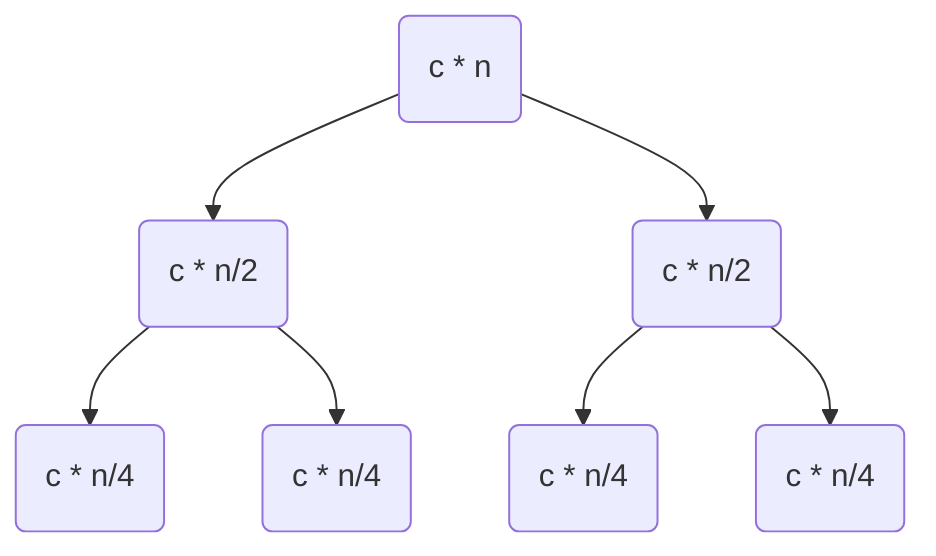

# Complexité des algorithmes

## Cours 1 : Introduction 

```python
def fruits(n):
	for i in range (5,n):
		print("Kiwi")
		for j in range (10,20):
			print("pomme")
		for j in range (1,i):
			print("bannane")
		for j in range (10,i):
			print("orange")
```

Ce qui nous donnera comme résultat : 

```
n = 15
Kiwi(15) = 10
pomme(15) = 10 x 10 (i x j)
bannane(15) = 4 + 5 + 6 +...+ 13 = (4 + 13)(10) / 2 = 85
orange(15) = 0 + 0 + 0 + ... + 1 + 2 +3 + 4 = 10
```

Ce qui, de manière plus mathématiques :

```
Kiwi(n) = 
0     ---  si n <= 5
n - 5 --- si n > 5
```
Et,

```
pomme(n) = 10 x Kiwi(n)
Bannane(n) = 
0            --- si n <= 5
(n+2)(n-5)/2 --- si n > 5
```

### Exercices

```c
void fun(int n)
{
	for (int i = 0; i <= n; ++i)
		for (int j = i; j > 0; --j)
			puts("foo");
}
```

Déterminer le nombre de fois que sera affiché "foo".

## Cours 2 : Notations

### $$ \Theta, 0, \Omega $$

$$f(n) = o(g(n)), f(n) $$ négligeable devant $$ g(n) $$. Ex

**Objectif : $$ f < g $$**

$$f(n) = O(g(n)), f(n) $$ au pire proportionnelle à $$ g(n) $$. 

**Objectif : $$ f <= g $$**

$$f(n) = \Theta(g(n)), f(n) $$  proportionnelle à, ou est du même ordre que $$ g(n) $$. 

**Objectif : $$ f = g $$**

  $$f(n) = \Omega(g(n)), f(n) $$ au moins proportionnelle à $$ g(n) $$.

**Objectif : $$ f >= g $$**

*Tous ces objectifs sont à un coefficient de multiplication près.*

#### Propriétés

Les propriétés sont celles usuelles, associativité, transitivité etc.

Soient deux fonctions $f(n) \& g(n)$. $ \lim f(n)/g(n) = l$

Si $l=0$, alors $f(n)\in O(g(n))$.

Si $0<l<\infty$, alors $f(n)\in \Theta(g(n))$.

Si $l=\infty$, alors $f(n)\in \Omega(g(n))$.


## Cours 3 : Exemples

Soit l’algortithme `Selection Sort` :

```python
def selection_sort(array):
  n = len(array)
  for i in range(0, n - 1):
    minpos = i
    for j in range(i + 1, n):
      if (array[j] < array[minpos]):
        minpos = j
    array[i], array[minpos] = array[minpos], array[i]
```

La ligne 1 est à $\Theta (1)$.

Les lignes 3, 4, 8 du premier `for` sont à $\Theta(n)$.

Les lignes 6 et 7 du second `for` sont à $\Theta(n^2)$.


Soit l’algorithme `InsertionSort` :

```python
def InsertionSort(A,n):
  for i in range(1, n):
    key = A[i]
    j = i - 1
    while (j >= 0 && A[j] > key):
      A[j + 1] = A[j]
      j-=1
    A[j + 1] = key
  return A
```

Voici la complexite en chaque ligne:

2. $\theta(n)$
3. $\theta(n)$
4. $\theta(n)$
5. $\Omega(n) \leq ? \leq \theta(n^2)$
6. $0 \leq ? \leq \theta(n^2)$
7. $0 \leq ? \leq \theta(n^2)$
8. $\theta(n)$
9. $\theta(1)$

Donc, pour `insertion_sort`, le tri est à $O(n^2)$.


## Cours 4 : Tri sur bande

## Cours 5 : Merge (Fusionner)

Soit le code de `merge` suivant:

```python
def MergeSort(A, b, e):
      if e - b <= 1:
        return
      m = b + (e - b) // 2
      MergeSort(A, b, m)
      MergeSort(A, m, e)
      Merge(A, b, m, e)
```

```python
def Merge(A, i, j, k)
	l = i
    r = j
    for b in range(i, k - 1):
        if r == k or (l < i and A[l] <= A[r]):
            B[b] = A[l]
            l += 1
        else:
            B[b] = A[r]
            r += 1
	A[i..k - 1] = B[i..k - 1]
```

On pose `n = k - i`. $T_n(n) =$ complexite temporelle de `Merge`.

2. $\theta(1)$
3. $\theta(n)$
4. $\theta(n)$
5. $\theta(n)$
6. $\theta(n)$
7. $\theta(n)$
8. $\theta(n)$
9. $\theta(n)$
10. $\theta(n)$

Donc `Merge` est de complexite $\theta(n)$

Étant donné que le fonction `Merge` est récursive, il faut calculer la complexité au cas d’arrêt, et dans le cas courant.

* Le cas d'arret: $T_{MS}(n) = \theta(1)$ pour `n = 1`
* Le cas courant: $T_{MS}(n) = T_{MS}(\lceil\frac{n}{2}\rceil) +
    T_{MS}(\lfloor\frac{n}{2}\rfloor) + \theta(n)$ pour `n>=1` 

**Simplification :**
$$
T(n) = \left\{
    \begin{array}{ll}
      \theta(1)       & \quad \text{if } n \text{ is } \leq 1\\
      \Theta(n) + 2T(\frac{n}{2}) & \quad \text{otherwise}
    \end{array}
\right.
$$



Développement des calculs :

On pose $cn = \Theta(n)$, ainsi que $n = 2^k$.
$$
T(n) = 2T(\frac{n}{2}) + cn\\
T(n) = 2(2T(\frac{n}{4} + c\frac{n}{2}) + cn)\\
T(n) = 4T(\frac{n}{4}) + 2cn/2+cn\\
T(n) = 8T(\frac{n}{8}) + 4cn/4 + 2cn/2 + cn\\
$$
Apres $i-1$ substitutions : $T(n) = 2T(\frac{n}{2}) + icn\\$.

**Rappel** : On arrête les substitutions lorsqu’on arrive au cas d’arrêt : $\frac{n}{2} = 1$.

On trouve alors :  $i = log_2(n)$ et donc :

$T(n)=(log_2n)cn+2^{log_2n}T(1) = \Theta(n\times log_2(n))$.

