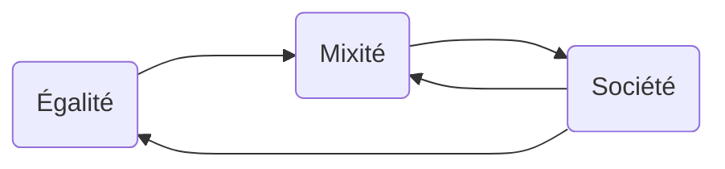

# Société, égalité & mixité

## Introduction

### Problèmatique 1

**Quelles ont été vos réactions lorsqu’on vous a parlé de ce cours ?**

>   –> Étonnant, mais finalement pas si étonnant que ce genre de cours puisse être dispensé.
>
>   –> Situation de la femme dans les pays étrangers.
>
>   –> En attente de preuves, car l’émotionnel est souvent présent dans ce genre de débat.
>
>   –> Appréhension, car à priori pas nécessaire. Non-égalité car les “Non Binaires” ne sont pas mentionnés.
>
>   –> Parfois un peu tard pour commencer à en parler. Margaux : On nait con, on meurt con. Pas tort, on a seulement 20 ans.
>
>   –> Cours assez peu habituel. Crainte des fondements plus ou moins scientifiques de chacun. Besoin de la remise en question.
>
>   –> Besoin et nécessité de le rappeler. Besoin et nécessité de débattre.
>
>   –> Insistance sur la remise en question. Est-ce que le cours va être vraiment utile au final ? Si aucune remise en question, peu de chances que ce soit finalement utile…
>
>   –> Classe pourvue à 90% d’hommes, donc pourquoi nécéssité de parler de ce sujet ?

### Problèmatique 2

**À votre avis, pourquoi un cours sur l’egalité F / H en école.  ?**

>   –> Dans de multiples écoles, dont Supélec, de nombreuses agressions sexuelles ont eu lieu, à priori par une majorité d’hommes.
>
>   –> Visiblement même situation pour Sciences Politiques. 
>
>   –> École possède une haute responsabilité. Donc importance d’aborder des sujets de ce genre.

---

## Dessins animés

Dans de nombreux dessins animés, on retrouve les personnages de **prince**, **princesse**, **roi**, etc.

-   **Le prince : ** Respecté, riche, combattif.

-   **Belle mère : ** Tyran, méchante. (Cendrillon, Blanche Neige).
-   **Roi : ** Personnage effacé.
-   **Princesse : ** Dans l’attente du prince.

