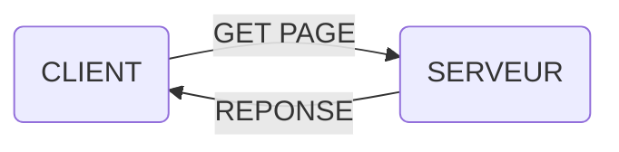
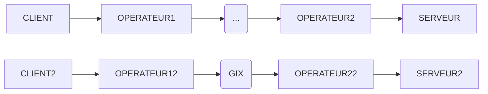
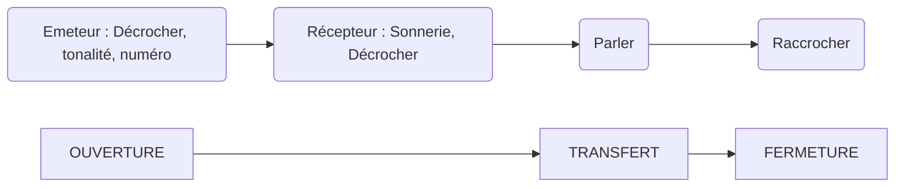
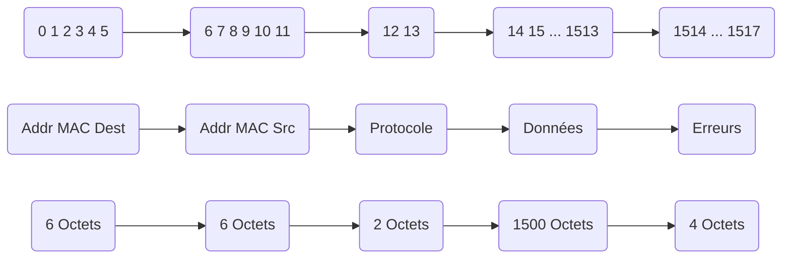
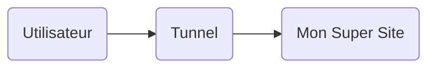

# Réseau et télécommunications

*Notes de cours par `Peugnet Thomas`.*

## Définition

Un **réseau** est composé de **liens** et de **noeuds**. 

## Introduction

Un réseau doit constituer un certain nombre de principes. Il peut être considéré comme une boîte noire.



**Principe du routeur**

Il n’existe pas de liaison direct entre le client et le serveur. La connexion est relayée par différents routeurs. On peut voir la liste des routeurs sur un chemin en effectuant la commande :

```sh 
traceroute www.epinotes.fr
Liste des routeurs/IP par lesquelles passe la communication.
```

---

## Composition d’un réseau

Il existe plusieurs couches au sein d’un réseau :

-   CLIENT –> BOX —> SERVEUR
-   HTTP —> `requête de la page` —> SERVEUR
-   TCP —> `Fiablisation de la communication` —> SERVEUR
-   IP —> `Chemin de routeurs en routeurs` —> SERVEUR


### Wifi

Le Wifi ne peut gérer qu’un seul signal à la fois. Un traffic trop important peut également réduire le débit, dû au traitement de chaque signal de manière indépendante.

### Routage



Les opérateurs peuvent s’échanger les données entre eux, mais peuvent aussi passer par un lieu neutre.

### Point d’échange Internet neutre GIX

Carrefour d’échange de données au sein d’un lieu. Les débits sont supérieurs à ceux pour les particuliers. Unité de compte Gigabit.

Lorsqu’une liaison se brise, Internet ne va pas faire de différence de flux. Si la nouvelle liaison utilisée est moins rapide que la précédente, alors des ralentissements/casses peuvent apparaître.

---

## Exemples 

### La poste

Limitations :

-   Poids limité
-   Temps de traversée du réseau variable
-   Temps de récupération du destinataire variable


### Réseau téléphonique



Contrairement au réseau postal, pour échanger à chaque fois un nouveau message, il n’est pas nécessaire de refaire toutes les démarches.

---

## Paquets (datagrammes) de taille limitée

Fonctionnement : **Store and forward**.

*Exemple avec les banques qui souhaitent communiquer ensemble.*

Chaque agence est une sorte de relais, qui va réceptionner les paquets.

`Réception du paquet, analyse du destinataire, renvoi du paquet`

Taille infinie => ressources infinies pour les traiter. Donc nécessité de limiter les tailles de paquets, en plusieurs petits sous-paquets.

---

## Appareils usuels

### Routeur :

-   Objectif : Distribuer une connexion
    -   Un routeur est souvent assimilé à un switch Ethernet, couplé d’un émetteur Wi-FI.

### Modem :

-   Objectif : Récupérer la connexion Internet fournie par l’opérateur.
    -   Un modem n’est **pas** un routeur. Il ne distribue pas la connexion, il se contente de la **réceptionner**.

### Box :

-   Objectif : Coupler un modem et un routeur au sein d’un même appareil. Il s’agit en fait d’un appareil nommé `modem routeur`.

### Switch / Hub Ethernet

-   Un switch est dit plus intelligent qu’un simple hub, mais ils auront la même apparence, et très grossièrement la même fonction. Il s’agit, comme un Hub USB, de redistribuer et démultiplier un signal Ethernet.

---

## Adresses

Objectif : localiser un objet sur le réseau.

### Adresses et identifiants

Deux choses différentes.

-   Identifiant : Permet d’identifier l’appareil, unique. Adresse MAC, par exemple.

-   Adresse : Permet de localiser l’appareil sur le réseau.

### Adressage Internet

Adresse sur Internet est de taille fixe. *123.123.112.124*

`www.epinotes.fr`

### DNS (Domain Name System)

C’est ce qui fait la liaison entre l’adresse IP du serveur, et son nom de domaine. Par exemple :

*Il existe un DNS dans lequel est inscrit : `www.epinotes.fr` = `123.234.234.567`*.

### URL

Protocole : `http`, `https`, `sftp`, `smb`…

Adresse IP / nom de domaine : `epinotes.fr`…

Fichier à récupérer : `/public/pages/examens.php`… 

**Remarque :** Lorsque l’on consulte une page Internet, on commence par télécharger le contenu de la page par notre navigateur, puis ce dernier se charge de l’afficher. Phénomène très visible lorsque l’on télécharge un fichier `PDF` et qu’on l’affiche dans notre navigateur.

### Adresse IP et Adresse MAC

#### Définitions

-   Une adresse MAC est unique, et a pour seul but d’identifier un appareil. La composition de cette adresse dépend donc uniquement de la marque, du modèle de l’appareil, etc.

-   Une adresse IP n’a rien à voir ! Il s’agit d’une adresse déterminée par un routeur. Il existe deux cas de figure courants, où l’on utilise le terme `Adresse IP` :
    -   Dans un **réseau local** : C’est l’adresse assignée par le routeur (la box), à un appareil suite à une demande **ARP**. Cette adresse IP sera, par exemple, de la forme `192.168.X.X`. Avec `X.X` variant de X.0 à X.255. Section plus détaillée ci-dessous.
    -   Dans le **réseau Internet Mondial** : C’est l’adresse qui est **assignée par l’opérateur**. Elle sera de la forme `123.456.789.123`. Lorsque vous utilisez un VPN, c’est cette adresse qui est “cachée”. Cette adresse peut-être dynamique, ou fixe. Certains opérateurs proposent de chosir, d’autres non. 
    -   Cette adresse est celle qui permet de **localiser** l’endroit ou se trouve la box. C’est à partir de cette dernière que les sites peuvent vous dire dans quelle ville votre box se trouve.

**Remarque : ** Ci-dessus, il est uniquement question d’adresses en IPv4 `123.456.789.123`.

Contrairement à ce qui était inscrit sur le diaporama en cours, les adresses IPv4 sont constituées d’entiers, et non de décimaux. Une adresse IP avec des nombres à virgule n’existe pas. Elle est codée sur 4 octets. Ainsi, toutes les adresses IP en IPv4 seront de la forme `X.Y.Z.W` , avec `X,Y,Z,W` variant de 0 à 255. (2⁸ = 256).

Depuis un certain temps, des adresses en IPv6 sont créées et utilisées, car le nombre d’adresses possibles en IPv4 est trop faible. Elles sont de la forme : `5f3e:a780:4371:bced`.

**Remarque : **L’adresse IP (dite `localhost` ) de la machine que vous utilisez est `127.0.0.1`, au sein de son propre réseau. Sur le réseau local créé par le routeur, l’adresse IP de la machine sera d'une forme différente. L’adresse `localhost` fait partie des adresses **privées de catégorie D**, décrite ci-dessous.


#### Types d’adresses

-   Unicast : Adresse qui vise un seul et unique destinataire.
-   Multicast : Adresse qui vise un groupe de plusieurs destinataires.
-   Broadcast : Adresse qui vise l’intégralité des destinataires présents sur le réseau.


### Les classes d’adresse IP

#### IPv4

Le nombre d’adresses IP total en IPv4 est de `4.3 milliards`. Il faut cependant en supprimer un certain nombre qui sont des adresses privées. Le reste des adresses peut donc être utilisé comme des adresses IP publiques.

Les adresses qui ne peuvent pas être utilisées en tant qu’adresse publique sont appelées **adresses privées**. Elles sont réparties en différentes classes :

-   Classe A 
    -   `10. … . … . … /8` –> `10.255.255.255`
-   Classe B
    -   `172.16. … . … /16` –> `172.31.255.255`
-   Classe C
    -   `192.168. … . … /24` –> `192.168.255.255`
-   Classe D
    -   Toutes les adresses de `Broadcast`, `Mulicast`, etc.

Si le modem ou la box trouve un paquet dont l’adresse IP source ou destination est une adresse privée, et qui doit sortir du réseau local, alors ce paquet est immédiatement supprimé.

#### Masque de sous-réseau

Le masque de sous-réseau est souvent de la forme : `255.0.0.0/8`. Il permet de donner le nombre de bits bloqués, et ce, en fonction de la classe d’adresse utilisée pour le réseau local.

Le `/8` est appelé `CIDR`. Il donne le nombre de bits bloqués, qui ne peuvent donc pas être modifiés lors d’une **demande ARP** d’un appareil. 

Le masque de sous-réseau existe uniquement pour les adresses en IPv4.

La plupart du temps, le `CIDR` est une puissance de 2. On peut ainsi en déduire que :

-   `10.0.0.0/8` est une adresse IP dont seuls les 8 premiers bits sont bloqués, à savoir le premier octet (`10.`).
-   `192.168.0.0/16` est une adresse IP dont seuls les 16 premiers bits sont bloqués, à savoir les deux premiers octets (`192.168.`).
-   `255.255.255.255/32` est une adresse IP dont tous les bits sont bloqués.

#### Exemple

On créé un réseau : `10.0.0.0/8`. On peut créer deux réseaux indépendants à partir de ce dernier :

-   `10.1.0.0/16`
-   `10.2.0.0/16` 
-   Le `broadcast` sera de la forme suivante : `10.X.255.255`

> **REMARQUE IMPORTANTE :**
>
> Il ne s’agit ici que des **adresses privées**. Les classes sont toutes aussi valables pour les adresses publiques, tout comme les notions de masques de sous-réseaux, de CIDR. Internet est en réalité une sorte d’immense réseau local, constitué de plusieurs sous-réseaux.
> Cependant, seules les adresses IP privées ont été abordées en cours. Après quelques recherches, un ajout s’impose de manière évidente.
>
> Voici les classes des adresses IP (Publiques, Privées, aucune importance en réalité):
>
> - Classe A : `1.0.0.0/8` –> `126.255.255.255/8`
>   - Le `\8` n’est que le CIDR par défaut, celui conseillé. Cependant une adresse de classe A peut tout à fait être en `\32` et ne proposer qu’un seul appareil (Box, par exemple).
>   - Le DNS de Google est `8.8.8.8`. Au vu de l’importance du réseau Google, on peut imaginer que les adresses de classe A, commençant par un 8, et ayant un CIDR de `\8` lui appartiennent. Ces adresses constitueraient une partie du réseau des différentes IPs de Google.
> - Classe B : `128.0.0.0/16` –> `191.255.255.255/16`
> - Classe C : `192.0.0.0/24` –> `223.255.255.255/24`
> - Classe D : `224.0.0.0` –> `239.255.255.255`
>   - Ces adresses sont celles du Multicast, du Broadcast, etc.

#### Exercice

>   On nous donne une adresse IP : `172.16.123.14/15`. L’objectif est de déterminer le masque de sous-réseau, l’adresse de réseau ainsi que l’adresse de `broadcast`.
>
>   -   `172.16.123.14
>
>       -   Le `CIDR` est de 15. On commence par écrire 15 `1` sur la forme binaire de notre adresse :
>       -   `11111111 11111110 00000000 00000000` (ce qui correspond aux différents octets de notre masque de sous réseau)
>           -   `255 . 254 . 0 . 0` -> Masque de sous réseau
>       -   Comme on peut le remarquer sur la deuxième octet, il reste le premier bit à `0` et non à `1`. Cela signifie que nous pouvons faire `+1` au deuxième octet de notre adresse de départ.
>       -   Nous obtenons donc l’adresse de réseau :
>           -   `172 . 16 . 0 . 0`
>       -   Ainsi que l’adresse de broadcast :
>           -   `172 . 17(+1) . 255 . 255`
>
>       
>
>   **Remarque** : Si nous avions eu un `CIDR` égal à 14, nous aurions eu la forme binaire de notre adresse `11111111 11111100 00000000 000000000`, avec donc `00` à la fin, nous permettant donc d’avoir une adresse réseau identique, mais de faire `+3` sur le deuxième octet de notre adresse de broadcast. Cette dernière est utilisée dans l’exemple, mais ce n’est pas la seule adresse qui possède un deuxième octet différent. Toutes les adresses comprises entre `172.16.255.255` et `172.19.255.254` auront un deuxième octet différent du `16` de l’adresse de départ.


#### IPv6

Il existe un total de `667 millions de milliards par mm²` d’adresses en IPv6 pouvant être utilisées en tant qu’adresse IP publique.

---

## Architecture

Il est important de conserver plusieurs liaisons pour accéder à un même serveur.  Si un noeud se brise, il est important de conserver le transfert de l’information entre les différents noeuds.

---

## Concepts et modèles de référence ISO/OSI

### Introduction

**Débit : ** le nombre de bits émis par seconde sur une voie de communication. Noté `D`.

**Exemple : ** Sur un réseau de 1Gbps, transférer une vidéo de 500Mo :

-   1 Gbps = 120 Mo/s
-   500Mo / 120Mo/s ≃ 4s.
-   => Le tranfert durera théoriquement **4s**.
    -   Il faut nécessairement prendre en compte que le débit peut varier, et que les 120Mo/s sont rarement atteints sur les cartes réseau 1 gigabit. De manière génerale, on plafonne à 117-118Mo/s. 
    -   Il faut donc prendre en compte l’aspect réel du matériel qui effectue le transfert. La catégorie des câbles Ethernet est un bon exemple. Un CAT 3 aura un débit de 10Mb/s (≃ 1,2Mo/s), tandis qu’un CAT 5e aura un débit de 1Gb/s (≃ 120Mo/s). C’est le **délai de propagation**. Les catégories de câble Ethernet est décrit ci-dessous.


Lorsque notre **FAI** (notre fournisseur d’accès Internet) nous procure une connexion Internet, il créé une voie **bidirectionnelle**. Le débit descendant, (*Download*) est généralement supérieur au débit ascendant (*Upload*). Dans le cadre d’une fibre optique, certains opérateurs proposent des offres ayant ces chiffres :

-   Download : 8 Gb/s (960 Mo/s)
-   Upload : 600 Mb/s (75 Mo/s)

*Remarque : Sur un réseau recevant 8 Gigabits/seconde, si le matériel réseau utilisé est prévu pour des débits allant jusqu’à 1 Gigabit/seconde, le débit sera bridé par le matériel ayant la plus faible capacité.*

### Services Réseau

Un service réseau est constitué d’un protocole et d’un service réseau. Récursivement, on peut construire autant de services réseaux que l’on souhaite.

### Couche protocolaire

L’ensemble des entités qui mettent en œuvre un même protocole au dessus d’un même service réseau, forment une couche protocolaire. Toutes ces entités protocolaires sont homologues. Dans chaque équipement, une instance de l’entité protocolaire de cette couche doit être implantée. 

Des entités protocolaires identiques, c’est-à-dire mettant en œuvre le même protocole, ne sont homologues que si elles sont associées à un même service réseau.

___

## Modèle ISO/OSI


| 7. Application<br />SSH, SSL, HTTPS : Encryptage des données depuis le logiciel. |
| :----------------------------------------------------------: |
| **6. Présentation**<br />La représentation des informations que des entités d’application se communiquent. Elle est nécessaire du fait de la variété des représentations de données dans les différents systèmes. |
| **5. Session**<br />Synchronisation… Démarrage, maintenance, et fin<br />**IPSec** : Encryptage des données directement depuis la carte réseau. |
| **4. Transport**<br />Le transfert de données de manière transparente entre utilisateurs en les déchargeant des détails d’exécution. Il existe de nombreux services de transport. Par exemple, les services **UDP** et **TCP**. |
| **3. Réseau**<br />La fonction d’acheminement des messages à destination. Elle réalise le routage ou relayage ou commutation, des messages. Elle doit être capable de calculer et trouver les chemins. Pour cela, elle doit disposer de plusieurs liaisons vers des entités réseau voisines jusqu’à atteindre la destination désirée. Il existe de nombreux services réseau. Demande **ARP** : Assignation d’une nouvelle adresse IP en fonction d’une adresse MAC. |
| **2. Liaison**<br />Le transfert de l’information entre les machines sur la voie physique. Elle détecte en général les erreurs et peut éventuellement mettre en œuvre des mécanismes de correction.<br />Les premiers bits (0&1)s vont permettre d’identifier si c’est un paquet qu’il faut traiter, ou autre chose. Il est donc nécessaire d’avoir un processus de normalisation. |
| **1. Physique**<br />Caractéristiques du transport : métallique, optique, hertzien, micro-ondes, la puissance et portée du signal, les longueurs des câbles, la forme des prises, le codage utilisé pour transmettre des bits sur le câble. |

**Remarque : ** Les erreurs présentes sur une couche, n’impliquent pas que les couches plus hautes ne feront pas d’erreurs.

>   **Astuce : ** Voici un jeu de mots connu pour se rappeler de l’ordre des différentes couches :
>
>   <center>« Ah Petite Salope Tu Recraches La Purée »</center>

### Protocole

Le différentes informations que possède chaque entitée protocolaire se nomme **SDU** pour Service Data Unit.

Pour effectuer une transmission de données entre plusieurs entités protocolaires, il faut établir un service de communication. Les entités protocolaires vont échanger des **PDU**, pour *Protocol Data Unit*, afin de créer ce service de communication.

|                            —                            |
| :-----------------------------------------------------: |
| Header (**ICP**, Informations de contrôle protocolaire) |
|                         **PDU**                         |
|                         **SDU**                         |

**SAP** : Service Access Point

>   “ En conséquence, la taille des PDU évolue jusqu'à la couche physique ; seul niveau où l’information est effectivement transmise à l’équipement distant. Les données En+1 sont fournies par l’utilisateur qui est situé dans la couche immédiatement supérieure. Un PDU du protocole n est composé de l’information de contrôle protocolaire notée « n ICP », et du n SDU. Entre la couche n+1 et la couche n, il existe une interface que nous appellerons SAP pour Service Access Point. ”

[…]

### Service

HTTP(S), etc. On parle de protocole, mais c’est véritablement un service, car ce dernier est présent sur la couche **Application**.


### Trame, Paquet, Segment

-   Une trame est toujours en relation avec du matériel physique. 

-   Un paquet est un élément géré par le réseau

-   Un segment est un élément géré par une application.

    => Globalement, c’est une unité de grandeur.

#### Exemple : Trame Ethernet

La trame Ethernet a une longueur maximale de 1518 octets et minimale de 64 octets.



Le champ `Erreurs` correspond à la détection d’erreurs sur la trame envoyée. Si une erreur s’est produite, la trame est jetée (détruite).

### VPN



Les erreurs ne peuvent provenir que de la couche physique. Donc, lorsqu’il s’agit d’un VPN, étant donné que tout est virtuel, les erreurs ne peuvent arriver qu’à un moment précis. Lors de l’utilisation de la couche physique, il faut faire toutes les vérifications. Une fois cette couche passée, on ne risque plus d’avoir d’erreur sur les couches physiques (mais virtuelles) du VPN.


### Câbles Ethernet

Il existe plusieurs catégories de câbles Ethernet. Leurs principales différences sont leur débit.

#### CAT 2

N’est pratiquement plus utilisé, et permet des applications jusqu'à **1 Mb/s**.

#### CAT 3

N’est pratiquement plus utilisé, et permet des applications jusqu'à **10 Mb/s**.

#### CAT 4

N’est pratiquement plus utilisé, et permet des applications jusqu'à **16 Mb/s**

#### CAT 5

Peut encore se trouver dans le commerce, et peut avoir de l’intérêt en fonction de matériel réseau (Sur du matériel relativement vieux, certaines cartes réseaux n’étaient compatibles que **100 Mb/s**, et il n’était donc pas nécessaire d’effectuer un câblage avec des câbles au-delà du CAT 5.

Il permet des applications jusqu'à **100 Mb/s**.

#### CAT 5e

Le câble Ethernet le plus répandu actuellement, car il est à la même norme que la plupart des cartes mères. 

Il permet des applications jusqu'à **1000 Mb/s**, soit **1 Gb/s**.

#### CAT 6

Il s’agit d’un câble dont la construction est différente de de celle des autres câbles vues plus haut, avec notamment un système de séparateur permettant de réduire la diaphonie (Fiabilité des données envoyées ?)  

Il permet des applications jusqu’à **10 Gb/s**.

#### CAT 6a, 7…

Câbles toujours plus performants, dont la construction permet de garantir des débits particulièrement élevés.

#### Différence vue en cours

Il a été indiqué en cours que la catégorie de câble dépendait de la fiabilité des informations transmises. Un câble **CAT 5** ne serait fiable à 100% que pour transférer des données allant jusqu’à 100 Mb/s. (?). La fiabilité ou non d’un câble serait donc liée à la construction de ce dernier.


# Questions - Réponses

## Modèle ISO/OSI

>   Quelles sont les couches utilisées par un **switch** ?
>
>   -   Physique et liaison

>   Quelles sont les couches utilisées par un **routeur** ?
>
>   -   Physique, liaison et réseau

>   Quelle couche les **trames** utilisent-elles ?
>
>   -   Liaison

>   Quelle couche les **paquets** utilisent-ils ?
>
>   -   Réseau

>   Quelle couche les **segments** utilisent-ils ?
>
>   -   Transport

>   Quels **protocoles** peut-on trouver sur la **couche 3** ?
>
>   -   IP et OSPF

>   Quels **protocoles** peut-on trouver sur la **couche 4** ?
>
>   -   TCP et UDP

>   Quelles **fonctions** peut-on attribuer à la **couche réseau** ?
>
>   -   Commutation de paquets
>   -   Traduction des adresses et des noms logiques en adresses physiques (MAC –> Adresse IP ?)

>   Quelles fonctions peut-on attribuer à la **couche transport** ?
>
>   -   Le rassemblement des paquets en un seul message
>   -   L'envoi et la réception d'un accusé de réception (TCP)

>   Quelle fonction peut-on attribuer à la **couche session** ?
>
>   -   L’ouverture et la fermeture d’une connexion

>   Quelles fonctions peut-on attribuer à la **couche présentation** ?
>
>   -   La conversion des protocoles
>   -   La traduction et l’encodage des données

## Adresses IP

>   Commande qui permet de lister les cartes réseaux disponibles sur un ordinateur :
>
>   -   `Netsh interface ipv4 show interface`

>   Quelle est la raison principale d'utiliser une adresse IP statique ?
>
>   -   Les adresses IP des serveur doivent rester les mêmes.
>       -   Il est cependant possible de faire différemment, comme Epinotes lors de sa création, en utilisant un DynDNS.

>   Quelle est la fonction d'un **serveur DNS** ?
>
>   -   Il convertit **un nom** en **adresse IP**.
>   -   `NOM` –> `ADRESSE IP`
>   -   `EPINOTES.FR` –> `234.222.111.212`

>   Quelle est la fonction d'un **serveur DHCP** ?
>
>   -   Il permet d'attribuer des adresses IP de façon automatique.


## Annale - Partiel 2024

> Le dernier **fragment** peut être à nouveau fragmenté.

> **Offset :** 
>
> - Décalage en terme de position du premier fragment, et l’actuel.

> Equipements dotés d’une **table d’apprentissage d’adresse MAC** : 
>
> - Switch, Routeur, Bridge

> Nombre de **domaines de collision** :
>
> - Nombre de liaisons à un **Switch** + compter le nombre de **Hub**, mais ne pas compter les liaisons qui sortent du hub.

> **Taille** en-tête IPv4 :
>
> - 20
>
> **Taille** en-tête IPv6 :
>
> - Fixe de 40 octets

> Une adresse IPv4 :
>
> - Est **toujours** unicast (?)
>
> Une adresse IPv6 : 
>
> - **Taille : ** 128 bits –> 8 groupes de 2 octets

> Un paquet IPv4 : 
>
> - ```mermaid
>   graph LR
>   A([...]) --> B(00 00 00 00) --> C(00 00 00 00)
>   D([...]) --> E(IP Source) --> F(IP Destination)
>   ```

> Un **Commutateur Ethernet** : 
>
> - Possède 48 ports, aura alors 48 collisions.
> - Agit sur la **couche 2**.

> Nombre de **domaines de diffusion :**
>
> - Nombre de domaines liés au **routeur**.

> **Nombre de bits/classes d’IP :**
>
> - A –> 7 bits de réseau, 24 bits d’hôte
> - B –> 14 bits de réseau, 16 bits d’hôte
> - C –> 21 bits de réseau, 8 bits d’hôte

> **Valeur MF** : 
>
> - Dernier fragment : **0**

> **Taille d’un datagrame IPv4 :**
>
> - 65 535 octets

> **Couches** du modèle **ISO** :
>
> - 3 –> Routeur
> - 2 –> Switch / Bridge
> - 1 –> Hub

> L’IPv6 agit sur le même niveau que l’IPv4.

> Une **adresse multicast** n’est pas une adresse **MAC** source.

> Une **adresse MAC source** est une adresse **unicast**.

> Le modèle **TCP/IP** possède **4 couches**.

> Le lien entre **IPv4** et **IPv6** est la table **ARP**.

> Le champ **Protocole** n’est pas lié à la fragmentation dans un en-tête IPv4.

> Le **spanning tree** permet d’éviter les boucles infinies.

> Une **adresse MAC** fait **48 bits** : FF:FF:FF:FF:FF:FF

> Le **CSMACD** correspond au **contrôle d’accès.**

> Le dernier fragment possède le flag **MF = 0**.
