# Théorie des Langages

*Début de cours de `Amsallem Florian`. Modifications et ajouts par `Peugnet Thomas`.*

## Introduction

Le **Python** est un parfait exemple de langage **interprété**.
Dans un langage **compilé**, la traduction a déjà eu lieu contrairement à un langage
interpreté.

Un langage **interpreté** donne plus de flexibilité au développeur.
Un langage **interpreté** a une plus grande portabilité.

Il y a des langages qui sont compilés et interpretés. Ex: **Java**


## Définitions

Un langage est un ensemble de **mots**.
Un langage peut être **infini**. (Exemple **N**: entiers Naturels)
Un langage n'a pas de **relation d'ordre**. (On peut lui en ajouter un)
Un langage peut etre **vide**.

Un **mot** est une sequence **finie** de **symboles**, appartenant à un **alphabet**.
Un **mot** peut être vide.

Un **alphabet** est un ensemble **fini** de symboles (Note Sigma).
Un **alphabet** ne peut pas être **vide** et **infini**.
Ce qui **caractérise** un alphabet est son **cardinal** (le nombre de symboles).

Ex:
$\sum$ = {`a`, `b`}
$\sum^*$ = {$\varepsilon$, `a`, `b`, `aa`, `ab`, `ba`, `bb`...}

Il y a **deux classes** de langages:

* Les langages *récursivement énumérables*: Il existe un algorithme pour lister l’intégralité des mots du langage.
* Les langages *récursifs*: Il existe un algorithme en temps fini pour tester si un mot appartient à un langage ou non.

Donc, un **langage récursif** est un **langage récursivement énumérable**.


# Opérations

## Sur les mots

* $\sum^*$: L'ensemble des mots
* Note E: epsilon
* `.`: Concaténation (C'est un monoide)
  * `a.E = E.a = a` (Avec `E`, l'element neutre, cf. Rappel : E : epsilon)
  * `|a.b| = |a| + |b|` 
  * `(a.b).c = a.(b.c)` (Associativité)
  * `a^^n^^ =  { E si n = 0; a.a.a.a....a }`

## Sur les langages

* $\cup$: Union
* $\cap$: Intersection
* `-`: Complément
* `.`: Concaténation (Associative, Non commutative)
  * `{E}`.*L* = *L*.`{E}` = *L* (Avec `{E}`, l'élément vide)
  * $L⁰$ = {$\epsilon$}  ==  L⁰ = `{E}` .
  * $\varnothing$.*L* = ∅ (Important ! Contre-intuitif)
* `*`: Étoile de **Kleene**

**Exemples :** 

-   **On pose $\Sigma = \{0,1\}$**.

L’expression résultant de tous les nombres binaires possibles est $\Sigma * /\ \{\epsilon\}$. Il est important de noter qu’il faut priver l’élément neutre, étant donné que ce n’est pas un nombre binaire.

De plus, $\Sigma * /\ \{\epsilon\}$ est littéralement égal à $\Sigma *.(\{0\}\cup \{1\})$.

-   **On pose $\Sigma = \{a,b\}$**

1.   Tous les mots qui commencent par un `a ` et qui finissent par un `a`, résulte de l’expression suivante : $(\{a\}.\Sigma *.\{a\}) \cup \{a\}$. Il est important de noter la nécessité d’ajouter l’élément `{a}`, car c’est le seul mot constitué d’une seule lettre, qui commence par un `a ` , et qui finit par un `a`.

2.   Tous les mots constitués de variations de `ab` : `abababababababababab`.

$$
(\Sigma *.a.a.\Sigma*)\cup (\Sigma *.b.b.\Sigma*) \cup (b.\Sigma *)\cup (a.\Sigma*)
$$

(Il faut le complémentaire de la formule ci-dessus).

2.   **MAIS**, on peut aussi l’écrire : 

$$
(a.b)*
$$

Ce qui est globalement plus simple.

3.   Tous les mots qui constituent $\Sigma *$, résultent de l’expression $ (a\cup b)*$.


## Préfixes et Suffixes

### Mots

Tout comme la définition du dictionnaire, un mot peut être préfixe, facteur, sous-mot ou suffixe d’un autre mot.

**De manière génerale :**

-   `u` *pref* de `v` si il existe `w = u.w`.

-   `u` *suff* de `v` si il existe `w = w.u`.

-   `u` *facteur* de `v` si il existe `w et w'` `v = w.u.w'`.
-   `u` *sous mot* de `v` si `u` est une sous-suite de `v`.

**Exemple :**

>   `abc` est préfixe de `abcdef`.

### Langages

Propriétés identiques. Ces dernières sont décrites en **3.2**.

**Exemple : **
$$
L_1.L_2 = \sum{u.v}
$$
Avec `u` $\in L_1\{u\}$ et `v` $\in L_2\{v\}$. 


## Compilateur

La compilation est constituée de plusieurs étapes :

* Découpage en entités lexicales
  * Le compilateur va détecter les identificateurs (les variables).
* Analyse sémentique
  * Vérification des types


## Langages Rationnels


L'ensemble des langages rationnels est défini par:

$$
\begin{equation}
\forall a \in \sum \{a\} *
\end{equation}
$$

## Expression Rationnelle

Par exemple, un nombre binaire peut s’écrire sous la forme :

({-}$\cup${+}$\cup${$\varepsilon$}).({0}$\cup${1}).({0}$\cup${1})^*^

Qui peut aussi s'écrire:
({-}$\cup${+}$\cup${$\varepsilon$}).({0}$\cup${1})^+^


## Simplifications des opérateurs

$\{\varepsilon\} \to \varepsilon\\
\{a\} \to a \\
. \to \\
\sum^* \backslash L \to \bar{L}$


## Rapprochement des `REGEX`

On utilise dorénavant les notations `[0-9]` pour que le caractère représenté soit un nombre compris entre 0 et 9. 

**Exemple : **

`([1-9].[0-9])*` correspond à l’expression de tous les nombres, en supprimant les nombres inutiles.


## Arbres

On peut utiliser des arbres pour représenter une expression rationnelle.

**Exemple :**

Soit l’expression `a*(b+cd)`. On peut représenter cette expression sous cette forme :


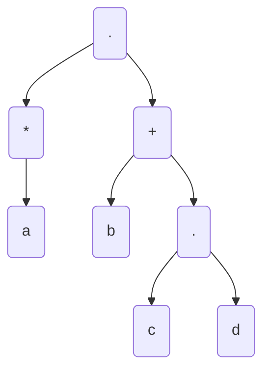


# Automates

## Introduction

Dans ce cours, un automate sera représenté de la sorte : 


Un automate est dit **complet** lorsqu’il n’est pas **enrayé** (qu’on ne peut pas sortir sans avoir eu de cas d’erreur ou de résultat), et gère les différents cas d’erreur, avec un **état d’entrée** et un **état de sortie** distincts.

De plus, l’état d’entrée possède uniquement des flèches **sortantes**, et vice-versa pour l’état de sortie, avec des flèches entrantes.


## Exemples

L’expression `a*`  est représentée par l’automate suivant :

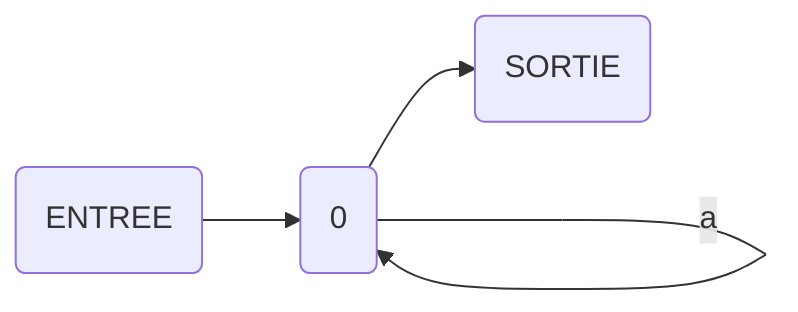

L’expression `a+b` :

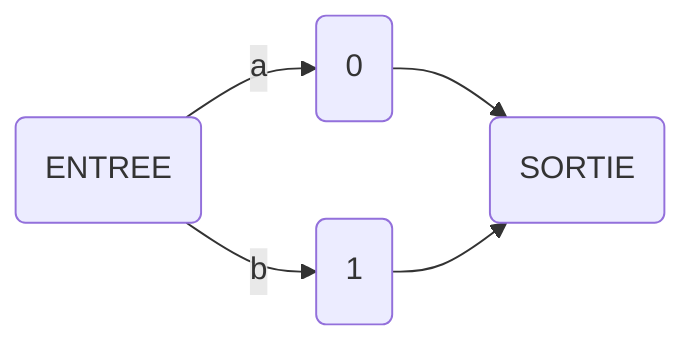

L’expression `a.b` : 


L’expression `(a+b)*bab` :

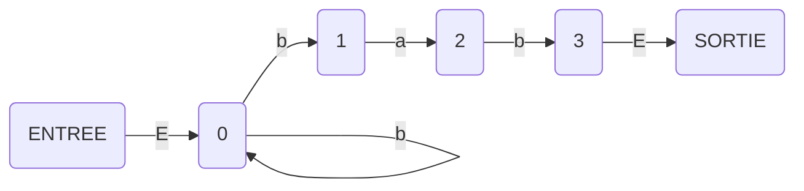

L’expression `a*(bc+d)` :

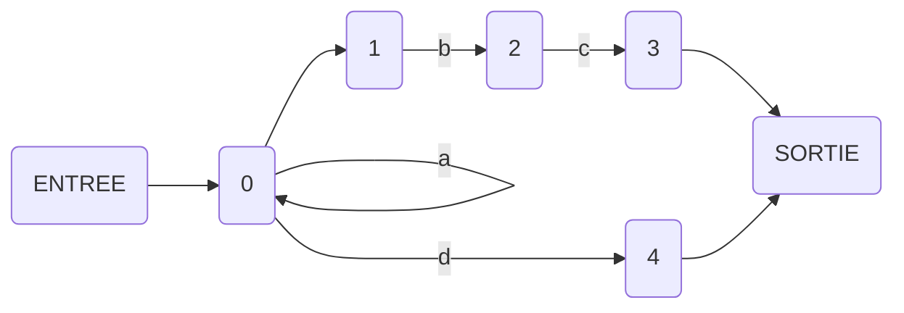


## Thompson

On peut utiliser la construction de Thompson pour construire des automates
avec les différents opérateurs.

## Non déterminisme

Le fait que l'algorithme prenne des choix subjectifs sur les transitions à prendre en compte le fait que ce soit un algo non déterministe. Cela est dû aux transitions $\varepsilon$.

**Exemple : ** `a+b` est non déterministe avec l’automate précédent.

On veut donc les rendre deterministes pour les simplifier.

## Simplifications d'automates ($\epsilon$NFA, **NFA**, **DFA**)

###  $\epsilon$NFA,  et NFA

On va créer un automate avec l'algorithme de Thompson. Cela donne un $\varepsilon$**NFA**
(Non Deterministic Finite Automaton with epsilon transition). Il est defini comme suit:

$A = (\sum, Q, I, F, \delta)$ avec:

* Un ensemble d'état $Q$.
* Un ensemble fini de symboles (alphabet) $\sum$ contenant $\varepsilon$.
* Un état de fin $F \in Q$
* Un état de départ $I\in Q$.

**Exemple : ** 

Un $\epsilon$NFA :


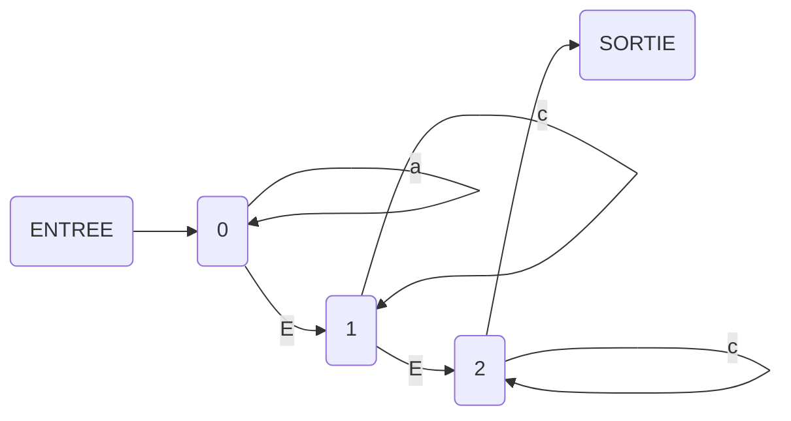

**Simplification** :

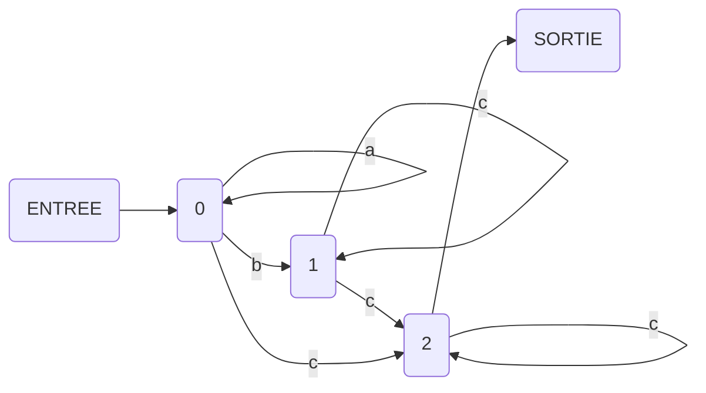

*Remarque : On a ajouté une liaison `-c-` entre `0` et `2`, on a supprimé les transitions `E`, et on les a remplacées par des transitions spontanées.*

Cependant, c’est toujours un $\epsilon$NFA. 

###  DFA

(Deterministic Finite Automaton with epsilon transition). Il est défini comme suit:

$A = (Q, \sum, \bigtriangleup, q_0, F)$ avec:

* Un ensemble d'états $Q$.
* Un ensemble fini de symboles (alphabet) $\sum$ contenant $\varepsilon$.
* Un fonction de transition $\bigtriangleup: Q \times \sum \rightarrow P(Q)$
* Un état de départ $q_0 \in Q$.

Si on a deux transitions qui partent du même état, qui ont la même étiquette, et qui partent dans des états différents. Ce sera nécessairement soit un **NFA**, soit un **$\epsilon$NFA**, mais pas un **DFA**.

### Création d'un DFA

```
(a+b)*a(a+b)
```


**Déterminisation** :

| T    | a    | b    |
| ---- | ---- | ---- |
| 0    | 0    | 01   |
| 01   | 02   | 012  |
| 02   | 0    | 01   |
| 012  | 02   | 012  |


## Propriétés

-   Tout **NFA** et **DFA ** est aussi **$\epsilon$NFA**. Mais tous les **$\epsilon$NFA** ne sont pas des **NFA**. Ce sont simplement des cas particuliers de  **$\epsilon$NFA**.

-   Idem pour les **DFA**. Ce sont les automates qui possèdent le plus de restrictions. 

-   Supprimer toutes les transitions spontanées ne permet pas de rendre un automate déterministe.

-   Langage rationnel $\rightarrow$ Expression rationnelle $\rightarrow$ $\varepsilon$-NFA $\supseteq$ NFA $\supseteq$ DFA

-   Le nombre d’états maximum **d’un automate déterminisé** est $2^n$ , avec `n` le **nombre d’états dans l’automate de base**.

-   Langage rationnel `L` transposé : $L^t$ — si $L=abc$, alors $L^t=cba$.

-   Définitions :

    Un **état accessible**:

    > S'il existe un état qui mène a lui.

    Un **état coaccessible**:

    > Un état qui mène à une solution.

    Un **état utile**:

    > Un état accessible et coaccessible.

## Exemple

Attention, ce ne sont pas des automates car des expressions sont inscrites sur des liaisons, ce qui ne permet pas de les définir comme automates.

**Automate initial :**

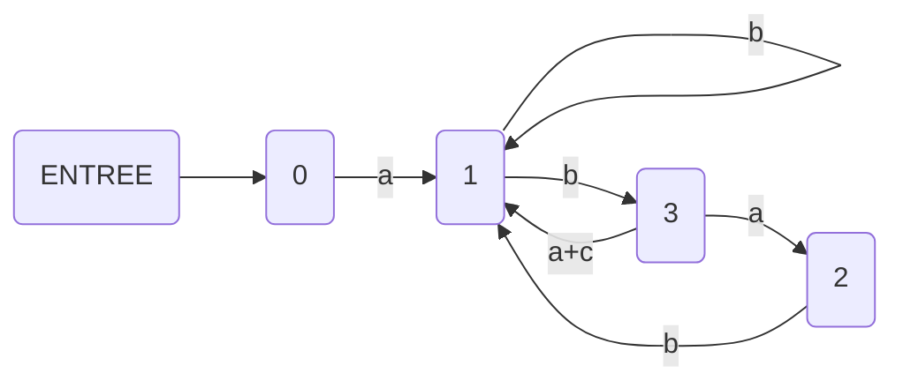

**Automate, après manipulations :**


L’algorithme de […] permet donc, à partir de n’importe quel automate, de déterminer son langage rationnel.

---

Il existe donc différentes manières de créer de nouveaux langages rationnels :

-   $L^t$ est la transposée d’un langage `abcd` devient `dcba`.
-   `Pref()` est le préfixe.
-   `Suff()` est le suffixe.
-   `Fact()` est défini dans une partie précédente.
-   `Sous-mot` qui est un sous-mot du langage $L$.
-   $\not(L)$ — “$L$ Barre”.
-   $L_1 \cap L_2$.

---

# Après les langages rationnels

## Introduction

* Une phrase est de la forme `sujet` `verbe`.
* Un sujet est un `pronom`.
* Un pronom est `il` ou `elle`.
* Un verbe est `parle` ou `écoute`.

On peut former 4 phrases différentes.

On a deux catégories de mots. Les éléments $\color{red}terminaux$ et $\color{blue}non\space terminaux$.

* Une $\color{blue}phrase$ est de la forme $\color{blue}sujet$ $\color{blue}verbe$.
* un $\color{blue}sujet$ est un **$\color{blue}pronom$**.
* un $\color{blue}pronom$ est $\color{red}il$ ou $\color{red}elle$.
* un $\color{blue}verbe$ est $\color{red}parle$ ou $\color{red}écoute$.

***"il parle"* est donc un <u>mot</u> de notre langage.**

## Définition

* **$\color{blue}P$** $\rightarrow$ $\color{blue}SV$
* $\color{blue}S$ $\rightarrow$ $\color{blue}PN$
* $\color{blue}V$ $\rightarrow$ "$\color{red}parle$" | "$\color{red}écoute$"
* $\color{blue}PN$ $\rightarrow$ "$\color{red}il$" | "$\color{red}elle$"

$L = (T,N, R, S)$

* $N$: éléments non terminaux (On ne termine pas par cet élément).
* $T$: éléments terminaux (On termine par cet élément).
* $R$: règle de production $(R \subseteq V^+ \times V^*)$.
* $S$: un axiome $\in N$.

L est une **grammaire** formelle.

### **Grammaire monotone** : (type 1)

-   $\alpha$ –> $\beta$  : $|\alpha| \leq |\beta|$

### **Grammaire sensible à un complexe :**

-   $\gamma \space A \space \delta$ –> $\gamma \space \alpha \space \delta$
-   $\gamma, \delta \in V^*$ et $\alpha \in V^+$
-   $A \in N$

### **Grammaire hors contexte : (type 2)**

-   $A$ –> $\alpha$
-   $A \in N \space \alpha \in V^+$

### Grammaire linéaire

#### À Droite :

>   $A$ –> `uB|v`, avec `A,B` $\in N$

#### À Gauche :

>   $A$ –> `Bu|v`, avec `a,v` $\in T$

**Remarque : Une grammaire est dite relationnelle, lorsqu’elle est linéaire à droite OU à gauche. Elle constitue le type 3.**

## Exemples

### Exemple 1

-   Sentence –> Name | List End

-   Name –> Ceriel | Dick | Noam

-   List –> Name | Name ‘,’ List

-   `,` Name End –> and Name

*La dernière règle est la seule qui permet de réduire la taille de la phrase.*

Le langage de `S –> aSb | E` est $a^n b^n$.

Pour gérer des langages avec des parenthèses, des accolades etc, il sera très utile d’utiliser les piles. On empile tous les `(, {, [`, puis on dépile au fur et à mesure des différentes valeurs rencontrées.

### Exemple 2

>   E –> E + E | n

-   Cette grammaire donne cette expression rationnelle : `n(n+)*`.
-   E –>2 n
-   E –> `1` E + E –> `2` n + E –> `2` n + n
    -   Dérivation gauche : C’est toujours le terme de gauche qu’on dérive en premier.
-   E –> `1` E + E –> `2` E + n –> `2` n + n
    -   Dérivation droite.
-   Deux manières différentes de lire une phrase :  (Et donc la comprendre différemment.).
    -   E –> `1` E + E –> `1` E + E + E –> `2` n + n + E –> `2` n + n + n
    -   E –> `1` E + E –> `2` n + E –> `1` n + E + E –> `2` n + n + E –> `2` n + n + n
    -   Le compilateur ne va donc pas le comprendre de la même manière.
    -   C´est une grammaire ambiguë.

**On va donc faire un arbre, appelé arbre de dérivation.**

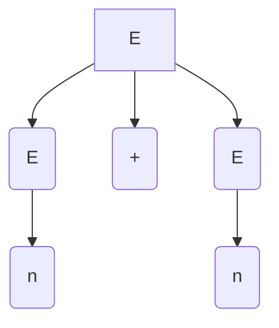

Pour la grammaire ci-dessus, on a réglé le souci concernant le premier cas de dérivation.

Mais, si on effectue une troisième dérivation, on se retrouve avec deux arbres possibles, différents.

On a donc un problème d’associativité.

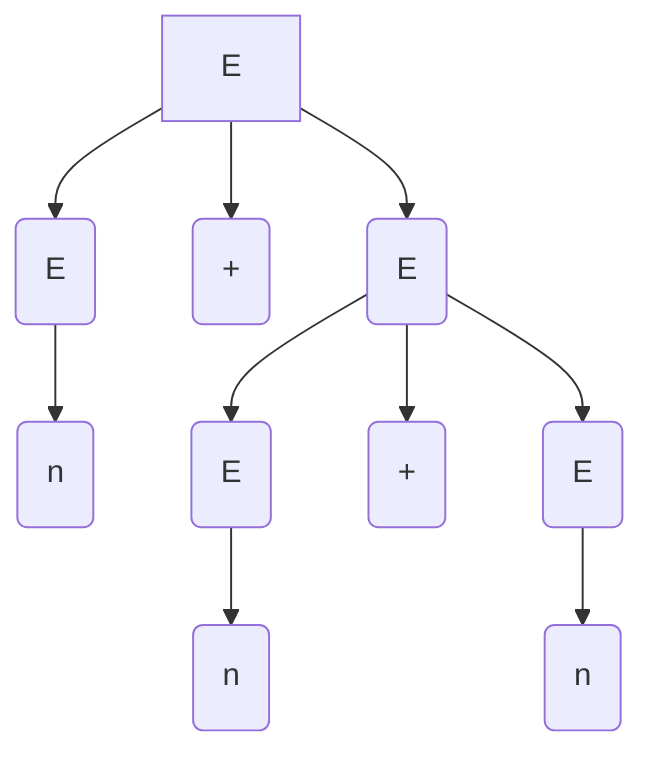


On va donc mettre des indices pour chaque lettre, en fonction des possibilités.

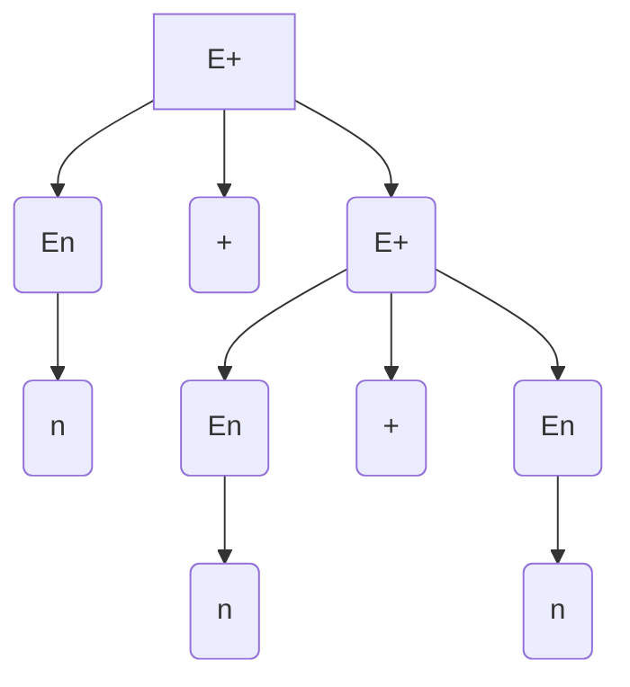

On peut également simplifier la grammaire :

>   E –> E_n | E_+
>
>   E+ –> E+ + E_n | E_n + E_n
>
>   E_n –> n

Et donc :

>   E –> E_n | E+
>
>   E+ –> E + E_n
>
>   E_n –> n

Enfin :

>   E –> n | E + n


### Exemple 3

>   **E –> E + E | E * E | n**

C’est une grammaire extrêmement ambiguë, car avec le `E+E` ou le `E*E` on peut descendre d’un côté ou de l’autre, sans le savoir à l’avance.

>   **E –> E+ | E* | E_n**
>
>   E+ –> E + E* | E + E_n
>
>   E* –> E* * E_n | E_n * E_n
>
>   E_n –> n

On souhaite que les `+` soient au dessus des `*`. Et on souhaite que les `n` soient au dessous des `*`.

**On simplifie la grammaire ci-dessus :**

>   T –> E* | E_n
>
>   **E –> E+ | T**
>
>   E+ –> E + T
>
>   E* –> T * E_n
>
>   E_n –> n

**Ce qui donne ensuite :**

>   F –> n
>
>   T –> T * F | F
>
>   **E –> E + T | T**

Cette grammaire n’est pas ambiguë.  


## Hiérarchie

|                    Nom                    | Type | **Grammaire Exemple**                                        | Information                                                  | Langage Exemple                   | Utilisation       |
| :---------------------------------------: | :--: | :----------------------------------------------------------- | :----------------------------------------------------------- | --------------------------------- | ----------------- |
|            Grammaire générale             |  0   | `aAbC` –> `DDe | epsilon`                                    | De nombreux langages ne pourront pas être reconnus par cette grammaire. | $\infty$                          | Machine de Turing |
| Grammaire monotone - Sensible au contexte |  1   | `aAb` –> `DDe |aaab` avec  $\alpha$ = `aAb` et  $\beta$ = `DDe` | Ajout d’une contrainte : <br /> La partie gauche doit être plus petite ou égale à la partie droite. | $a^nb^nc^n$                       | —                 |
|          Grammaire Hors Contexte          |  2   | `A` –>  $\alpha$                                             | Suppression du contexte.                                     | $a^n b^n$                         | PDA               |
|           Grammaire Rationnelle           |  3   | `A` –> `Ba` : linéaire à **gauche** <br /> `A` –> `uB` : linéaire à **droite** | Pas de changement sur la partie gauche. Sur la partie droite, seulement droit à un terminal. Et, sur l’une des deux parties, avoir uniquement des terminaux. <br /> Attention, une grammaire ne peut pas être linéaire à gauche **et** à droite. | $a^n$ avec $a \rightarrow \infty$ | Automate fini     |
|          Grammaire à choix fini           |  4   | —                                                            | —                                                            | $a^n$ avec $n$ fini.              | —                 |


# Automate à pile

## Introduction

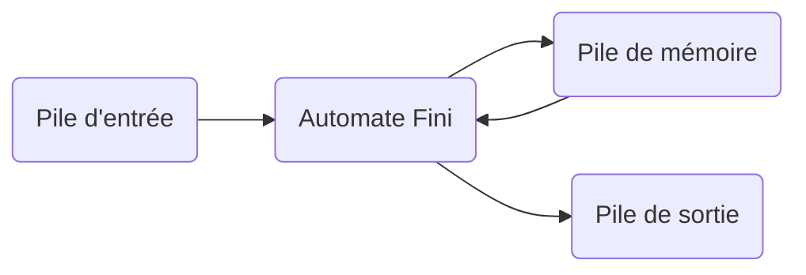

*Un automate à pile est un automate qui fonctionne avec un système de pile (LIFO).*

-   `IO` 
    -   I : Accepteurs
    -   IO : Transducteurs
    -   O : Générateurs
-   `Mémoire`
    -   $\empty$ pour les automates finis.
    -   LIFO pour les automates à pile.
    -   LBRAM pour les LBTM.
    -   RAM pour les TM (Turing Machine).
-   `Déterministe / Nondéterministe (D/N)`
    -   D = N pour les automates finis. (Temps d’exécution identiques)
    -   
    -   $DP \subseteq NP$ pour les TM.


## Exemple

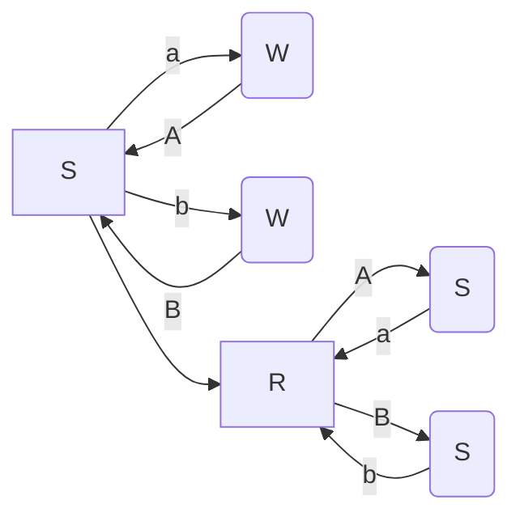

Le schéma ci-dessus correspond au langage : `S –> aSa | bSb|c`

Schéma aussi présent sur **complément de cours** : *Exemple : 12.1*


# Parser LL

## Exemple 1

>   S –> `if E then S` | `echo toto`
>
>   E –> `true` | `false`

Ce qui correspond au code `Bash` suivant :

```bash
if (true | false)
then echo toto
```

Et donc, le langage rationnel serait de la forme : `(if (true | false) then)* echo toto (fi)`

Complément de cours : *Exemple 6.1*.

## Exemple 2

>   Z –> X Y Z
>
>   Z –> d
>
>   X –> a
>
>   X –> Y
>
>   Y –> c
>
>   Y –> $\epsilon$

| I    | `Fst(A)`             | `Fol(a)`      |
| ---- | -------------------- | ------------- |
| A    | A –> a -> $\epsilon$ | A –> $\alpha$ |

1.   `Fst(Z) = {d, a, c}`
2.   `Fst(X) = {a, c}`
3.   `Fst(Y) = {c}`

Et donc :

1.   `Fol(x)` $\subseteq$ `Fst(YZ) = Fst(Y)` $\cup$ `Fse(z)` et `Fol(Y)` $\subseteq$ `Fst(Z)`
2.   `Fol(Y)` $\subseteq$  `Fol(X)`

Tableau `LL` :

| LL    | a       | c       | b        |
| ----- | ------- | ------- | -------- |
| **Z** | 1/      | 1/      | **1,2/** |
| **X** | **3/4** | 4/4     | /4       |
| **Y** | /6      | **5/6** | /6       |

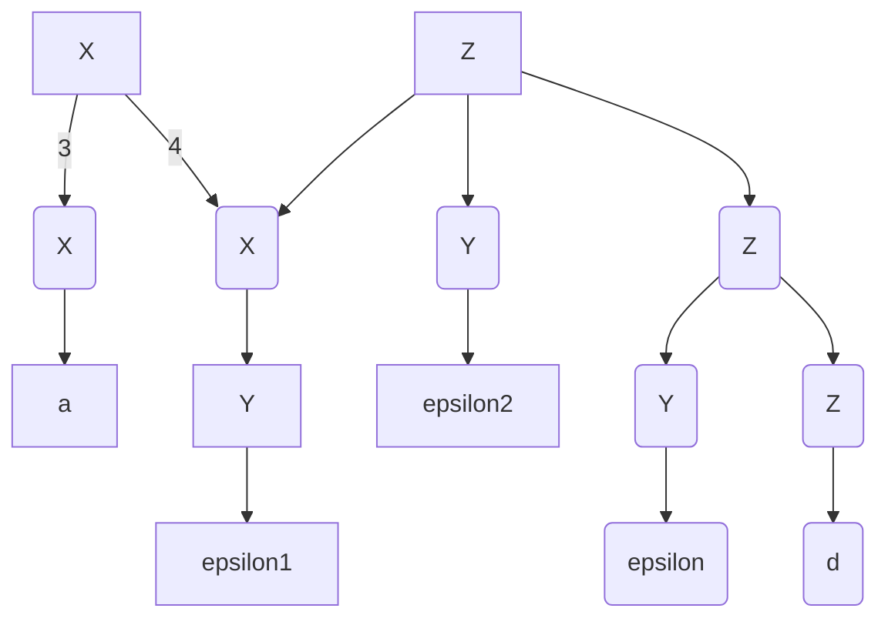

## Exemple 3

>   S –> E$
>
>   E –> E + T | T
>
>   T –> T * F | F
>
>   F –> n | (E)

1.   `First(S,E,T,F) = {n,(}`


|  LL   | **n**   | (       | )        |
| :---: | ------- | :------ | -------- |
| **S** | 0       | 0       |          |
| **E** | 1,2     | 1,2     | **1,2/** |
| **T** | **3/4** | 4/4     | /4       |
| **F** | /6      | **5/6** | /6       |

**Objectif : Créer un parserLL.**

-   On commence par créer une fonction qui permet de parser `E`.

    ```c
    E()
    {
        switch (look_ahead) // On consulte la valeur en question
        {
            case First(E + T):
                	E(); eat(T); T();
                	break;
            case First(T):
                	T();
                	break;
        }
    }
    ```

    

**–> Problème : On a une récursion infinie : on rappelle `E()` sans rien modifier.**

-   On va donc changer la grammaire.

    -   On ne veut pas de récursivité à gauche, on va donc se mettre à droite.

    >   S –> E$
    >
    >   E –> **T + E** | T
    >
    >   T –> **F * T** | F
    >
    >   F –> n | (E)

-   On continue en factorisant les parties communes de la grammaire :

    >   S –> E$
    >
    >   **E –> T E’**
    >
    >   **E’ –> +E | $\epsilon$**

-   On peut donc générer un nouveau code :

    ```c
    E()
    {
        switch (look_ahead) // On consulte la valeur en question
        {
            case First(TE´):
                	T(); E´();
                	break;
            default:
                	error();
                	break;
        }
    }
    
    E´()
    {
        switch (look_ahead) // On consulte la valeur en question
        {
            case First(+E):
                	eat(+); E´(); // +
                	break;
            case Follow(E´): // $
                	error();
                	break;
        }
    }
    ```

-   Mais, cette grammaire nous donne un arbre mauvais :

    ```mermaid
    graph
    S --> E
    S --> A($)
    
    E --> T
    E --> EE(E')
    
    T --> TT(n)
    
    EE --> EEE1(+)
    EE --> EEE2(E)
    
    EEE2 --> TTTT(T)
    EEE2 --> EEEE1(E')
    
    TTTT --> TTTTT(n)
    
    EEEE1 --> EEEEE2(+)
    EEEE1 --> EEEEE3(E)
    
    EEEEE3 --> TTTTTT1(T)
    TTTTTT1 --> TTTTTTT1(n)
    
    EEEEE3 --> EEEEEE1(E')
    EEEEEE1 --> EEEEEEE1(epsilon)
    ```

    

Tout cet arbre, simplement pour afficher `n + n + n` !

“*Notre grammaire a donc suivi une chirurgie esthétique un peu foireuse…!*”

**Il faudrait une grammaire qui soit de la forme :**

>   E –> T (+T | -T)*

```	c
static int E()
{
    int res = T();
    while (look_ahead == '+' || look_ahead == '-') // On consulte la valeur en question
    {
        if (look_ahdead == '+')
        {
            eat('+'); res += T();
        }
        if (look_ahdead == '-')
        {
            eat('-'); res -= T();
        }
    }
    return res;
}
```

Note : *Sûrement utile pour parser les programmes pour 42sh.*

---


# Parser Shift-Reduce

Complément de cours : *Exemple Parser-Reduce 1*

>   S : ||  || –> Pile
>
>   S : ||  (\*( ||
>
>   S : || (\*(S ||
>   S : || S ||
>
>   Reduce 1 : || (\*(S) ||
>
>   Reduce 2 : || (*n ||
>
>   Ace : || S ||


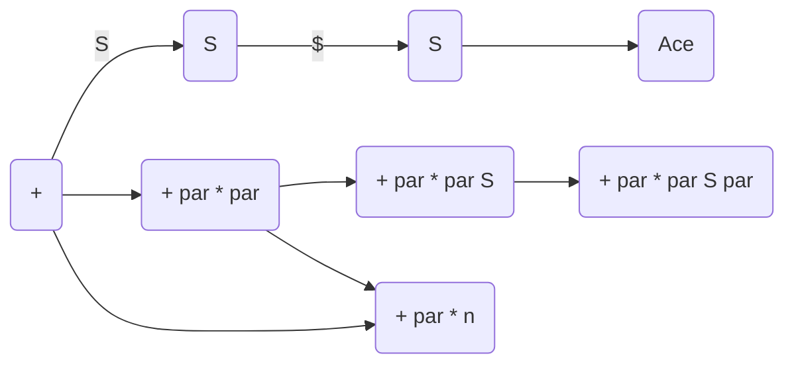

Dans ce schéma : `+` correspond à la `Pile` : `||`.


|       | **Action** | **(** | n    | $    | **)** | **S** |
| :---: | ---------- | ----- | :--- | ---- | ----- | ----- |
| **0** | Shift      | 3     | 6    |      |       | 1     |
| **1** | Shift      |       |      | 2    |       |       |
| **2** | Ace        |       |      |      |       |       |
| **3** | Shift      | 3     | 6    |      |       | 4     |
| **4** | Shift      |       |      |      | 5     |       |
| **5** | Reduce 1   |       |      |      |       |       |
| **6** | Reduce 2   |       |      |      |       |       |


Compléments de cours : *Exemple**s** Parser `LR0`, `LR1` et `CR1`.*

Comme il est visible sur *`Tableau numéro 1 pour Exemple Parser LR0`*, il y a un conflit `R/S`.

Deux possibilités : Soit notre grammaire est ambiguë, soit notre grammaire est trop compliquée à comprendre par notre interpréteur, qui lui est trop simple.


---

