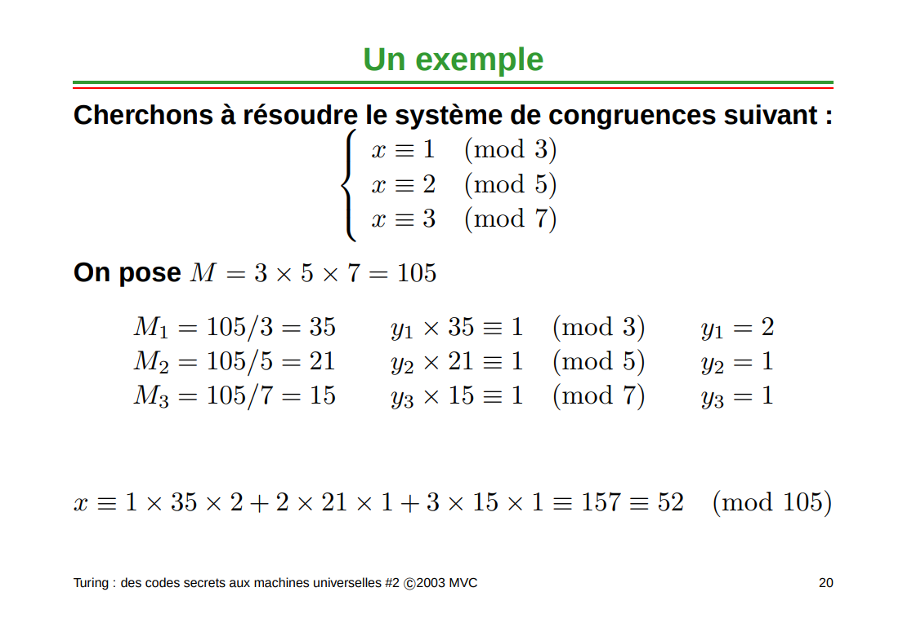

# Chiffrement

`Notes de cours par Thomas Peugnet`.

# Introduction

## Concept général

> - *Alice et Bob souhaitent communiquer en privé*
>
> - *Eve, une oreille indiscrète, souhaite savoir ce qu'Alice et Bob disent*
>   *Alice envoie un message spécifique x, écrit en binaire, à son ami Bob :*
>
> 1. *Alice encode le message en $e(x)$ et l'envoie*
> 2. *Bob applique une fonction de décryptage $d(.)$ pour le décoder : $d(e(x)) = x$*
> 3. *Eve va intercepter $e(x)$ : par exemple, elle peut être un « sniffer » sur le réseau*
>
> *Dans l'idéal, la fonction d'encryptage $e$ est choisie de façon à ce que sans*
> *connaître $d(.)$, Eve ne puisse rien tirer de l'information qu'elle a interceptée*
> *Autrement dit, la connaissance de $e(x)$ ne dit rien sur ce que $x$ pourrait être*
> *Une fonction d'encryptage $e$ : `messages` → `messages encryptés` doit être*
> *inversible -afin de rendre le décryptage possible- et est donc une bijection. Son*
> *inverse est la fonction de décryptage $d(.)$.*
>
> **Extrait de "Cours 5 : Cryptographie et cryptosystème RSA"**.

## Classes d'algorithmes de chiffrement

### Cryptographie symétrique (à l'aide d'une clé privée)
> Les clés de **cryptage** et de **décryptage** sont **identiques**.
> Dans ce cas, l'expéditeur et destinataire possèdent **tous les deux une clé identique**. On parle de clé **privée**.

### Cryptographie asymétrique (à l'aide d'une clé publique)

> Les clés de **cryptage** et de **décryptage** sont **distinctes**.
> L'expéditeur a une clef pour fermer le coffre, et le destinataire une clef distincte, qu'il est le seul à posséder et qui permet d'ouvrir ce coffre. La clef de fermeture **ne permet pas d'ouvrir le coffre**. Elle est **publique**.

> Chaque utilisateur dispose d'une paire de clés : une clé publique et une clé privée.
> La clé **publique** est utilisée pour le **cryptage**. Elle est connue du public.
> La clé **privée** est utilisée pour le **décryptage**. Seul le propriétaire la connaît.

## Arithmétique modulaire

### Théorème de décomposition en facteurs premiers

$\forall n \in \N^*, \space \exists q \in P$ tels que :

- $n = \Pi_1^n p_i^{k_i(p_i)}$

- $p_1 < p_2 < p_{...} < p_n \space \forall n (p_i) \in \N^*$

### Algorithme d'Euclide

- $PGCD(a,b)$ : 
  - $\exists (q,r) \in \N^* \times [a,b] \space | \space a = bq+r$, avec $0 \leq r \leq b$

## Règles

### Associativité

$x + (y + z) = (x + y) + z (\mod n)$

### Commutativité 

$xy = yx (\mod n)$

### Distributivité

$x * (y + z) = xy + yz (\mod n)$

### Exemple

$2345 = (25)69 = 3269 = 169 = 1 (\mod 31)$

# Protocole RSA

## Principe de création des clés

> - Générer deux grands nombres premiers p et q
> - Soit $n = p\times q$
> - Soit $m = (p-1)(q-1)$
> - Choisir un nombre $e$ premier avec $m$ (choix fréquent : $e = 3$)
> - Trouver $d$ tel que $d\times e \mod m = 1$
>
> Ce qui donnera les clés suivantes : 
>
> - Clé **publique** : $(e,n)$
> - Clé **privée** : $(d,n)$
> - **Cryptage** : $y = x^e \mod n$
> - **Décryptage** : $x = y^d \mod n$

> *Lors du calcul de $n=p\times q$, il faut trouver $p,q$ premiers entre eux.*
>
> *Cela revient donc à calculer $\Phi(n) = Card\{m \in [0,n],\space PGCD(m,n)=1\}$*

## Exemple

### Génération des clés

> $p = 7$ et $q = 19$
> $n = 7 * 19 = 133$
> $m = (p-1) * (q-1) = 6 * 18 = 108$
>
> **Choix de $e$ premier avec $m$ :**
> $PGCD(2,108) = 2 ; PGCD(3,108) = 3 ;$
> $PGCD(4,108) = 4 ; PGCD(5,108) = 1$ → $e = 5$
>
> Détermination de $d$ tel que $d\times e \mod m = 1$
> Autrement dit, il existe $k$ tel que $d = (1+km) / e$
> k = 0 → d = 1/5 ; k = 1 → d = 109/5 ; k = 2 → d = 217/5 ;
> k = 3 → d = 325/5 = 65
> ● Clé publique : (n = 133 ; e = 5)
> ● Clé privée : (n = 133 ; d = 65)

### Transmission du message

> Supposons que l'on cherche à transmettre le message `x=6`.
>
> On a actuellement $n=133$, $e=5$, $d=65$.
>
> Le cryptage serait le suivant : 
>
> - $y = x^e [n] = 65 [133] = 7776 [133] = 62$
>
> Le décryptage serait le suivant :
>
> - $x=y^d [n]$
>   - $62^{65} [133]$
>   - …
>   - $62 \times (3884 [133]) [133]$
>   - …
>   - $62 \times 85^2 [133] = 62 \times 43 [133] = 2666 [133] = 6$

Pour casser le code, il faut trouver $d$, l'exposant privé, dans l'équation $d\times e [n] = 1$. Il faut donc connaître $m$ pour résoudre cette équation.

> Autrement dit, il faut d**éterminer les nombres premiers** $p$ et $q$ tels que $p \times q = n$
> Étant donné que $m = (p-1)(q-1)$
>
> En conséquent, il faut trouver la factorisation de $n$ en deux nombres premiers $p$ et $q$.

> ‘*En 2010, **l'INRIA** et ses partenaires ont réussi à factoriser un entier de 768 bits. Il leur a fallu deux ans et demi de recherche, et plus de 1020 calculs. C'est à ce jour le meilleur résultat connu de factorisation.*’ - INRIA

# Application  sur des nombres beaucoup plus grands

> Pour $e$ et $m$ fixés, résoudre l'équation $d\times e [m] = 1$, revient à trouver des entiers $d$ et $y$ tels que :
> $d \times e + m \times y = 1$

Pour résoudre cette équation, il suffit de modifier le déroulement de l'algorithme **d'Euclide**.

## Exemple

> Supposons qu'on veuille résoudre l'équation $15\times d [26] = 1$, autrement dit trouver $d$ et $y$ tels que : $15 \times d + 26 \times y = 1$.

> $PGCD(15,26) =$
>
> - $26 = 15 + 11$
> - $15 = 11 + 4$
> - $11 = 2 * 4 + 3$
> - $4=1*3+1$
> - $3=3*1+0$

> Résolution : 
>
> $ PGCD(15,26)$ :
>
> - $1 = 4 – 3 = 4 – (11 – 2 * 4)$
>
> - $ -11 – 3 * 4 = -11 + 3 * (15 – 11) = 3 * 15 – 4 * 11 = 3 * 15 – 4 * (26 – 15) $
> - $15 * 7 + 26 * -4 = 1$
>
> **Et donc, ici $d=7$.**

# Cours de maths

Résoudre le système d'équations suivant : 

> - $13x = 4[99]$
> - $15x = 56[103]$

On commence par chercher $y$ tel que :

> - $y = 4.15[99]$
> - $y=56.13[103]$

# Codes correcteurs

## Définition

> Soit $A$ tel que $|A|=q \in \N^*$, 
>
> Un code sur $A$ de longueur $n$ est un **sous-ensemble de $A^n$**. Le **log cardinal** d'un code $c$ sur $A$ est la quantité $k=\log_q|c|$. Son taux d'information est la quantité $\frac{k}{n}$.

$A$= $\{n_0, n_1, ...,n_q\}$, et $c \subset A^n$.

$A$= $\{n_0, n_1,n_2\}$, –> $q = 3$. Le cardinal est $3$.

> **Question : ** Donner un exemple de code $c$ de longueur $4$ :
>
> => $c\{n_0, n_1, n_2, n_0 + n_2\}$
>
> => Taux d'information : $\frac{k}{n} = \frac{\log_3|c|}{4}  = \frac{\log_34}{4}$ avec $\log(4)$, $4$ étant le cardinal code en question $|c|$.

## Poids de Hamming

Le poids de $x=(x_1, ..., x_n) \in A^n$ est l'entier $\omega_H(x)=\sharp\{i \in [1,n] \space | x \neq 0\}$.

> **Exemple :**
>
> $x=(1,0,0,1,0)$, $\omega_H(x)=2$.
>
> Distance de **Hamming** = $\forall(x,y)\in(A^n)², d_H(x,y)=\omega_H(x-y)$.
>
> $y=(1,0,1,1,0)$ –> $d_H(x,y)=1$ car il n'y a qu'une seule différence. Pour $x_3 - y_3$, on trouve $-1$, c'est donc une différence supplémentaire.
>
> $y=(1,1,1,1,1)$ et $x=(1,0,0,1,0)$ => $d_H(x,y)=3$.

## Code de répétition

> $\Phi :$
>
> - $F_2$ –> $F_2^n$
> - $m$ –> $(m, ..., m)$
>
> $C = \Phi(F_2)$ : C'est la longueur de $C$ est égal à $n$ et $\log$-cardinal $C =1=\log_n|C|$.

## Code de parité

On considère $C$ défini comme l'image de $F_2^{n-1}$ par :

> $\Phi$ :
>
> - $F_2^{n-1}$ –> $F_2^n$
> - $(m_1, m_2, m_…, m_{n-1})$ –> $(m_1, ..., m_{m-1}\sum_{i=1}^{n-1}ni)$
>
> **=> On compte le nombre de $1$**, et on l'ajoute à la fin du message.

## Distance minimale

La distance minimale d'un code $C \subset A^n$ de longueur $n$ est :

> $d = \min{d_H(x,y)}$, avec $(x,y) \in C$ et $x \neq y$. On choisit la distance minimale de toutes les distances mesurées.

## Code linéaire

> Soient $k,n \in \N$ des entiers, tels que $h \leq n \neq 0$. Un code linéaire de **longueur** $n$ et de **dimension** $k$ est un **sous-espace vectoriel** de $F_q^n$ de dimension $k$.

## Matrice Génératrice

> La **matrice** **génératrice** de $C$ est sous la forme : $C = (I_kA)$ avec $A \in M_{n-k}(F_q)$.

## Dual d'un code 

Le **dual d'un code** $C$ de $[n,k,d]q$ est défini par :

$C^\perp=\{x\in F^n_q |\space \forall y \in C, \space<x,y> = 0\}$.

> **Exemple** : $C = (0,1)$, $C^\perp = \{00, 01\}$ 

## Matrice de contrôle

Une **matrice de contrôle** de $C$ est une matrice **génératrice** de $C^{\perp} = H$

> - $C = \{x \in F_q^n\ | H \times \space ^t x = 0\}$
> - $C^{\perp} = \{x \in F_q^n\ | G \times \space ^t x = 0\}$

## QCM - Révisions 

- Code correcteur (Bonus)

  - Identifier $[n, k,d]$

  - Capacité de correction pour $d=8$

  - Connaissant $G, $ être capable de générer un code

  - Déterminer la matrice de contrôle $H$

  - Décoder un message par syndrôme

