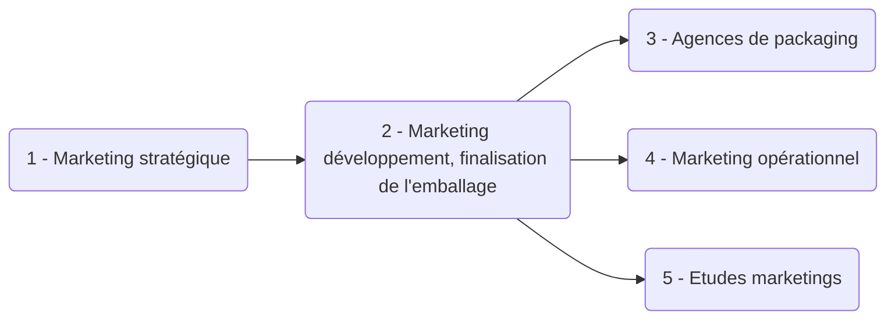
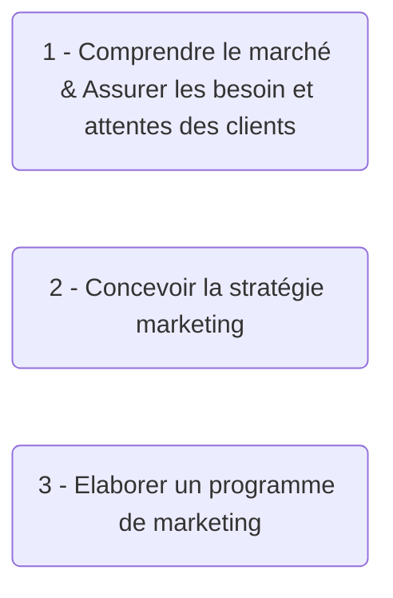
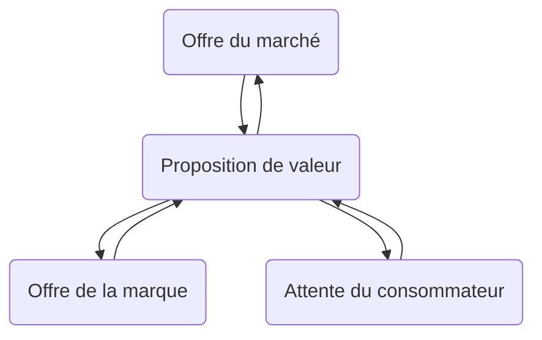

# Marketing

Notes de cours de `Thomas Peugnet`.

Partie 1 : Cours en présentiel sur Toulouse (Incomplet, `[…]`).

Partie 2 : Diaporama sur Moodle

# Partie 1

# Business Model

Le `buisness model` décrit la logique de fonctionnement de l'entreprise.

Plus précisément, comment l'entreprise va :

- Créer de la valeur pour les clients
- Délivrer de la valeur pour les clients
- Capturer de la valeur

## Business Model Canvas

### Ressources et activités clés

### Partenaires

Ce sont les différents intervenants avec lesquels l'entreprise va interagir pour son fonctionnement.

> Il existe plusieurs types de partenaires. Commerciaux, Technologique, Industriels. Ces derniers peuvent s'occuper de la gestion de la production, de la sous-traitance ou encore de la logistique.

### Coûts

#### Logique de coûts

-> Objectif : Proposer des produits à des coûts bas

-> Proposition de valeur basée sur les prix bas

#### Logique de valeur

-> Objectif : Être considéré comme un produit premium

-> Préoccupé par la qualité

### Structure des coûts

- Coûts **fixes** : Identiques quelque soit le volume des ventes
- Coûts **variables** : Variation des coûts en fonction de l'activité
- Économie d'échelle : baisse des coûts au fur et à mesure de la production
- Économie d'envergure : `[…]`

### Segments clientèle

- Ce sont des groupes de clients dont les besoins requièrent et justifient une offre distincte.
- Ils utilisent des canaux de communication différents.
- Il exigent différents types de relation. (Ex. voitures de luxe.)

- Ils n'ont pas la même rentabilité.

#### Relation client

Cette dernière dépend des objectifs : 

- Acquérir des clients
- Fidéliser les clients actuels
- Ventes supplémentaires

**Exemple** : Traitement par un conseiller et traitement automatisé.

### Canaux

- Internes
  - Force de vente, Site e-commerce, Magasin
- Externes
  - `[…]`

### Revenus

- Ventes de biens et de services
- Frais d'usage
- Abonnements
- Locations / Prêts
- Publicité
- Licensing (vente / location de propriété intellectuelle)
- Frais de courtage
  - Mise en relation (Airbnb…)
- `[…]`

### Proposition de valeur

Pour `quoi` paye le client ? 

#### Valeur

- Quantitative
  - Prix
  - Rapidité de services

- Qualitative
  - Qualité globale du produit
- `[…]`

#### Créer de la valeur pour le client

`Innovation`, `Nouveauté`, `Performance`, `Personnalisation`, `Accompagnement`, `Design`, `Marque / Statut`, `Prix`, `Réduction des coûts`, `Réduction des risques`, `Accessibilité`, `Dimension RSE`.

Il est possible de combiner plusieurs de ces critères.

**Exemple** :  Apple, innovation technologique et design recherché.

`Accessibilité` : 

-> Quand on achète une part d'un portefeuille d'action.

-> Création d'une copropriété de jets privés

# La fonction Marketing en entreprise

## Marketing Stratégique

> C'est ce qui définit les orientations stratégiques.
>

## Marketing développement

> - Développe les produits et services commercialisés par l'entreprise
>
> - Chef d'orchestre
>
> - Interagit avec le service recherche et développement

## Marketing opérationnel

> - Développe les outils permettant de commercialiser les produits et services développés par le **marketing développement**.
>
> - Implante les filiales sur le terrain

## Études marketing

> - Étudie les marchés et les tendances des consommateurs
>
> - Gère toutes les études de marché nécessaires au développement de nouveaux services

## Exemple

*Le marketing n'a pas un rôle uniquement dans le secteur marchant. Les lieux culturels permettent d'amener plus de visiteurs, dans les musées, par exemple. Pour les œuvres caritatives, le marketing permet de récolter des dons.*

# Différence entre communication et marketing

## Marketing

- Analyser l'environnement
- Développer l'offre et son avantage concurrentiel
- Définir la cible

> L'objectif est d'identifier les marchés rentables et de se différencier de la concurrence.

`[…]`

## Communication

> - Faire connaître l'offre de l'entreprise
> - Déterminer le positionnement de la marque
> - Augmenter la visibilité et la notoriété
>

`[…]`

# Partie 2

# Marque

## Définition

> *Une marque est un nom, un terme, un symbole, un signe, un design ou une combinaison de ces différents attributs, avec le but d’identifier les biens et les services d’un vendeur ou d’un groupe de vendeurs, et de les différencier de la concurrence. »*

> *Une marque est une relation entre un produit, un business et un consommateur.*

# Marché / Cibles

> L'objectif est d'identifier les profils-clés des consommateurs, leur mode de fonctionnement et leurs besoins par rapport à un produit ou à un service.

- Quelles sont les sources qui sont utilisées par le consommateur ?
- Qui sont les clients ?
  - Quelles sont leurs motivations ?
  - Quels sont leurs besoins ?
  - Qu'est-ce qu'ils évitent ?

# Démarche Marketing

## Insights

> Un **insight** marché correspond à la découverte d'une **réalité pertinente**, concrète et auparavant inexploitée concernant un marché cible. On l'obtient à la faveur d'une analyse subjective et approfondie de données.

> Un **consumer insight** est une **opinion**, un **comportement** ou une **attente dominante** présente et détectée chez les consommateurs d'un produit.

## Paint Points

> *L'expression "**pain points**" ou “points de douleur” désigne un problème irritant auquel est confronté un client. Il peut s'agir d'un problème spécifique rencontré par un prospect lors de ses interactions avec les services de l'entreprise, ou d'un problème plus profond demandant davantage d'investigations.*

## Désirs

> *Un désir est un moyen privilégié par un consommateur pour satisfaire un besoin.*
>
> => Un désir est un moyen de satisfaire un besoin. (EPITA Marketing : JL. Viard-Gaudin, 2022)

> *Les désirs sont influencés par l'environnement et l'expérience antérieur du consommateur.*

Le marketing influe le consommateur sur la façon dont il choisit de répondre à un besoin.

## Problématique

Une problématique doit toujours résulter d'une démarche marketing. Cette problématique doit répondre à un enjeu, faire le lien avec les différents concepts analysés et être pertinent par rapport à la solution proposée.

## Les `Persona`

> Il existe un procédé optimisé pour définir des cibles. Il s'agit de définir des profils type, nommés **Persona**.

Dans l'exemple du diabète vu dans le cours de Paris, il existe 5 `Persona` :

- Le combatif organisé
- Le combatif système D
- L'optimiste insouciant
- L'esquiveur dans le déni

- L'anxieux résigné

# Analyse de la concurrence

> L'objectif est de comprendre le marché à travers les axes de positionnement des principaux concurrents. Il sera ensuite possible d'observer les opportunités pour la marque en dressant une cartographie des différents axes.

L'idée est de diviser l'analyse en quatre points distincts :

- Qui ?

  > Comment je me présente ? Quel est mon domaine d’expertise, mon origine ?

- Quoi ?

  > Quel est le cœur de l’offre ? Quels sont les services/produits proposés ?

- Pour quoi ?

  > Qu’est-ce que je promets à mes clients ? À quoi je m’engage ?

- À travers quoi ?

  > Quels sont les moyens mis en place pour livrer la promesse ?

## `POD` : "Point of difference"

C'est la réponse à la question : 

> Qu'est-ce qui fait votre différence ?

- C'est l'argument qui permet de se démarquer des autres entreprises concurrentes.

- C'est un attribut/bénéfice **unique** qui est est fortement associé à la marque par le public.

**Exemple** : Un iPhone : Téléphones luxueux, matériaux nobles, etc.

## `POP` : Point of Parity

> Ce sont les attributs qui sont partagés par la marque ainsi que ses concurrents.

Il s'agit, en quelques sortes, des fondamentaux à posséder pour être reconnu comme légitime dans son domaine d'application.

**Exemple : ** Un iPhone doit être capable de se connecter à Internet rapidement, comme tous les smartphones des marques concurrentes.

## Analyse compétitive

L'idée est de diviser l'analyse en quatre points distincts :

- Concurrents
- Forces
- `POP`
- `POD`

# Échelle des bénéfices

> À partir des informations récoltées grâce aux analyses concurrentielles et aux démarches marketing, l'objectif est de construire une échelle des bénéfices du point de vue des **cibles**. (Consommateurs)
>
> => C’est dans cette échelle de bénéfice que l’on doit mettre en lumière les territoires fertiles pour sécuriser les `POP` et identifier les `POD` les plus porteurs

# Proposition de valeur

C'est un point qui rejoint l'idée de `POD`, car c'est ce qui répond à la question : 

> Pourquoi devrait-on choisir vos services plutôt que ceux de la concurrence ?

C'est donc une offre qui va devoir être un mélangés de compromis entre l'**offre de la marque**, l'**offre du marché** et l'**attente du consommateur**.

C'est la formulation claire et précise de l'expérience que font les clients des services proposés.

# Partie 3

## Définitions

Le **BtoC** (ou B2C) = Business to Consumer - ex Danone pour son activité de commercialisation de ses yaourts auprès des consommateurs.

 Le **BtoB** (ou B2B) = Business to business - ex Danone pour son activité de commercialisation de ses yaourts auprès des distributeurs.

Le **BtoBtoC** (ou B2B2C)= Business to business to consumers - ex Doctolib pour son activité business avec les hôpitaux et le corps medical, puis en relais avec les patients.

Le **BtoG** = Business to Government- ex Doctolib pour son activité de partenariat avec l’Etat

## Business Model Canvas

1. Partenariats
2. Activités clés
3. Ressources clés
4. Proposition de valeur
5. Relation client
6. Canaux
7. Segments Clients
8. Structure de coûts
9. Flux de revenus
