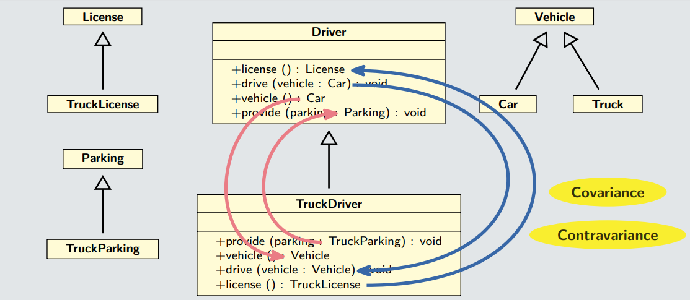
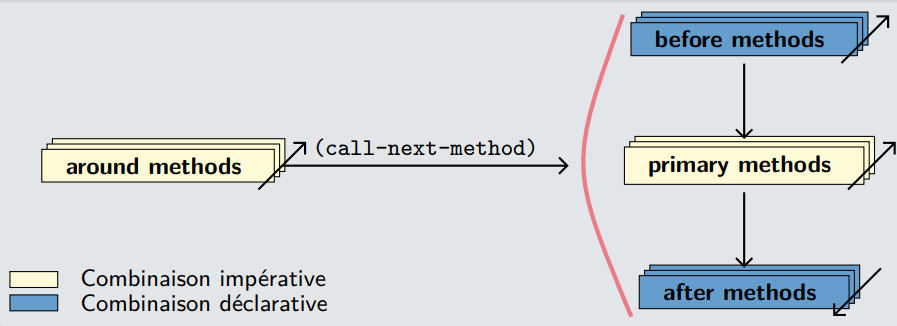
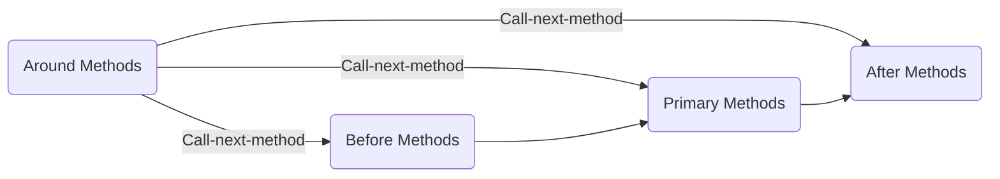
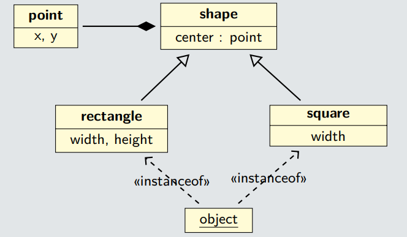

# Modélisation Objet

`Notes de cours par Thomas Peugnet`.

## Introduction

**1986** : *ACM Lisp and Functionnal Programming Conference*

- C'est un groupe informel pour standardiser un système objet.

**1994** : Standardisation du `Lisp`.

=> `Flavors`, `Common Loops`, `Lucid`.

## Caractéristiques

### `CLOS`

> C'est un langage **stratifié et flexible**.
>
> - API (syntaxique) => API (fonctionnelle) => Implémentation
> - Il est possible de modifier les fonctions internes au langage.

> `CLOS` est constitué de **fonctions génériques.**
>
> - Envoi de message inadapté aux opérations n-aires.
> - Multi-méthodes
> - Extension naturelle des fonctions classiques.

**Remarque** : `Dylan`: Langage Multi Méthode, orienté objet et dérivé du `Lisp`.

Il est possible de faire de **l'héritage multiple**, ainsi que de la **combinaison de méthodes**.

> L'Ordre supérieur (MOP) :
>
> - Possibilité d'utiliser des `Meta-objects` : Fonctions génériques, classes …
> - Première classe : Manipulation anonyme …

**Typage dynamique : ** Le fait de pouvoir ne pas typer des variables. La 'découverte' du type se fait durant le **runtime**.

Il n'existe pas de `Public`, `Protected`, `Private` en `CLOS`. 

# Classes et objets

## Classes et objets

```lisp
(defclass human () (name size birth-year))
```

- C'est une définition fonctionnelle. 
- Elle possède un cycle de vie dynamique, car sa création, sa modification, sa suppression se font durant le **runtime**. 
- Il n'y a **pas** de système de protection.

**Note : ** Les arguments entre parenthèses juste après la définition de la fonction sont appelés **Symboles**.

### Instanciation

```lisp
(make-instance 'human)
```

Il n'y a pas de constructeur. L'exemple ci-dessus permet d'instancier un objet de type `Human`.

**Note : ** Il n'y a pas besoin de libérer la mémoire une fois la création de l'objet. Il y a un `Garbage collector` intégré à `CLOS`.

```lisp
(defclass human ()
    ((name :initarg :name)
    (size :initarg :size)
    (birth-year :initarg :birth-year)))

(make-instance 'human :name "Alain Térieur" :size 1.80 :birth-year 1970)
```

Pour initialiser les attributs de la classe par défaut :

```lisp
(defclass human ()
    ((name :initarg :name)
    (size :initarg :size)
    (birth-year :initarg :birth-year :initform 1970)))

(make-instance 'human :name "Alain Térieur" :size 1.80)
```

`make-instance` fonctionne, mais par convention il vaut mieux faire `make-<class>`.

Soit donc l'exemple suivant :

```lisp
(defun make-human (name size &rest keys &key birth-year)
	(apply #'make-instance 'human :name name :size size
           									keys))

;; (make-human "Alain Térieur" 1.80)
;; (make-human "Alex Térieur" 1.80 :birth-year 1939)
```

`&rest` récupère tout ce qui se trouve juste après.

**Avantage : ** Lors de la **surcharge**, en ajoutant un attribut, cette manière de faire simplifie les choses.

## Portée et accessibilité de l'information

### Portée de l'information

Il est question des **slots locaux** et des **slots partagés**.

```lisp
(defclass human ()
    ((population :allocation :class :initform 0)
        (name :initarg :name)
        (size :initarg :size)
        (birth-year :initarg :birth-year :initform 1970))
```

Par défaut, on a : `:: allocation :instance`. Il n'y a pas d'accès standard aux slots partagés à travers les classes.

Par ailleurs, il n'y a pas d'équivalent directe des méthodes de classes (**statiques**).

### Accessibilité de l'information

```lisp
(slot-value alain 'birth-year)
```

`Alain` est une instance, résultat d'un `make-human…`. 

- Il s'agit toujours d'un accès fonctionnel
- C'est une fonction commune à toutes les classes

### Accesseurs

```lisp
(defclass human ()
    ((name :initarg :name :reader name :writer rename)
        (size :initarg :size :accessor size)
        (birth-year :initarg :birth-year :initform 1970 :reader birth-year)))

(name alain) ;; => "Alain Térieur"
(rename "Alain Verse" alain) ;; => "Alain Verse"

(size alain) ;; => 1.80
(setf (size alain) 1.78) ;; => 1.78

(birth-year alain) ;; => 1970
(setf (birth-year alain) 1971) ;; error
```

Note : Il n'est pas question de `Getter` ou de `Setter`, mais de `Reader` ou de `Writer`.

**Remarque : ** Il y a une génération automatique de fonctions (génériques).

`Getter` $\neq$ `Reader`. Un `Reader` permet de pouvoir accéder à une variable sans avoir besoin d'en modifier le nom, partout où elle apparaît dans le code.

### Comportement hors classe

```lisp
(defun hello (human)
    (format t "Hello! I'm ~A, ~Am, ~Ayo.~%"
        (name human)
        (size human)
        (age human))
    (values))	
```

**Remarque : ** Le développeur doit toujours être vigilant quant à la protection de ses classes.

## Intégration classes / types

Il existe une forte intégration de type / classe.

> - Il y a une hiérarchie unique : classe racine `t (class-of)`
> - Correspondance classe / type `(type-of, typep)`
> - Correspondance type natif / classe

**Remarque : ** sous-classage $\Leftrightarrow$  sous-typage `(subtypep)`

**MOP** : (Possède une réflexivité totale : introspection / intercession)

> - Les classes sont des objets (système de type de première classe)
> - Métaclasse : Classe d'une classe.
> - `standard-class`: Il s'agit d'une classe des classes utilisateurs.

# Héritage

## Rappels

- Agrégation : C'est la relation "ensemble / partie"
- Composition : Agrégation plus forte
- Héritage d'inclusion implicite

```lisp
(defclass employee (human)
    ((company :initarg :company :reader company)
        (salary :initarg :salary :accessor salary)
        (hiring-year :initarg hiring-year)))
```

## Modèles de l'héritage

### Spécificités

Héritage **implicite** : 

> - Il existe une hiérarchie de classe unique.
> - `user-class` –> … –> `standard-object` —> `t`
> - Il n'y a aucun slot. (cf `print-object`).

Héritage des **slots** :

> - C'est différent des systèmes traditionnels
> - Il y a un slot unique, sans ambiguïté.

Héritage des **options** : 

> - `initargs`, `intforms`, …
> - Les modalités sont différentes selon les options.

Héritage des **méthodes** : 

> - Sous-classage $\Leftrightarrow$ sous-typage 
> - Aucun héritage des méthodes car les méthodes sont définies en dehors des classes.

Dans l'exemple ci-dessous, il n'y a qu'un seul point d'entrée `make-instance`.

Le `let` est simplement utilisé pour la valeur de retour.

```lisp
(defun make-employee (name size company salary hiring-year
								&rest keys &key birth-year)
    (let ((employee (apply #'make-instance 'employee
                            :name name :size size
                            :company company :salary salary
                            :hiring-year hiring-year
                            keys)))

    (incf (slot-value employee 'population))
    employee))
```

## Problèmes liés à l'héritage

Ce qui **persiste** : 

> - L'héritage vs l'instanciation
> - L'ambivalence de l'héritage 
>   - *Sous-classage* $\Leftrightarrow$ *Sous-typage*

**Alternatives** : 

> - Héritage par restrictions, programmation différentielle.
> - Héritage multiple, en diamant.

# Polymorphisme

## Rappels

La notion de **surcharge **:

> - Il n'y a aucun intérêt à utiliser des types dans un langage dynamique.
> - La cardinalité est trop **ambiguë** et trop **compliquée**.
> - La surcharge est donc **remplacée** par une **sémantique d'appel plus riche.**

La notion de **masquage :**

> - Aucun intérêt dans les **fonctions** **génériques**.
> - Le masquage est spécifique aux **méthodes** **membres**.

## Fonctions génériques

```lisp
(defgeneric translate (object x &optional y))
```

Sur l'exemple ci-dessus : 

> - Il s'agit d'une définition fonctionnelle (`defgeneric` est une macro).
> - La fonction possède un cycle de vie dynamique.
>   - Les objets sont gérés lors de l’exécution.
> - La déclaration est optionnelle.

**Remarque** : les `Reader` et les `Writer` sont des fonctions génériques, que l'on peut donc modifier.

L'exemple ci-dessous est une méthode `translate()` :

```lisp
(defmethod translate ((circle circle) x &optional (y 0))
    (translate (center circle) x y))
```

On peut donc remarquer :

> - Une définition **fonctionnelle**
> - Un typage **dynamique**
> - La spécialisation sur les arguments est **obligatoire**.
> - Une méthode est une **implémentation** **particulière**.
> - Les méthodes ne sont **pas** **exécutables** et **anonymes**.
>   - Lors de leur appel, on commence par appeler la **fonction** **générique**. C'est cette dernière qui va choisir quelle fonction convient le mieux à l'appel précédemment effectué.
> - Multi-méthodes (la spécialisation est possible sur **plusieurs** arguments).

```lisp
(defgeneric hello (object))
    (defmethod hello ((human human))
        (format t "Hello! I'm ~A, ~Am, ~Ayo.~%"
            (name human)
            (size human)
            (age human))
    (values))
    (defmethod hello ((employee employee))
        (call-next-method)
        (format t "Working at ~A for ~A euros, started at the age of ~A.~%"
            (company employee)
            (salary employee)
            (hiring-age employee))
    (values))
```

## Relations classe / type

### Rappels



### Covariance et contravariance

# `CLOS` avancé

## Protocoles standards





**Rôles des méthodes :**

- `primary` : travail principal, retour de valeur.
- `before` / `after ` : effets de bords.
- `around` : travail auxiliaire

**Effets de bords :** Ce sont des modifications, une sorte de `trigger`.

```lisp
(defmethod hello ((human human))
    (format t "Hello! I'm ~A, ~Am, ~Ayo.~%"
        (name human)
        (size human)
        (age human))
    (values))
(defmethod hello :after ((employee employee))
    ;(call-next-method)
    (format t "Working at ~A for ~A euros, started at the age of ~A.~%"
        (company employee)
        (salary employee)
        (hiring-age employee))
    ;(values))
```

On enlève le `call-next-method` et on le remplace par `:after`.

On enlève `values`, car on a pas de retour de valeur. `after` fait simplement des effets de bords.

## Combinaisons de méthodes

Utilisation d'une ou plusieurs méthodes (primaires) applicables

Spécification déclarative plutôt qu'impérative

Combinaison standard (par défaut) : la méthode la plus spécifique

- > `before`, `after`, `around`.

Combinaisons disponibles (built-in)

> - `+, min, max, list, nconc, append, and, or, progn`
>   - `nconc`: concaténer
>   - `append` :  renvoie la liste concaténée
> - Aucun `before` et aucun `after`.
> - `call-next-method` rigoureusement interdit.

Programmation de nouvelles combinaisons

> - `define-method-combinaison`
> - Deux formes

## Application

### La combinaison de `progn`

```lisp
(defgeneric nurse (animal)
    (:method-combination progn))

(defmethod nurse progn ((mammal mammal))
    ;(when (next-method-p) (call-next-method))
    (format t "I suckle my children.~%")
    (values))

(defmethod nurse progn ((oviparous oviparous))
    ;(when (next-method-p) (call-next-method))
    (format t "I brood my eggs.~%")
    (values))
```

Intérêt de `progn` : En `CLOS`, `progn` va faire automatiquement l'appel à toutes les fonctions nécessaires. Cela permet également de supprimer la ligne `(when (next-method-p) (call-next-method))`.

### Instanciation

- `make-instance` : calcul et validité des options d’initialisation.

- `allocate-instance` : allocation d’un objet non initialisé.
- `initialize-instance` : appel à `shared-initialize`.
- `shared-initialize` : initialisation des `slots`.

### Vérification post-initialisation

```lisp
(defmethod initialize-instance :after ((human human) &key)
    (slot-value human 'name)
    (slot-value human 'size)
    (incf (slot-value human 'population))) ;; bonus
(defmethod initialize-instance :after ((employee employee) &key)
    (slot-value employee 'company)
    (slot-value employee 'salary)
    (slot-value employee 'hiring-year))
```

### `eql` Specializers

Exemple de pattern matching :

```lisp
(defgeneric product (x y)
    (:method (x (y (eql 0))) 0)
    (:method ((x (eql 0)) y) 0)
    (:method (x y) (* x y)))
```

Exemple d'une classe Singleton :

```lisp
(defclass singleton (#|...|#)
    (#|...|#))
(let (instance)
    (defmethod make-instance
        ((class (eql (find-class 'singleton))) &key)
    (or instance (setf instance (call-next-method)))))
```

Exemple d'un faux slot partagé :

```lisp
(defclass human (#|...|#)
    (#|...|#))
(let ((population 0))
    (defmethod initialize-instance :after ((human human) &key)
    	(incf population))
	(defgeneric census (obj)
        (:method ((human human)) population)
        (:method ((class (eql (find-class 'human)))) population)
        (:method ((symbol (eql 'human))) population)))
```

On peut donc avoir des `eql` specializers sur des arguments. Ils permettent d'avoir un meilleur niveau d'abstraction, et d'ajouter toutes sortes de fonctionnalités n'étant pas natives en `CLOS`.

# Meta-classes

## Principe

- Spécialiser le comportement d'une ensemble de classes.
- Faire une classe de classes (une meta-classe)

## Processus

1. Créer une meta-classe (sous-classer `standard-class`)
2. Macrologie (Couche 1)
3. Déclarer sa validité (Couche 3 / MOP)
4. Spécialiser (option `:metaclass de defclass`)

## Applications

### Classes abstraites

```lisp
(defclass abstract-class (standard-class) ())

(defmethod validate-superclass
    ((class abstract-class) (superclass standard-class))
    t)
(defmethod validate-superclass
    ((class standard-class) (superclass abstract-class))
    t)
(defmethod make-instance :before ((class abstract-class) &key)
    (error "~A is an abstract class." (class-name class)))

;; (defclass foobar (#...#)
;; (#...#)
;; (:metaclass abstract-class))
```

### Classes finales

```lisp
(defclass final-class (standard-class) ())

(defmethod validate-superclass
        ((class final-class) (superclass standard-class))
    t)
(defmethod validate-superclass
        ((class standard-class) (superclass final-class))
    nil)
(defmethod validate-superclass
        ((class final-class) (superclass final-class))
    nil)

;; (defclass foobar (#...#)
;; (#...#)
;; (:metaclass final-class))
```

Sur la ligne 2&3, on essaye de créer une sous classe de `standard-class`.

### Classes singleton

```lisp
(defclass singleton-class (standard-class)
	((instance :initform nil)))

(defmethod validate-superclass
		((class singleton-class) (superclass standard-class))
	t)
(defmethod validate-superclass
    	((class standard-class) (superclass singleton-class))
    nil)
(defmethod make-instance ((singleton-class singleton-class) &key)
    (or (slot-value singleton-class 'instance)
    	(setf (slot-value singleton-class 'instance) (call-next-method))))

;; (defclass foobar (#...#)
;; (#...#)
;; (:metaclass singleton-class))
```

# Redéfinitions

###**Rappels** :

> - **Classe** ⇔ **Type fixe**, connue à la compilation.
> - **Objet** ⇔ **Valeurs variables**, de type fixe, connu à la compilation.
> - Nouveau contexte :
>   - Langage **dynamique**
>     - *Les valeurs ($\neq$ variables) portent leur propre information de type*.
>   - **MOP**
>     - *Chaque composant du système objet est lui-même un (méta-)objet, donc modifiable.*
> -  Nouvelles fonctionnalités :
>   - **Ajout** / **Suppression** / **Modification** de classes, méthodes, fonctions génériques.
>   - Changement de classe d’une instance.

###**Héritage par restriction**

> Le problème cercle/ellipse (carré/rectangle) 
>
> - Un carré est un rectangle… …mais avec des contraintes statiques… …et dynamiques 
> - Programmation Différentielle : 
>   - Hériter de manière **additive** et **non restrictive** 
>   - Problème surtout lié à la **mutation**

###**Changement de classe**

- `change-class` : Modification destructive d’un objet (sans changement d’identité).

- `update-instance-for-different-class` : Validité des options d’initialisation.

- `shared-initialize` : Initialisation des slots.



**Côté rectangle**

```lisp
(defun make-rectangle (width height)
    (if (= width height)
   		(make-instance 'square :width width)
    (make-instance 'rectangle :width width :height height)))

(defmethod (setf width) :after (width (rectangle rectangle))
    (when (= (width rectangle) (height rectangle))
        (change-class rectangle 'square)))

(defmethod (setf height) :after (height (rectangle rectangle))
    (when (= (width rectangle) (height rectangle))
    	(change-class rectangle 'square)))
```

**Côté carré**

```lisp
(defclass square (shape)
	((width :initarg :width :reader width :reader height :accessor side)))
(defmethod (setf width) (width (square square))
    (let ((side (side square)))
        (unless (= width side)
        	(change-class square 'rectangle :width width :height side)))
        	width)

(defmethod (setf height) (height (square square))
    (unless (= height (side square))
        (change-class square 'rectangle :height height))
        height)
```

# Visiteurs

## Objectifs

- Ne pas toucher à la hiérarchie de départ

- Abstraire le parcours de la structure

##Mécanisme

> - Hiérarchie de départ
>   - Visitable (classe abstraite)
>   - Accepte des visiteurs (méthodes)
> - Visiteurs
>   - savoir visiter (classe abstraite) …
>   - … chaque composant (méthodes)
