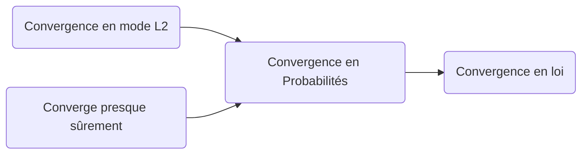

# Statistiques

`Notes de cours par Thomas Peugnet`

# Matrices stochastiques

## Définition

$A=(a_{ij})$ stochastique :

- $A_{i,j} \ge 0$ pour $\forall (i,j) \in [1,n]$
- $\forall i \in [1,n]$ pour $\sum_{j=1}^na_{ij}=1$

## Partie 1

> Une particule a 2 états possibles, 1 et 2. Elle passe de 1 à 2 de façon aléatoire $(\Omega, F, P)E_P$ tel que : 
>
> - $\forall n \in \N, \space X_n = $ état de la particule au temps $n$.
>
> À $n$ : 
>
> - Si $X_n=1$, alors $X_{n+1}=2$ avec la probabilité de $1/2$.
> - Si $X_n=2$, alors $X_{n+1}=1$ avec la probabilité de $1/2$.
>
> **$P(X_0=1)=P(X_0=2)=1/2$** -> ce qui permettra d'établir la loi de $X_1$.

Ainsi, 

- $P(X_1=1)=1/2 P(X_0=1) + 1/4 P(X_0 = 2)$

- $P(X_1=2)=1-P(X_1=1)$

On pose $\mu_n = (P(X_n=1), P(X_n=2))$, montrons que :

- $\forall n \in \N, \mu_{n+1}=\mu_n A$
- $A=\begin{pmatrix}
  1/2 & 1/2\\
  1/4 & 3/4
  \end{pmatrix}$​

Soit $n \in \N$, $\mu_{n+1}=(P(X_{n+1}=1), P(X_{n+1}=2))$

- $P(X_{n+1}=1)= \space \frac{1}2P(X_n=1) + \frac{1}4P(X_n = 2)$
- $P(X_{n+1}=2)= \space \frac{1}2P(X_n=1) + \frac{1}4P(X_n = 2)$

=> $\mu_{n+1}=\mu_n\times \begin{pmatrix}
1/2 & 1/2\\
1/4 & 3/4
\end{pmatrix}$

On a donc, $\forall n \in \N, \space \mu_n = \mu_0 \times A^n$ -> $\mu_5$

**Question :** Temps de premier accès : $T$ la variable égale au plus petit entier naturel $n$ tel que $X_n=1$.

- $P(T=1)=P((\cap_{k=0}^{n-1}\{X_k=2\}) \cap \{X_n=1\})$ avec $\cap_i^j$ correspondant à la somme intersectionnelle.
- $\prod_{k=0}^{n-1}P(X_K =2)\times P(X_n=1)$

On a donc :

$A^n= \begin{pmatrix}
1/2 & 1/2\\
1/4 & 3/4
\end{pmatrix}^n$

[…]

Finalement :

- $\forall n \in \N, \space A^n= \begin{pmatrix}
  1 & -2\\
  1 & 1
  \end{pmatrix}\begin{pmatrix}
  1/3 & -1/3\\
  \frac{2}{3\times 4^n} & \frac{2}{3\times 4^n}
  \end{pmatrix}$
- => $P(X_{k=2}) = 1/3(\frac{1}2 + \frac{1}{4^k} - \frac{1}2 + \frac{1}{4^k})$
- => $1/2\times 1/{4^k}$

$\prod_{k=0}^{n-1}q^k=q^{\sum_{k=1}^{n-1}k} = q^{\frac{n(n-1)}2}$

> Soit $A \in M_p(\R)$, stochastique $(\forall i,j \space A[i,j] \ge 0)$ et $(\forall i, \sum_{j=1}^nA[i,j]=1)$
>
> **S1 : ** Montrer que : $x_A (1) = 0$
>
> **S2 : ** Montrer que : $\exists X \neq 0$ tel que $AX=X$
>
> - $\forall X \in \R^P 0_\R=(x_1 ... x_p)$

# Espace Probabilisé ($\Omega, B, P$)

## Définition

> $A \subset P(\Omega) :$
>
> - $\forall A \in A, \overline{A} \in B$ avec $B$ un espace, et $A$ un évènement => $\Omega \in B$
> - $\emptyset \in B$ => $\Omega \in B$
>
> - $\forall (A_1, ..., A_n) \in B^n, \space \cup^n_{i=1}A_i \in B$
>
> => **$\cap_{i=1}^n\overline{A_i} \in B$.**
>
> $\Omega = \{a,b,c\}$
>
> $B=\{\emptyset, \Omega, \{a\}, \{b\}, \{c\}, \{a,b\}, \{a,c\}...\}$
>
> $P: B$ –> $[0,1]$ et $\omega$ –> $P(\omega) $ tel que $P(\Omega) = 1$ et $\forall (i,j) \in I^2$, avec $i \neq j$ et $A_i \cap A_j = \emptyset$

# Variable aléatoire discrète ou continue

Étant donné un espace probabilisé ($\Omega Σ, P$), **une variable aléatoire est une fonction** $X : Ω → R$.
L'ensemble de ses valeurs possibles est $X(Ω)$.

Si on peut écrire $X(\Omega)=\{x_1, x_2, x_3, ..., x_n\}$, alors on dit que $X$ est une variable discrète.

Si $X(\Omega)$ contient des intervalles, alors $X$ est une variable continue.

> On obtient donc : $P$ :
>
> - $P(X(\Omega))$ –> $\R$
> - $A$ –> $P(X \in A)$
>
> **Contrainte : ** $\sum_{n\in k}P(X=n) = 1$

## Variable continue

Une variable aléatoire $X $ est continue si l'ensemble $X(Ω)$ de ses valeurs possibles est un **intervalle** de $\R$.

### Tribu

> Une tribu de $\R$ est un ensemble $Σ ⊂ P(R)$ tel que :
>
> - $\R \in \Sigma$
> - $\forall A ∈ Σ, \overline{A} ∈ Σ$
>
> - $\forall$ famille $(A_n , n ∈ K)$ de $Σ ($avec$ K ⊂ \N)$, $\cup_{n\in K}A_n \in \Sigma$

### Loi de probabilité

> Une loi de probabilité sur $Σ$ est une fonction $P : Σ → R^+$ telle que :
>
> - $P(X\in \R) = 1$
> - Pour toute famille disjointe : $\sum_{n\in K} P(X \in A_n)$.

### Tribu borélienne

> La tribu borélienne est la tribu $Σ$ engendrée par tous les intervalles $$]−∞, x], x ∈ R.$$
>
> **La fonction de répartition** d'une variable aléatoire $X$ est la fonction : $F_x$ : 
>
> - $\R$ –> $[0,1]$
> - $x$ –> $P(X \in [-\infty, x])$
>
> $F_x$ doit être croissante, 
>
> - $\lim_{x\rightarrow-\infty}F(x) = 0$,
> - $\lim_{x\rightarrow+\infty}F(x) = 1$

**Règles : ** Pour $\forall (a, b) ∈ \R^2$ tel que $a \leq b$ :

> - $[a, + \infty[$ –> $P = 1 - F(a)$
> - $[a, b]$ —> $P=F(b) - F(a)$
> - $]-\infty, a[$ –> $P=\lim_{a^-} F(x)$
> - $[a, +\infty]$ –> $P = 1 - \lim_{a^-}F(x)$
> - $[a,b]$ –> $P=F(b) - \lim_{a^-}F(x)$

Si $F$ est continue en $a$, alors $P(X\in [a,a]) = F(a) - \lim_{x^-}F(a) = 0$

### Fonction de densité

S'il existe une fonction $f$ telle que $F(x)=\int_{-\infty}^xf(t)dt$, alors $f$ est une fonction densité de $X$.

**Remarque : ** Souvent, on peut avoir $F'(x) = f(x)$

> **Propriétés :**
>
> Soit $X$ une variable aléatoire admettant une **densité** $f$.
>
> - $f$ est positive
> - $\int_{-\infty}^{+\infty}f(t)dt$ converge et vaut $1$.
> - $\forall [a,b] \subset \R, \space P(X \in [a,b]) = \int_a^bf(t)dt$.
>
> **Inversement, toute fonction $f$ satisfaisant ces propriétés est une densité.**
>
> Par ailleurs, la fonction répartition est continue. On a donc $P(X=a) = 0$.
>
> Et donc : $P(X \in [a,b]) = P(X\in ]a,b]) = \int_a^bf(t)dt$.

# Suites de variables aléatoires

## Définition

$\overline{X_n} = \frac{X_1 + X_2 + X_3 +... + X_n}{n}$

> Dans l'exemple d'un dé à 6 faces, on obtient donc :
>
> -  $P(X_n=1)=\frac{1}{6}$
> - $P(X_n=0) = \frac{5}{6}$
> - $E(X_n)=\frac{1}{6}$

## Convergence Presque sûre

> La suite $(X_n)$ converge **presque sûrement** vers une variable $X$ si 
>
> - $P(X_n \rightarrow X) = 1$ 

**Notation :** $(X_n) \xrightarrow{ps} X$

Il existe $A \subset \Omega$  tel que $P(A) = 1 \space \forall \omega \in A, X_n(\omega) \rightarrow X(\omega)$

## Convergence en probabilité

> La suite $(X_n)$ converge **en probabilité** vers une variable $X$ si 
>
> - $\forall \epsilon > 0, \space P(|X_n - X| < \epsilon) \rightarrow 1$

**Notation :** $(X_n) \xrightarrow{prob} X$

## Convergence en mode $L_2$

> La suite $(X_n)$ converge **en mode $L_2$** vers une variable $X$ si 
>
> - $E(X_n - X)^2 < \epsilon) \rightarrow 0$

**Notation :** $(X_n) \xrightarrow{L_2} X$

## Convergence en loi

> La suite $(X_n)$ converge **en loi** vers une variable $X$ si 
>
> - $P(X_n \in A) \rightarrow P(X \in A)$

**Notation :** $(X_n) \xrightarrow{loi} X$

## Théorème

> Soient $(F_n)$ les fonctions de répartitions des $X_n$ et $F$ la fonction de répartition de $X$. Alors
>
> -  $(X_n) \xrightarrow{loi} X$ <==> $\forall A \in \R, F_n (a) \rightarrow F(a)$

## Exemple

> Soient $X1, X2, ... $ des variables aléatoires i.i.d. admettant une espérance $m$ et une variance $σ²$.
>
> - $\overline{X_n} = \frac{\sum_0^n X_i}{n}$
> - $E(\overline{X_n}) = \frac{1}{n}\sum_0^nE(X_i) = m$
> - $Var(\overline{X_n}) = \frac{1}{n^2}\sum_0^nVar(X_i) = \sigma/n^2$

### Convergence en mode $L_2$

> $(X_n) \xrightarrow{L_2}m$ : 
>
> - $E((\overline{X_n} - m)^2) = Var(\overline{X_n}) = \frac{\sigma^2}{n}\rightarrow 0$

### Convergence en probabilité

> $(X_n) \xrightarrow{prob}m$ : 
>
> - $P(|\overline{X_n} - m|\geq \epsilon) \leq \frac{Var(\overline{X_n})}{\epsilon^2} = \frac{\sigma^2}{n \epsilon^2}\rightarrow 0$

## Lois

### Loi faible des grands nombres

> Si les $X_k$ admettent une **variance** et sont **f** deux à deux, alors
>
> - $(\overline{X_n}) \xrightarrow{prob} m$

### Loi forte des grands nombres

> Si les $|X_k|$ admettent une **espérance** et si les $X_k$ sont **indépendantes**, alors
>
> - $(\overline{X_n}) \xrightarrow{ps} m$

# Correction de l'examen de Paris

## Exercice 1

> $f_\alpha(x) =$ 
> $f_\Z(x,y) = $
>
> -  $2$ si $0 \leq y \leq x \leq 1$
> - $0$ sinon

Soit $x \in \R_+$, 

- $f_X(x)=\int 2 . 1|_D(x,y)dy$
- $y \in \Delta y$
- $=\int_0^x2dy = 2x$

$D=\{(x,y) | 0 \leq y \leq x \leq 1\}$

> La fonction $1|_A(x)=$
>
> - $1$ si $\alpha \in A$
> - $0$ sinon

Soit $y \in [0;1]$ :

- $f_Y(y)=\int_{x\in \Delta X}f(x,y)dx$

- $f_Y(y)=\int_y^12dx = 2(1 - y) = 1$

$E[X] = \int_{-\infty}^{+\infty}xf(x)dx = \frac{2}{3}$

$E[Y]=\int_{-\infty}^{+\infty} yf_Y(y)dy = \frac{1}{3}$

> $X$ et $Y$ sont indépendantes ?
>
> => $f_X(x).f_Y(y)=f_{Y,Y}(x,y)$
>
> - Donc elles ne sont pas indépendantes.

- $<X,Y> = 1/2(||X+Y||^2 - ||X||² - ||Y||²)$

$P(|\overline{X_n} - 42| \leq 5) \leq 5\%=\frac{625}{n_0\epsilon²}$

$n_0=\sqrt{\frac{1}{25}}$
