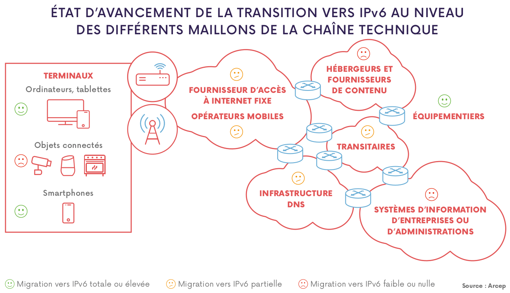

# Réseau

# Introduction

## Origine d'Internet

`1962` - MIT : Concept de communication de paquets

`1966`- `ARPANET` : Réseau à commutation de paquets de 2,4 kbps à 50 kbps

`1969`- Premiers nœuds opérationnels

`1972` - Définition de l'ancêtre du protocole `IP`: `NCP`. Permet de communiquer d'une machine à une autre.

`1973`- Création d'Ethernet

`1974`- Création du `TCP` et de `UDP` (Initialement prévu pour la voix)

`1980s` - `SMTP`, `DNS`, `FTP`

`1998` - Naissance de l'IPv6.

# Trois grands axes

## Confidentialité

L'information ne doit pas être comprise par n'importe qui.

Concept du cours abordé en chiffrement, clé publique, privée, etc.

## Authenticité

Dans l'exemple de la gestion de clés publiques / privées, on doit s'assurer que la clé publique envoyée appartient bien à son propriétaire.

On utilise donc un certificat pour vérifier cette identité.

### Certificat

C'est un document qui contient plus informations : 

- Identifiant de l'individu qui possède le certificat et la clé publique.
- La clé publique de l'identifiant
- La signature du certificat, qui permet de vérifier la concordance entre clé publique et identifiant.
- Les dates de début et de fin de validité de la clé publique et du certificat
- Le nom de l'autorité de certification
- Nom de l'algorithme de chiffrement et de signature

> Le format le plus utilisé est le **X.509**.

Le certificat est signé par un tiers de confiance qui atteste du lien entre l'identité physique et l'entité numérique.

#### Génération du certificat

Les **informations** contiennent :

- Autorité de certification
- Nom du propriétaire
- Adresse mail
- Dates de validités
- Clé publique

L'autorité de certification exécute un algorithme de chiffrement à l'aide de sa clé privée.

La **signature** est de la forme `3B:E4:8C…`

#### Concept

Trafic en clair :

Trafic chiffré :

#### Validation du certificat

1. Récupération du nom du propriétaire et de la clé publique.
2. Hachage de ces informations
3. Hachage de la signature
4. Vérification que les hash sont identiques

#### Gestion des certificats

`PKI` : infrastructure constituée de l'ensemble des serveurs servant à signer, distribuer et valider les certificats.

- `CA`: `Certificate Authority`
- `VA`: `Validation Authority`

Les `VA` sont validés directement dans les navigateurs. Il n'y a pas de demandes dans sur des bases de données, la liste des `VA` sont stockés directement sur le serveur.

#### Autorité de certification intermédiaire

- Meilleure protection des certificats `root`.
- Meilleure scalabilité de l'infrastructure `PKI`.

Il n'existe pour le moment aucune vulnérabilité, excepté concernant la gestion des clés privées.

### Exemple d'un tunnel sécurisé

L'attaquant va se positionner sur l'accès Internet, et va tenter de s'introduire dans le routeur pour faire une `man-in-the-middle`. D'où l'intérêt de vérifier les certificats.

#### Types de certificats

- Certificat `X.509`: Chiffrement varie entre 40 et 256 bits.
- Certificat `X.509` étendu : Plus trop utilisé
- Certificat `X.509` omnidomaines : Permet de rendre générique une partie du nom de domaine certifié.
  - Exemple :
    - `epinotes.fr`, `news.epinotes.fr`, `wall.epinotes.fr`, `*.epinotes.fr`

# `IPv6`

Adresse créée sur `128 bits`, permettant de ne plus avoir la moindre pénurie d'adresses.

Le format des paquets est également simplifié.

# `IPv4`

Les effets de la pénurie :

- Il n'y a plus, depuis Décembre 2019, d'adresses IPv4 disponibles. 
- Frein à l'introduction de nouveaux acteurs et services
- Difficulté d'identification de suspects. Free gère son faible nombre d'adresses IP grâce à une gestion avec un port.

# Avancement de la transition IPv6

