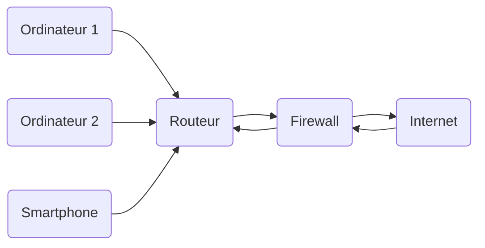
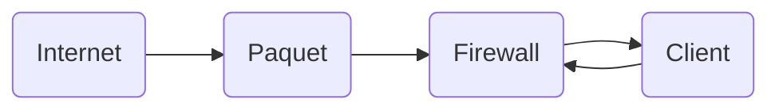

> Internet est au centre de toutes les conversations. C'est une technologie qui a, sans prétention, changé la vie de la majorité de la population mondiale.

Il est cependant important de noter que cette technologie, comme toutes les autres, se doit d'être sécurisée. Au sein d'un réseau, à l'échelle d'une entreprise comme celle d'un particulier, la sécurité est prédominante. Nous allons nous intéresser plus précisément à la technologie de Pare-Feu, `Firewall` en anglais.

# Introduction

Un pirate peut s'attaquer à un utilisateur ou à une entreprise de plus façons différentes. Il peut, par exemple, scanner tous les ports de la box ou du routeur de la victime. Ceci, afin de déceler ceux ouverts permettant potentiellement de s'engouffrer dans une faille de sécurité du service concerné.

> Un **Pare-Feu** est un logiciel ou du matériel physique, permettant de filtrer les attaques provenant d'un réseau. Dans la majorité des cas, il s'agit de protéger son réseau personnel du réseau Internet.

# Fonctionnement général

Le principe de base d'un routeur est le filtrage. Ce dernier se décline en plusieurs types et catégories.

L'idée initiale est de partir du principe que trois actions sont possibles :

- Autoriser la connexion
- Refuser la connexion
- Supprimer la connexion (immédiat)

Le Firewall peut être configuré de deux façons différentes. 

- Soit le client décide de n'autoriser que certaines connexions (présentes sur des listes blanches). Toutes les connexions sont donc par défaut bloquées.
- Soit le client décide de n'interdire que certaines connexions (présentes sur des listes noires). Toutes les connexions sont donc par défaut autorisées.

L'une des deux méthodes est plus contraignante, mais est davantage sécurisée. Il s'agit du compromis "sécurité/confort d'utilisation", présent dans de nombreux domaines en informatique.

# Filtrage

## Concept de base

Un Firewall peut effectuer un filtrage sur le réseau en analysant chaque paquet y entrant et y sortant. Avec cette méthode, on regarde les en-têtes  de chaque paquet, et on regarde quelles sont les adresses IP sources et destination, ainsi que le port et le protocole utilisés.

Les adresses IP déterminent de qui le paquet provient, et à qui est-il destiné. Le protocole (`UDP` ou `TCP`) et le port donnent des informations sur le service duquel le paquet provient.

Il est possible d'autoriser certains services à la connexion en ouvrant le port dédié à ce service.

## Filtrage dynamique

Le concept de base du filtrage donné plus haut consiste simplement à observer les adresses IP et les services utilisés, se plaçant exclusivement sur la couche 3 du modèle **ISO/OSI**. 

Le **filtrage dynamique** est beaucoup plus avancé. Certains services, comme le FTP par exemple, utilisent un port statique pour son protocole, mais peut être amené à en ouvrir plusieurs pour les transferts de fichiers aux clients. Il revient donc à priori impossible de gérer ces changements sans entraver la sécurité de son réseau. 

Le **filtrage dynamique** regarde donc le contenu des en-têtes des paquets, mais peut également voir si ce dernier est lié à un protocole spécifique, nécessitant une action particulière. De nombreux services nécessitant la gestion d'une session sont aussi pris en charge par ce type de filtrage. Il est donc à la fois sur la couche 3 et sur la couche 4 du modèle **ISO/OSI**.

## Filtrage applicatif

C'est le concept de Firewall le plus avancé. Il permet de gérer directement les applications, opérant donc sur la couche la plus haute du modèle **ISO/OSI**.

Il est nécessaire de l'avoir configuré en fonction des différents services et applications présents sur le réseau. Les services de base tels que le `SSH`, le `HTTP` ou encore le `FTP` sont pris en charges par défaut. Ce type de filtrage demande cependant beaucoup de puissance, car l'analyse des données de chaque application est bien plus complexe que l'analyse de l'en-tête d'un paquet. 

Comme nous pouvons le voir ci-dessous, le filtrage applicatif est souvent placé après un premier Firewall dynamique. Ceci pour plusieurs raisons. Le fait de dégrossir le trafique avant que ce dernier ne soit traité par le filtrage applicatif peut en être une.