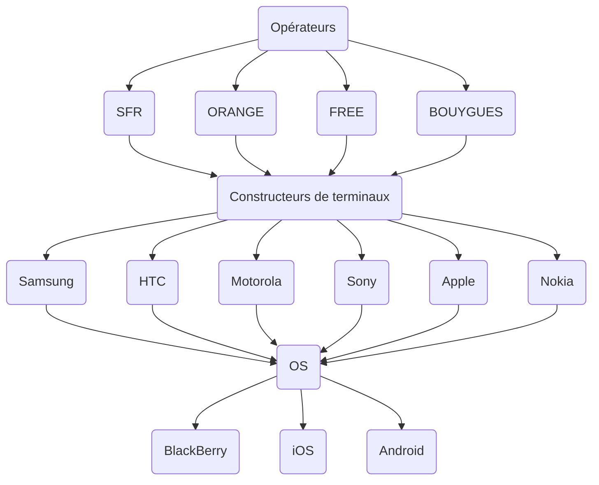

# Télécoms, réseaux et services

Notes de cours par `Guilhem Carlet`, `Thomas Peugnet`.

# Introduction

En quoi un réseau informatique est différent d'un réseau télécom ?

- Les réseaux informatiques
  - Sont très peu régulés
  - Ne possèdent aucune norme
- Les réseaux télécoms
  - Gèrent plus de monde
  - Répondes à une norme précise
  - Possèdent de nombreuses régulations

> La durée de vie moyenne d'un équipement réseau est d'environ **3 ans**. Leur coût d'acquisition est de **8 ans**.

Il existe une augmentation constante de `data` à analyser et traiter. Chaque année, cette quantité augmente de 50%. Il faut donc prévoir les nouvelles technologies qui permettront de gérer ce flux de données. C'est pour ça qu'il existe la `2G`, `3G`, `4G`, `5G`. Chacune de ces normes possède une fréquence différente. La `2G` se trouvait sur une fréquence se trouvant vers 1800 Mhz, tandis que la `5G` se trouve sur des fréquences proches de 30 000 Mhz.

> Ces fréquences appartiennent à l'État, les opérateurs ont donc l'obligation de payer une licence pour les utiliser.

## Les opérateurs et les réseaux sociaux

En 2005, plusieurs multinationales ont proposé aux opérateurs un partenariat de revente de données pour de la publicité. Les opérateurs s'y étant opposé, les multinationales ont réfléchi à un moyen différent de pouvoir effectuer de la publicité ciblée. Ils y sont parvenus à l'aide de l'apparition des smartphones. Étant pratiquement connectés à Internet, et ayant un OS développé par ces entreprises, passer par les opérateurs n'est maintenant plus un problème.

> Initialement, il n'y avait que 3 opérateurs mobile.
>
> - SFR
> - Orange
> - Bouygues Telecom

**Note :** Le service utilisé dans les jeux télévisés s'appelle `SMS+`.

# `XG`

La `5G` se trouve actuellement sur 2 bandes : le **700Mhz**, et le **3,5Ghz**.

La santé est bien entendue une question légitime étant donné qu'il est question d'ondes. Il y a actuellement la moitié des études qui montrent que des effets nocifs peuvent se présenter, l'autre moitié indiquant le contraire. Une chose est cependant certaine, c'est que l'on utilise bien plus son smartphone, mais ces derniers n’émettent que très peu d'énergie, donc seraient à priori moins nocifs.

La `5G` se base sur les bandes de la `4G`.

- Agrégation de porteuse (fusion des bandes de fréquence pour augmenter le débit)
- `Mimo`: multiple `in multiple out`.
- `NFV`: Network function virtualisation
- `MEC`: Mobile Edge Community
- `NOMA`: Non Orthogonal Mupliple Access

> **Notes : ** Le premier appel sur le réseau cellulaire a été effectué par Martin Cooper, le 3 avril 1973.

**Latence :** Capacité à un réseau de répondre à une requête.

**Full-duplex** : Le débit montant et le débit descendant ne sont pas sur des bandes identiques.

La `5G` a été conçue pour s'adapter à l'usage qui lui incombe.  Les bandes **millimétriques** représentent les fréquences > 6 GHz.

Le concept d'onde est basé sur le principe suivant : plus la fréquence est haute, plus il faut mettre de la puissance pour conserver une longue portée.

Les différentes générations de réseaux cellulaires :

- `1G`: `NMT` (Nordic Mobile Telephone)
- `2G`: `GSM` (Global System for Mobile Communication)
- `2,5G`: `GPRS` (General Packet Radio Service)
- `2,75G`: `EDGE` (Enhanced Data Rate for GSM Evolution)
- `3G`: `UMTS` (Universal Mobile Telecommunication System)
- `3,5G`: `HSDPA` / `HSUPA` (High Speed Download/Upload Packet Access)
- `3,75G`:  `HSOPA` (Hight Speed OFDM Packet Access)
- `4G`: `LTE` (Long Term Evolution)

## Duplex

- `TDD` : Time-division duplex
- `FDD` : Frequency-division duplex

L'évolution du `Full Duplex` donnera `NOMA`, qui correspond au `full duplex` en `5G`.

## Business apportés

*Informations provenant de la vidéo Huawei.*

Une génération (`G`) dure environ 20 ans. Ici, la `5G`  va permettre d'avoir un meilleur débit, pouvant être utilisé pour la VR, mais permettra aussi de connecter davantage d'objets connectés (IoT). Cette génération va également réduire la latence. 

Les premiers à avoir adopté cette technologie, ce sont les chinois. 

Un système de multiplexage est utilisé : `OFDMA`. Ce dernier va rentrer en compétition avec `NOMA` et `SOMA`.

# Anecdotes

Le bug de l'an 2000 : les dates étaient en `XX/XX/96`. Après l'an 2000, on serait passé logiquement à `XX/XX/00`, ce qui pose problème.

- `MVNO`: Mobile Virtual Network Operator (Virgin Mobile, Laposte Mobile, Sosh, B&You)
- `TA` : Terminaison d'appel
  - Comment SFR a réussi à casser les prix.
- Le premier réseau télégraphe optique a été créé par `Claude Chappe`
- Création du téléphone par `Graphan Bell` pour pouvoir communiquer avec sa fille
- Le minitel était uniquement utilisé en France.
- Après la seconde guerre mondiale, les télécoms sont passés dans le domaine publique, sauf aux États-Unis.

# Rivalité FAI - Google

Les opérateurs ont investi les réseaux des télécommunications. Cependant, Google étant dans la volonté d'être dans le quotidien des utilisateurs, demande un partenariat avec les FAI. Partenariat qui est refusé pour des raisons déontologiques. 

- Environ 12 Go de consommation mensuelle par utilisateur du réseau mobile
- Environ 160 Go de consommation mensuelle par utilisateur du réseau filaire (ADSL, Fibre…)

Le streaming vidéo constitue 2/3 du trafique mondial. La modernisation des équipements et l'augmentation des débits a permis une explosion des consommations.

- `NSP`: Network Sevice Provider
  - Opérateur de transite

> Orange demande à Google un pourcentage sur les publicités mises sur chaque site Internet. Google répond en restreignant l'accès à certains sites si les clients sont client chez Orange.
>
> Des clients d'Orange ont donc appelé le Service Après Vente pour les problèmes de débit sur Youtube.
>
> Après une demande d'Orange à Google pour faire cesser ces restrictions, Google a accepté en échange de l'abandon de la demande de pourcentage effectuée par Orange pour les publicités. Google a ajouté qu'il s'agissait de leur modèle économique, et non celui d'Orange.

Google a fini par arriver à ses fins, en outrepassant les opérateurs. Avoir un OS installé sur le mobile de 90% de la population lui permettait de collecter des données sans avoir de compte à rendre aux FAI.

# Les FAI & les OS

> Windows dominait le monde du PC, mais souhaitait également avoir une importance dans le monde du mobile. Ils ont donc créé Windows Mobile, qui fut un échec complet.

> Avoir un BlackBerry était initalement vu comme un signe de puissance. Mais l'équipement a fini par être plus abordable, lui enlevant son côté exclusif et causant sa perte.

> L'iPhone est arrivé en 2007.

# Ondes

> Le signal reçu pour regarder la télévision est passé de l'analogique au numérique.

- Norme `MIC` - Lien `MIC` : 2Mb / s

- Norme CCITT n°7

> **Boucle locale :**
> Il s'agit du nom donné à la partie d'un réseau de télécommunications situé entre la prise téléphonique de l'abonné final et le centre local.

- Dégroupage partiel ou total : est-il possible d'utiliser son propre routeur ou obligés d'utiliser celui de l'opérateur ?

## Ondes radio longue distance

**Wimax** : Wifi avec plus de portée. Il y a eu du lobbyusme pour limiter cette technologie.

> Tous les ans, l'`ARCEP` effectue des tests sur le réseau des opérateurs, et publie des rapports sur la qualité du service.
>
> Le réseau français est considéré comme de très bonne qualité, en comparaison avec l'internationnal.

## Zones blanches

L'objectif est de mettre en place des Roaming en France, ceci pour couvrir un maximum d'espace. Les opérateurs vont donc passer des accords pour desservir l'intégralité des clients dans les zones blanches.

# Normalisation

La normaliation est au coeur du sytème universel des télécommunications. (Interconnexion totale avec plusieurs acteurs). Une absence de normalisation pourrait donner des réseaux d'une complexité similaire à celle visible en informatique.

- Débit d'une conversation téléphonique en France : 64Kbps, échantillonée sur 8 bits en France, 7 bits aux États-Unis.
- Réseau haut débit : 2048 Mbps
- Réseau très haut débit : 30 000 Mbps

# Questions type partiel

> C'est quoi 1 Ho ?
>
> - 1000 To

> Quelle est la tarification `Q60` ? 
>
> - Modèle économique, tarification à la minute.

> Wimax mobile est une technologie concurrente à la `4G`

> C'est quoi l`Endover ?
>
> - Conserver une communication mobile entre 2 cellules (Antennes)

> C'est quoi l'OTA ?
>
> - Over The Air : Configurer à distance un téléphone mobile

> C'est quoi un réseau mèche ?
>
> - Réseau où le signal va se propaher d'antenne à antenne

> Sur quel réseau Free fait de l'itinérance ?
>
> - Sur le réseau Orange

> Combien il y a d'abonnés mobile dans le monde ?

> Combien il y a de cartes SIM en France ?

> C'est quoi TA ?
>
> - Terminaison d'appel

> Quel est le principal service qui fait l'engorgement des réseaux sociaux ?
>
> - Streaming Vidéo

> Quel duplex pour la `5G` ?
>
> - Le full duplex

> Quelle est la norme qui normalise le Wifi ?
>
> - I3E (802.11b)

> La boucle locale est accessble en France.

> Quel est l'ancien nom d'Orange ?
>
> - France Telecom
