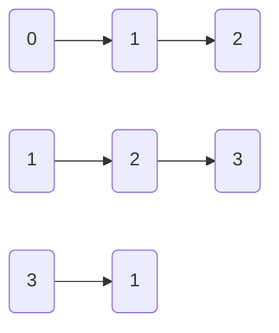

# Théorie des graphes

## Définitions & Théorèmes

> Un arbre de `n` sommets possède `n-1` arêtes.

> Dans un graphe, la somme des degrés de chaque sommet est le double du nombre d'arêtes.

> Le nombre d'arbres que l'on peut construire pour relier n $\geq$ 2 est $n^{n-2}$.

> Le théorème de **Kirchhoff** permet de dénombre les arbres courants.

> **Théorème de Kirchhoff** : 
>
> Le nombre d'arbres couvrants d'un graphe `G`est égal à la valeur absolue de n'importe quel cofacteur de la matrice laplacienne de `G`.
>
> **La matrice laplacienne** est la matrice des degrés moins la matrice d'adjacence.

## Notations

> 1. Graphe **orienté** `G = (V, E)`
>
>    - `V` est l'ensemble de sommets (non vide)
>
>    - `E` est l'ensemble d'arêtes (peut être vide)
>
>      - `E`$\subseteq$ `V`
>
>    - $\sum_{x \in V} \deg⁺ (x) = \sum_{x \in V}\deg⁻ (x) = |E|$
>
>      

On appelle **graphe simple** un graphe sans arête multiple, et sans boucle sur un sommet.

> 2. Graphe **non orienté** `G = (V, E)`
>    - Propriétés identiques
>    - $ \sum_{x \in V}\deg (x) = |E| \times 2$

La complexité d'un algorithme de graphe se calcule en fonction de $|V|$ et de $|E|$.

> 3. Graphe **pondéré** (orienté ou non)
>    - $G = (V, E, \omega)$
>    - $\omega : E\rightarrow W$
>
> Avec $\omega$ la `weight`, et $W$ un ensemble à définir au cas par cas.

**Ex : ** L'algorithme de Dijkstra tourne en $O(|E|+|V|log|V|)$.

Un algorithme $O(|V|+|E|)$ est dit **linéaire**, car $|V| + |E|$ représente la taille du graphe.

## Simplifications

> - Sur un graphe **simple : ** $|E| = O(|V|^2)$
>
> - Sur un **arbre** : $|E|=\Theta(|V|)$
> - Sur un graphe **connexe** : $|V|=O(|E|)$

Ainsi, la complexité d'un algorithme linéaire $O(|V| + |E|)$ peut être simplifiée en $O(|E|)$ si l'on ne travaille que sur des graphes connexes.

## Représentations

### Liste d'adjacence

### Matrice d'adjacence

$$
\begin{vmatrix}
0 & 1 & 1 & 0\\
0 & 0 & 1 & 0\\
0 & 0 & 0 & 1\\
0 & 1 & 0 & 0
\end{vmatrix}
$$

# Parcours

## BFS

> "*Le parcours **largeur** utilise une **file** d'attente pour stocker les sommets visités.*
>
> *Dans cette méthode, l'accent est mis sur les sommets du graphe, un sommet est sélectionné en premier, puis il est visité et marqué. Les sommets adjacents au sommet visité sont ensuite visités et stockés de manière séquentielle dans la file d'attente.*
>
> *De même, les sommets stockés sont ensuite traités un par un et leurs sommets adjacents sont visités. Un nœud est entièrement exploré avant de se rendre dans un autre nœud du graphe, autrement dit, il traverse en premier les nœuds non explorés les moins profonds.*" – Internet

## DFS

> "*Le parcours en **profondeur** utilise une **pile** pour stocker les sommets visités.*
>
> *Il s'agit de la méthode basée sur les arêtes et fonctionne de manière **récursive**, les sommets étant explorés le long d'un chemin (arête).*
>
> *L'exploration d'un nœud est suspendue dès qu'un autre nœud non exploré est trouvé, et que les nœuds les plus profonds non explorés sont traversés au premier plan.*
>
> *Le parcours profondeur traverse / visite chaque sommet exactement une fois et chaque bord est inspecté exactement deux fois.*" – Internet