# Tiger

Notes de cours par `Thomas Peugnet`.

# Construction d'un compilateur

## Ressources

- https://www.lrde.epita.fr/tiger/lecture-notes/slides/ccmp/
- https://moodle.cri.epita.fr/course/view.php?id=678
- https://www.lrde.epita.fr/~tiger/exams/

## Cours

Le projet Tiger est divisé en plusieurs ==parties.==

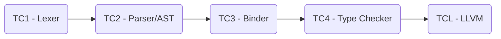

Chaque partie est dépendante d'une autre.

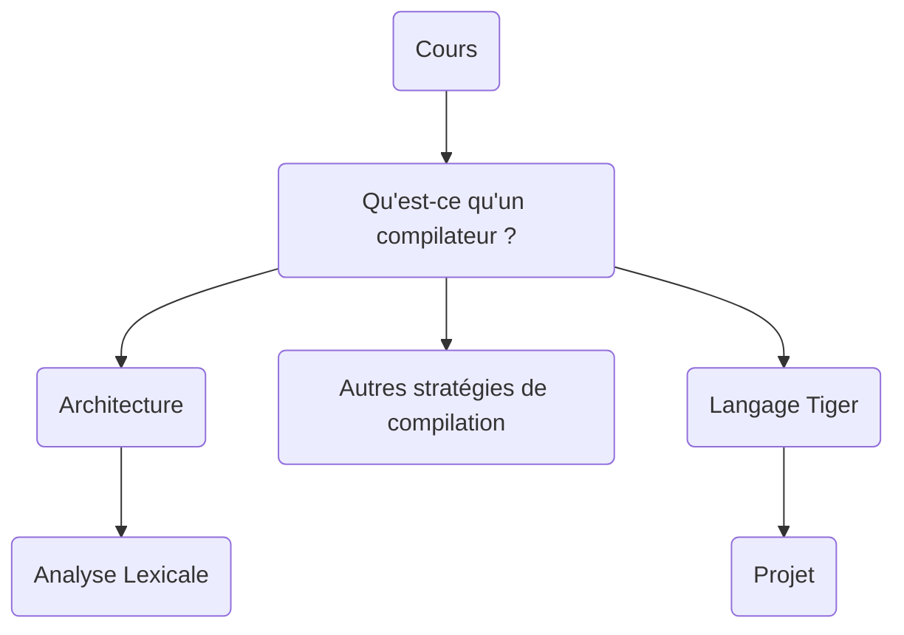

## Examen

Le projet Tiger est noté de la manière suivante : 

- 80% : Développement du projet
  - Récupération de la note maximale pour chaque TC.
- 20% : Examen final

# Qu'est-ce qu'un compilateur ?

> *« A compiler is a program that accepts as input a program text in a certain language and produces as output a program text in another language, while preserving the meaning of that text. »*

### Vocabulaire

> *Un **transpilateur** est un programme qui convertit une langue source en une langue cible.*
>
> *⇒ Même niveau d'abstraction*

> Un **compilateur** est un programme qui convertit un langage source en un langage machine cible.
>
> ⇒ *Niveau d'abstraction différent*

### Étapes

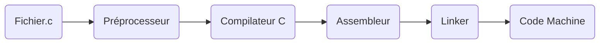

#### Préprocesseur

> Un **préprocesseur** est un **transpilateur** de source à source : il *simplifie le* code d'entrée et produit du code source pur. Il applique les traductions suivantes :
>
> - Expansion des macros
> - Expansion des fichiers
> - Expressions conditionnelles
> - Directives diverses
> - Supprimer les commentaires
> - Conversion des trigraphes

#### Compilateur C

> Nombreux défis :
>
> - Lexing
> - Parsing
> - Vérification de type
> - Linéarisation
> - SSA
> - Optimisation
> - Allocation des registres

#### Assembleur

> Un **assembleur** traduit les programmes en langage assembleur en **code machine**.
>
> La sortie d'un assembleur est appelée un `Object File`, qui contient une combinaison d'instructions machine ainsi que les données nécessaires pour placer ces instructions en mémoire.

#### Linker

> Un **Linker** est un programme qui relie et fusionne divers `Object File`, afin de créer un fichier exécutable. La principale tâche d'un linker est de rechercher et de localiser les modules/routines référencés dans un programme et de déterminer l'emplacement mémoire où ces codes seront chargés, ce qui permet aux instructions du programme d'avoir des références absolues.

#### `Cross compiler`

> Un `Cross Compiler` est un compilateur capable de créer un code exécutable pour une plate-forme autre que celle sur laquelle le compilateur fonctionne. (`Intel` & `ARM`, par exemple).

#### `Bootstraping compilers`

> *« Bootstrapping is the technique for producing a self-compiling compiler. »*

> Avantages du **`bootstraping`** :
>
> - Les développeurs ne doivent connaître qu'une seule langue
>
> - Test non trivial du langage en cours de compilation
>
> - L'amélioration du code générée par le compilateur profite à la fois au compilateur et aux programmes des utilisateurs.
>
> Compilateurs : `C++ (clang)`, `C(gcc)`, `Java`, `Ada`, `Common Lisp`, `Eiffel`, `Delphi`, `Python`, `Rust`.

# Construction d'un compilateur

## Disposition générale

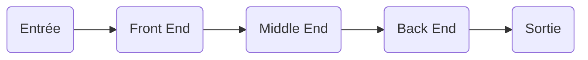

### `Front End`

> - Analyse lexicale 
> - Analyse syntaxique 
> - Analyse sémantique statique :
>   - Vérification du type
>   - Vérification contextuelle
>   - ...
>
> - Optimisations spécifiques au langage source

### `Middle End`

> **Synthèse et optimisations génériques**.
>
> - Optimisations

### `Back End`

> **Synthèse de sortie**.
>
> - Sélection d'insctructions
> - Allocation des registres
> - Optimisations spécifiques à l'assemblage
>   - SIMD
>   - Caches
>   - ...

## Architecture classique

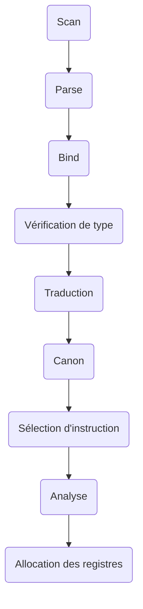

### Scanner

> Décompose le fichier source en mots individuels appelés `tokens`.
>
> ```mermaid
> graph LR
> A(Chars) --> B(Scan) --> C(Tokens)
> ```
>
> 

### Parser

> Analyse la structure de la phrase du programme.
>
> ```mermaid
> graph LR
> A(tokens) --> B(Parser) --> C(AST)
> ```

### Binder

> Relier les utilisations des variables à leurs définitions.
>
> ```mermaid
> graph LR
> A(AST) --> B(Binder) --> C(Bound AST)
> ```

### Vérification de type

> Vérification des types de chaque expression.
>
> ```mermaid
> graph LR
> A(Bound AST) --> B(Vérification de type) --> C(Bound & Typed AST)
> ```

### Traduction

> *« Place variables into activation records and generate Intermediate Representation. »*
>
> ```mermaid
> graph LR
> A(Bound & Typed AST) --> B(Traduction) --> C(HIR)
> ```

### `Canonicalize`

> Nettoyage pour les phases suivantes.
>
> ```mermaid
> graph LR
> A(HIR) --> B(Canon) --> C(LIR)
> ```

### Sélection des instructions

> Regroupe les éléments `IR` en groupes correspondants aux instructions réelles de la machine cible.
>
> ```mermaid
> graph LR
> A(LIR) --> B(Canon) --> C(Pre-ASM)
> ```

### Analyse

> Calculer les endroits où chaque variable est présente.
>
> ```mermaid
> graph LR
> A(Pre-ASM) --> B(Canon) --> C(Graphe d'interférence)
> ```

### Allocation des registres

> Calculer les endroits où chaque variable est présente.
>
> ```mermaid
> graph LR
> A(Graphe d'interférence) --> B(Canon) --> C(ASM)
> ```

## `Wide compilers` vs `narrow compilers`

> Un ***compilateur étroit*** est un compilateur qui ne lit que **quelques caractères** de l'entrée, généralement une ligne ou une fonction.
>
> Un ***compilateur large*** est un compilateur qui travaille sur **l'ensemble** du fichier source.

# Langage Tiger

## Coeur du langage

- Commentaires : `/*` and `*/`
- Identifier : Chaine de caractères, underscores, nombres
- `Builtins` : `int`, `string`
- Types définis : `Records`, `arrays`, `recursive types`

## Programmes

*Note : Pour la coloration syntaxique plus ou moins approximative, nous indiquerons le langage `Haskell`.* Le code demeure néanmoins écrit en `Tiger`.

```haskell
let
	function cdown(i: int) : int =
		if i = 0 then 0
		else cdown(i-1) 
in
	cdown(3*3+1)
end
```

```haskell
let
	function hello(name: string) =
		print(concat("Hello", name)) 
in
	hello("you!") 
end
```

```haskell
let
	var myvar := 42
in
	print_int(myvar)
end
```

```haskell
let 
	function ten(): int = (print("Once.\n"); 10)
in
	for i := 0 to ten() do
		print_int(i)
end
```

```haskell
let 
	var useless := 0 
in
	for i := 1 to 10 do break 
end
```

```haskell
let
	type intArray = array of int 
	var row := intArray[8] of 0
in
	print_int(row[0])
end
```

```haskell
let
	type rec = { a : int } 
	var b :=
		if 0 then nil
		else rec { a = 1 } 
in
	print_int(b.a)
end
```

## Interdit

```haskell
let
	var a := nil
in
	/* ... */
end
```

```haskell
if nil = nil then /* ... */
```

**Remarque : ** *`nil` doit être utilisé dans un contexte où le type peut être déterminé.*

# Stratégies de compilation

## Interpréteurs

*Un interprète lit le code et l'exécute immédiatement. Il travaille en allant chercher, en analysant et en exécutant une instruction à la fois.*

> **Portable** : il n'est pas nécessaire de compiler le code pour une architecture ciblée
> **Impact sur le langage d'entrée** : 
>
> -  typage dynamique
> - `scoping` dynamique

## Compilation

*Programs are compiled (translated) into native code during a compilation process.*

> **En avance sur le temps (compilation AOT) ** : 
>
> - Produire un fichier binaire qui peut être exécuté sur l'architecture ciblée.
>
> **Compilation juste-à-temps (JIT)** :
>
> - Implique la compilation pendant l'exécution d'un programme (au moment de l'exécution) plutôt qu'avant l'exécution.

## Machine virtuelle

> *A virtual machine is a platform-independent programming environment that abstracts away details of the underlying hardware or operating system. It allows a program to execute in the same way on any platform.*

# Analyse lexicale

## Fonctionnement

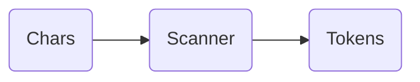

- Décompose l'entrée en mots ou en `tokens`
- Réduit le bruit

## Token lexical

> *Un `token` lexical est une séquence de caractères qui peut être traitée comme une unité dans la grammaire du langage de programmation.*

```haskell
let var a := 2 in a + 1 end
```

```haskell
  ...... , TOK_NUMBER(2) ,TOK_ASSIGN,TOK_ID(a), TOK_VAR, TOK_LET
```

## Manipuler des `tokens`

### Expressions régulières

> Chaque expression régulière produit un token (avec ou sans données). L'ordre des `tokens` ci-dessous est très important.

```haskell
let                (TOK_LET) 
var                (TOK_VAR) 
[a-z][a-z0-9]*     (TOK_ID) 
[0-9]+             (TOK_NUM)
```

### Automates finis

> *Un automate fini déterministe est un automate où deux arêtes quittant le même état n'ont pas le même symbole.*

L'expression `a+b` : 

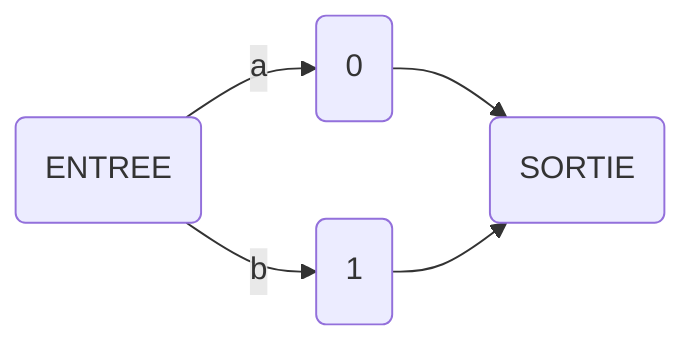

# Flex

## Présentation

> *`Flex`: Fast Lexical analyser generator*
>
> - Créé en 1987, `C` par Vern Paxson.
> - Génère des analyseurs lexicaux

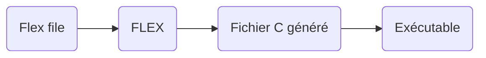

## Exemples

```flex
%{
[pre-code C (nec. def.)]
%}
[definitions and options] 
%%
[rules]
%%
[post-code C (subprograms)]
```

```c
%{
%}
/* Only one input file */ 
%option noyywrap
num [0-9]+
%%
{num} { printf("NUMBER [%s]\n",
          yytext); }
.     { printf("UNKNOWN [%s]\n",
          yytext); }
%%
int main(void) {
	yylex();
	return(0); 
}
```

## Détails

- `yytext` : le texte reconnu
- `yyleng` : la taille du texte reconnu
- `yylex` : démarrage du scan

Pour chacune des expressions rationnelles correspondantes, on peut renvoyer un identifiant (un jeton).

**Remarque : ** L'ordre des règles est important.

# Analyse syntaxique

## Présentation

> ```mermaid
> graph LR
> A(Tokens) --> B(Parse) --> C(AST)
> ```
>
> *Voir les cours de **Théorie des langages**. Les notions de **langage**, **grammaire**, **dérivations** et **arbres** y sont abordées.*

# Bison

## Présentation

> *`Bison`: Remplace YACC `Yet Another Compiler Compiler`*
>
> - Créé en 1985, `C` par Robert Corbett.
> - Génère des analyseurs syntaxiques

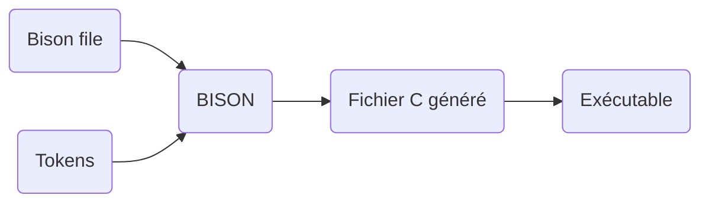

## Exemples

```bison
%{
[pre-code C (nec. def.)]
%}
[definitions and options]
%%
[production rules]
%%
[post-code C (subprograms)]
```

```c
%% 
exp:
		"if" exp "then" exp
	| "if" exp "then" exp "else" exp 
  | "exp";
%%

// Grammaire Ambigüe
  
%expect 0
%right "else" "then" 
%%
exp:
    "if" exp "then" exp
  | "if" exp "then" exp "else" exp 
  | "exp" ;
%%
```

## Détails

- `yyparse` : 
  - Consomme le flux d'entrée (séquence) de jetons
  - Vérifie si la séquence peut être réduite à la règle initiale `(%start)`
  - Exécute le code C associé aux règles de production utilisées pour réduire l'entrée
  - Peut révéler des erreurs `(yyerror)`
  - Retourne 0 ou 1
- `yyerror` : Utilisé pour la reconnaissance d'erreur

# AST

## Une grammaire simple et non ambiguë

```c
<E> ::= <E> "+" <T> 
  		| <E> "-" <T>
      | <T>.
<T> ::= <T> "*" <F>
      | <T> "/" <F>
      | <F>.
<F> ::= "(" <E> ")"
			| <num>.
```

- `E` : Expression
- `T` : Terminal
- `F`: Factor

## `Parse tree`

On peut représenter l'expression `a*(b+cd)` de la forme suivante : 

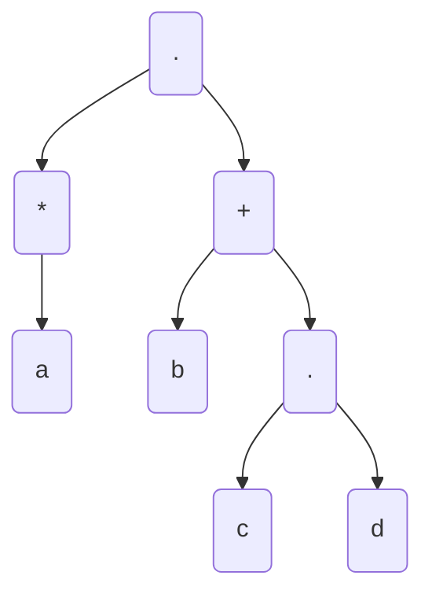

Cependant, la forme n'est malgré tout pas adaptée pour ce que nous souhaitons faire.

## `AST` pour `Abstract Syntax Tree`

> *Une AST est la traduction du `parse tree` afin de correspondre à la grammaire abstraite.*

Ce qui donnerait, toujours pour la même expression : 

````mermaid
graph
A(Mul)
A --> B(Num)
A --> C(Add)

C --> D(Num)
C --> E(Num)
````

Pour construire un AST : 

```cpp
int main() 
{
	Exp* tree =
		new Bin('+',
            new Num(42), 
            new Num(51));
delete tree; 
}
```

# `Pretty Printer`

Faire un `pretty printer` va permettre de vérifier que le démarrage de la compilation s'effectue correctement. Il doit respecter une certaine **coding style**, une indentation etc.


# Affichage des erreurs

L'objectif est de pouvoir afficher toutes les erreurs syntaxiques simultanément (actuellement, il n'est possible d'en voir qu'une seule).

Il existe deux classes de récupération d'erreurs :

- `Local Recovery`: ajuster l'entrée au point où l'erreur a été détectée.

- `Global Recovery`: ajuster l'entrée avant le point où l'erreur a été détectée.

# `Efficient traversal`

## Dans les compilateurs

> - Pretty-printer 
> - Analyse de nom
> - Identifiants uniques
> - `Desugaring`
>
> - Vérification du type
>
> - `Escaping variables`
>
> - Inlining`
>
> - Optimisation de haut niveau
>
> - Traduction en représentation intermédiaire

## Problèmes d'héritage

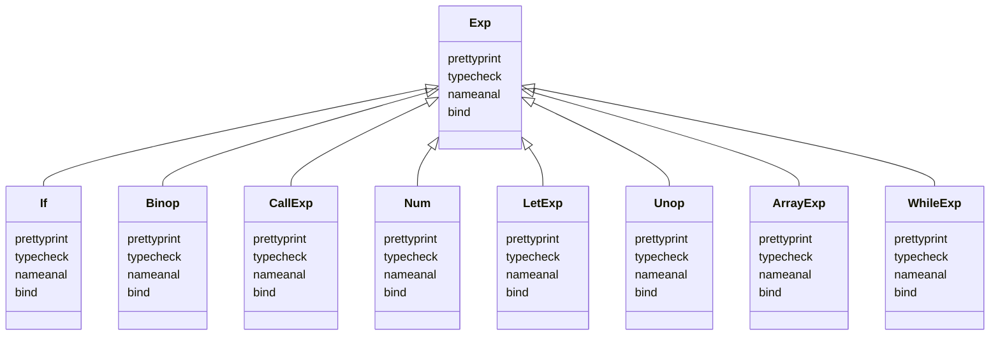

> L'héritage n'est donc plus adapté à la solution.
>
> - Difficile à maintenir
> - Ne peut plus être généré
> - Répartir du code de traversée dans plusieurs fichiers présente des risques

## Séparer `processing` et `dispatching`

- `Processing`
  - Extérieur
  - On peut l'ajouter facilement
- `Dispatching`
  - Intérieur
  - On peut le réduire facilement

> On va donc utiliser le polymorphisme sur tous les arguments, et non plus uniquement sur l'objet.

# Visiteurs

> -  Définir de nouvelles opérations sans changer les classes des éléments sur lesquels on opère.
> - En substance, le `visitor pattern` permet d'ajouter de nouvelles fonctions virtuelles à une famille de classes.
> - Solution au `dispatching multiple` lorsque le langage ne le prévoit pas.

## La fonction `accept()`

1. Augmenter toutes les classes avec une méthode `accept()`.

2. Regrouper tous les traitements dans une seule classe de visiteur.

3. `accept()` effectue le `dispatch dynamique` et appelle le `callback` correct.

## Exemple

```cpp
class PrettyPrinter 
{
public:
  void visitNum(Num& e); { 
    ostr_ << e.val_;
  }
  void visitBin(Bin& e) {
  	ostr_ << '('; 
    e.lhs()->accept(*this); 
    // ...
	}
private:
	std::ostream& ostr_; 
  unsigned tab_;
};
```

# Tiger `AST Visitors`

## Syntaxe Abstraite de Tiger

### `Exp`

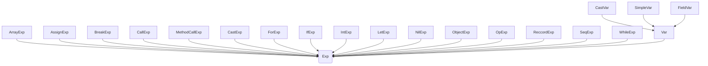

### `Dec`

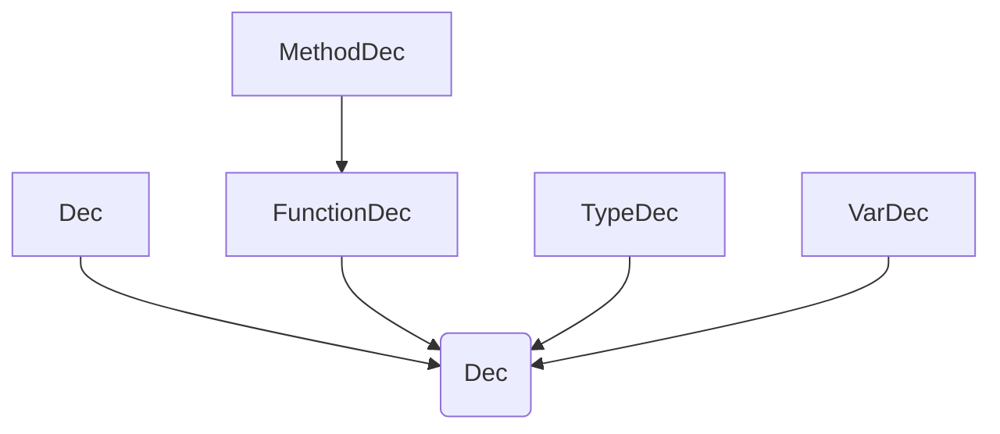

### `Ty`

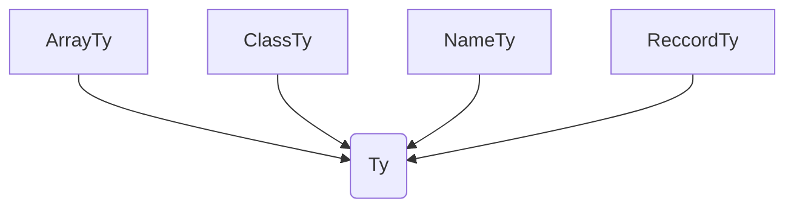

## Héritage

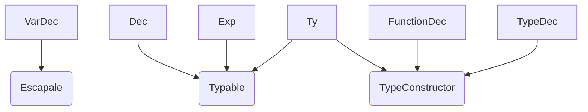

## Visiteurs

> - `PrettyPrinter` – Pretty-printer
>
> - `Binder` – Lier les utilisations aux déclarations
>
> - `Renamer` – Noms uniques
>
> - `TypeChecker` – Annoter les nœuds avec leur type
>
> - `object::Binder` – Lier les `Object Tiger`
>
> - `object::TypeChecker` – Vérifier les types pour `Object Tiger`
>
> - `overload::TypeChecker` – Check types for `overloaded Tiger`
> - `object::DesugarVisitor` – Enlève le sucre syntaxique dans `Tiger Object` 
> - `DesugarVisitor` – Traitement du sucre syntaxique
> - `BoundCheckingVisitor`  – Vérification des frontières 
> - `Pruner` – Suppression des définitions des fonctions inutiles 
> - `Translator` – Conversion en HIR

# Sucre Syntaxique

## Définition

> *Additions to a language to make it easier to read or write, but that do not change the expressiveness*.

## Enlever le sucre syntaxique

> *Higher-level features that can be decomposed into language core of essential constructs ⇒ This process is called ”**desugaring**”.*

**Méthode** : 

1.  Parcourir l'`AST` en utilisant un visiteur
2. On regarde le type de nœud à remplacer
3. Construire un nouveau `sous-AST`
4. Remplacer les noeuds (et les sous-arbres associés) par le nouveau `sous-AST`

# `Binding`

> *Binding refers to the process of linking identifiers to objects*.

## Fonctionnement

1. Commencer par un environnement vide.
2. Pour chaque déclaration, ajouter l'identifiant à l'environnement.
3. Pour chaque utilisation, faire un lien vers la bonne déclaration.
4. À la fin d'un `scope`, supprimer les identifiants qui ne sont plus visibles. 

## Statique

>  Le compilateur associe statiquement (au moment de la compilation) un identifiant à une certaine définition.

## Dynamique

> Le compilateur doit ajouter du code qui identifie le type d'objet au moment de l'exécution, puis fait correspondre l'identifiant avec la définition (par exemple, l'appel de fonction).

## Exemple

```cpp
struct Shape 
{
	virtual void draw() const = 0; 
};
struct Square : public Shape 
{
	void draw() const override {}; 
};
struct Circle : public Shape 
{
	void draw() const override {}; 
};

// Other Cpp File

#include <vector> 
#include "shapes.hh"

using shapes_type = std::vector<Shape*>;
int main() 
{
	auto ss = shapes_type{new Circle, new Square};
	for (auto s: ss)
		// Inclusion polymorphism. 
    s->draw();
}
```

# Surcharge

## Exemple

```cpp
// foo is overloaded.
int foo(int); 
int foo(float);
// x and y are aliases.
int x;
int& y = x;
```

```cpp
// Surchargé
void foo(int);
void foo(char);
void foo(const char*); 
void foo(std::string);
int main () 
{
  foo(0);
  foo('0');
  foo("0"); 
  foo(std::string("0"));
}

// Non-Surchargé
void foo_int(int);
void foo_char(char);
void foo_char_p(const char*); 
void foo_std_string(std::string);
int main () 
{
  foo_int(0);
  foo_char('0');
  foo_char_p("0"); 
  foo_std_string(std::string("0"));
}
```

# `Escaping Variables`

> Techniquement (et dans notre situation), `escaping` signifie "ne peut pas être stocké dans un registre".

## En `C`

- Grandes valeurs (`tableaux`, `structs`).
- Variables dont l'adresse est prise.

## En `Tiger`
- Variables accessibles depuis une fonction imbriquée.
- Arguments accessibles depuis une fonction imbriquée

# Vérification de type

> La vérification de type est l'activité qui consiste à s'assurer que les opérandes d'un opérateur sont de types compatibles.
>
> Un type compatible est un type qui est soit légal pour l'opérateur, soit autorisé par les règles du langage à être implicitement converti par le code généré par le compilateur (ou l'interprète) en un type légal.

## `Coercion` (± `Cast`)

> La `coercition` est la conversion automatique (implicite) d'un type à un autre.

Il existe 2 types de `coercitions` :

- les conversions élargissantes : d'un type "plus petit" à un "plus grand".

  ```cpp
  int i = 42 ; 
  float f = i ;
  ```

- les conversions réductrices : d'un type "plus grand" à un "plus petit".

  ```cpp
  float f = 42.0 ; 
  int i = f ;
  ```

**Remarque :** Un langage de programmation est fortement typé si les erreurs de type sont toujours détectées.

## Équivalence de type

> Deux types sont **équivalents** si un opérande d'un type dans une expression est **substitué** à un opérande de l'autre type, **sans coercition**.
>
> En d'autres termes, l'équivalence de type est une **forme stricte de compatibilité de type** sans coercition.

- `Name Type Equivalence` : deux variables ont des types équivalents si elles sont définies dans la même déclaration ou dans des déclarations qui utilisent le même nom de type.

  ```cpp
  int i = 42 ; 
  int j = 51 ;
  ```

  

- `Structural Type Equivalence` : deux variables ont des types équivalents si leurs types ont des structures identiques.

  ```cpp
  struct A { int a ; int b;} ;
  struct B { int c ; int d;} ;
  ```

## Typage Dynamique vs. Typage Statique

> - **Langages à typage statique** : la totalité ou la quasi-totalité de la vérification des types a lieu au moment de la compilation.
>   - `C`, `Java`, etc.
> - **Langages typés dynamiquement** : la quasi-totalité de la vérification des types est effectuée au cours de l'exécution du programme.
>   - `Scheme`
> - **Langages non typés** : aucune vérification de type
>   - `Assembleur`, code machine

# Plugin `GCC`

## Fontionnement

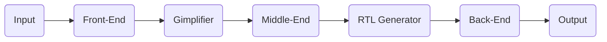

## Objectifs du `Middle-End`

> - Optimisations génériques
> - Préparer et simplifier le backend :
>   - Pas de séquences imbriquées dans `ASM`
>   - Pas d'expressions dans `ASM`
>   - Pas de sauts conditionnels bidirectionnels dans `ASM`
>   - `ASM` a une convention d'appel	

# Divers

## Hierarchie de mémoire

> Il existe différents types de mémoire dans un ordinateur, avec des performances différentes :
>
> - **Registres** :  Petites unités de mémoire construites sur le processeur (octets, 1 cycle)
> - Cache L1 : Dernier accès à la mémoire principale (Ko, 2-3 cycles)
> - **Cache L2** :  (Mo, 10 cycles)
> - **Mémoire** : RAM (GB, 100 cycles)
> - **Disques de stockage** (100 Go, TB, > 1Mcycles)
>
> L'objectif est d'utiliser au maximum les registres.

## `Register Overflow`

> Utilisation de la mémoire principale si le nombre de registres est insuffisant.
>
> - Récursion :
>   - **Sans** : Chaque nom est lié une fois. Il peut être alloué statiquement une seule unité de mémoire principale. (`Cobol`, `Concurrent Pascal`, `Fortran` (sauf si récursif)).
>   - **Avec** : Un seul nom peut faire partie de plusieurs liaisons concurrentes. L'allocation de mémoire doit être dynamique.

La fin de ces notes de cours correspond globalement à la fin de `TC-7`.
